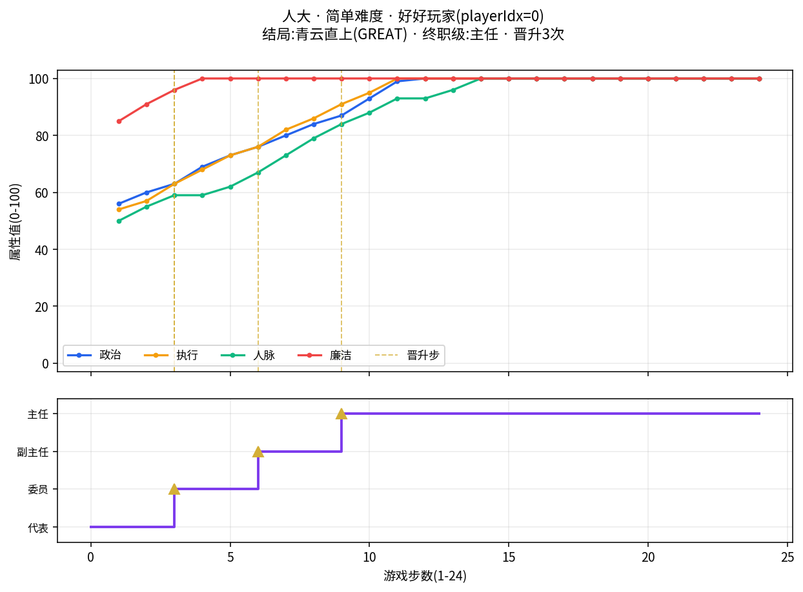
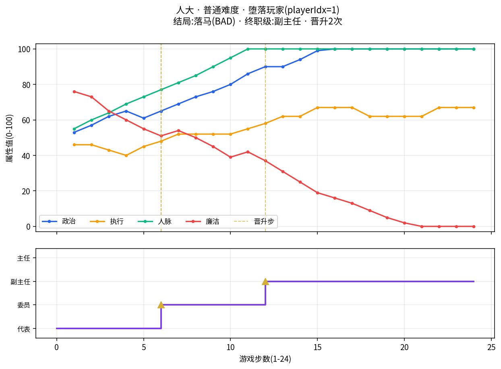
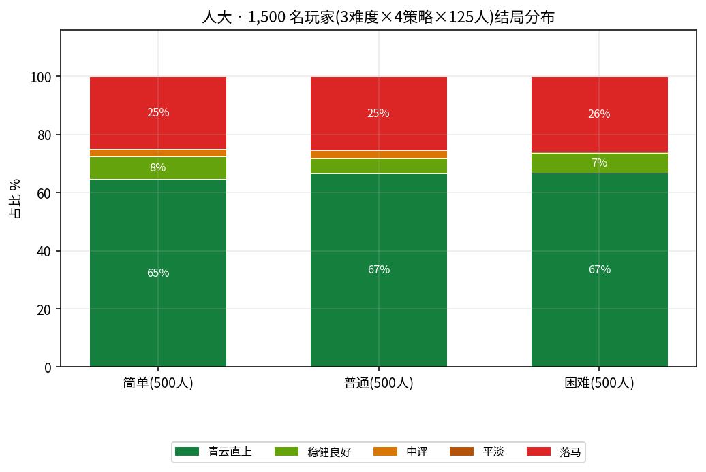

# 📜 人大 · 轨迹 Demo

> 立法权的行使者，是干部晋升路上的重要转折驿站

## 部门速览

| 维度 | 评分 | 职级阶梯(起步科员) |
|---|---|---|
| 权力 ★★ | 忙碌 ★★ | 代表 → 委员 → 副主任 → 主任 |
| 晋升 ★★ | 风险 ★ | 终点:主任 |

| 职级 | 对应岗位 |
|---|---|
| 代表 | 人大代表（无行政级别） |
| 委员 | 人大专门委员会委员/法制委委员（副处级/正科级） |
| 副主任 | 人大常委会副主任（副厅级/正处级） |
| 主任 | 人大常委会主任（正厅级/副部级） |

## 好好玩家(简单难度 · playerIdx 0)



- **结局**:青云直上(GREAT)·「光荣退休 — 主任」
- **终职级**:主任(晋升 3 次)
- **结算评语**:你的官途，是一首质朴的诗。

政治嗅觉 100 | 执行力 100 | 人脉 100 | 廉洁度 100

3次晋升，稳步向前。你始终知道，真正的权力不是用来占便宜的，而是用来做事情的。

【官途评语】清廉务实型 · 稳步致远者

<details>
<summary>📈 24 步完整轨迹表(点开)</summary>

| 步 | 年份 | 事件标题 | 所选选项 | 生效效果 | 职级 | 晋升 |
|---:|---:|---|---|---|---|:---:|
| 1 | 2016 | 急件连夜核改报送 | 按惯例请示后再定 | `政+6 执+4 网0 廉+5` | 0 |  |
| 2 | 2017 | 一把手点名调研 | 请办公室主任把关 | `政+4 执+3 网+5 廉+6` | 0 |  |
| 3 | 2018 | 验收现场的购物卡 | 暂缓签署补充材料 | `政+3 执+6 网+4 廉+5` | ↑ 1 委员 | ✔ |
| 4 | 2019 | 两位领导方案之争 | 转交牵头科室办理 | `政+6 执+5 网0 廉+6` | 1 |  |
| 5 | 2020 | 信访群众围堵办公楼 | 公开流程接受监督 | `政+4 执+5 网+3 廉+5` | 1 |  |
| 6 | 2021 | 老科长退休托付 | 如实上报数据口径 | `政+3 执+3 网+5 廉+3` | ↑ 2 副主任 | ✔ |
| 7 | 2022 | 材料改到第七稿 | 按老口径先报后补 | `政+4 执+6 网+6 廉+4` | 2 |  |
| 8 | 2023 | 网络舆情半夜爆了 | 请第三方复核把关 | `政+4 执+4 网+6 廉+4` | 2 |  |
| 9 | 2024 | 空缺的副科长职位 | 建议列入下期议程 | `政+3 执+5 网+5 廉+3` | ↑ 3 主任 | ✔ |
| 10 | 2025 | 审批窗口的老同学 | 分送相关部门会签 | `政+6 执+4 网+4 廉+3` | 3 |  |
| 11 | 2026 | 饭局座次玄机 | 保持低调静观其变 | `政+6 执+5 网+5 廉+3` | 3 |  |
| 12 | 2027 | 检查组明天到 | 把关材料退回补正 | `政+4 执+5 网0 廉+4` | 3 |  |
| 13 | 2028 | 防汛值守第一夜 | 请示上级书面确认 | `政+4 执+5 网+3 廉+5` | 3 |  |
| 14 | 2029 | 会议室的座次牌 | 报送前再核一遍 | `政+6 执+6 网+6 廉+6` | 3 |  |
| 15 | 2030 | 扶贫村的第一周 | 主动说明情况配合调查 | `政+4 执+4 网+4 廉+4` | 3 |  |
| 16 | 2031 | 接待工作的细节 | 移交督查室跟进 | `政+3 执+3 网+6 廉+6` | 3 |  |
| 17 | 2032 | 文件流转的失误 | 按预案启动响应 | `政+4 执+3 网+5 廉+5` | 3 |  |
| 18 | 2033 | 民主生活会的发言 | 逐级签字审批 | `政+5 执+4 网+6 廉+6` | 3 |  |
| 19 | 2034 | 跨部门协调会 | 备案之后再生效 | `政+5 执+5 网+4 廉+6` | 3 |  |
| 20 | 2035 | 年度考核的谈话 | 搁置待新规明确 | `政+5 执+4 网+6 廉+4` | 3 |  |
| 21 | 2036 | 招标现场的质疑 | 请老同志出主意 | `政+3 执+4 网+4 廉+3` | 3 |  |
| 22 | 2037 | 家属院的求助 | 按批次统一处理 | `政+5 执+3 网+6 廉+3` | 3 |  |
| 23 | 2038 | 值班室的不速之客 | 先试点再推开 | `政+3 执+6 网+5 廉+4` | 3 |  |
| 24 | 2039 | 纪检组长突然约谈 | 书面报告最新进展 | `政+3 执+4 网+5 廉+3` | 3 |  |

</details>

**开局样例(第 1 步原文,逐字取自 JSONL)**

> **急件连夜核改报送**(`日常政务`)

*衔接语*:这是你入职后的第一件事。

晚上九点,办公室只剩你一人。一份标注"明早八点前报领导"的急件摆在桌上,数据口径不一致,分管领导电话关机。王建国打来电话催进度,你盯着屏幕,时钟一分一秒走过。

| 选项 | 提示 | 效果(政/执/网/廉) |
|---|---|---|
| A. 逐项核对台账后再报 | 稳妥但费工 | `政+3 执+5 网-3 廉+4` |
| B. 按惯例请示后再定 ←选中 | 程序优先 | `政+6 执+4 网0 廉+5` |
| C. 找老科长打听底细 | 经营关系 | `政+3 执-6 网+5 廉-4` |
| D. 先放一放明天再说 | 省事但有代价 | `政-3 执+3 网0 廉-3` |

**晋升步样例(第 3 步原文,逐字取自 JSONL)**

> **验收现场的购物卡**(`利益诱惑`)

*衔接语*:承接「一把手点名调研」的余波,事情还没完。

项目验收现场,施工方老板张卫东临走时把一个厚信封塞进你口袋:"验收标准弹性大,您多关照。"当晚他又发来城里最好酒店的饭局邀请。

| 选项 | 提示 | 效果(政/执/网/廉) |
|---|---|---|
| A. 当场婉拒并登记报备 | 稳妥但费工 | `政+3 执+4 网-4 廉+7` |
| B. 暂缓签署补充材料 ←选中 | 程序优先 | `政+3 执+6 网+4 廉+5` |
| C. 请同学从中斡旋 | 经营关系 | `政+5 执-3 网+4 廉-8` |
| D. 把责任推给前任 | 省事但有代价 | `政+6 执0 网+3 廉-5` |

## 堕落玩家(普通难度 · playerIdx 1)



- **结局**:落马(BAD)·「落马——双规室里的人生终点」
- **终职级**:副主任(晋升 2 次)
- **结算评语**:你的官途，是一面镜子。

廉洁度只剩 0 分。你选择了那条看似捷径的路，在权力的诱惑面前一次次妥协，终于走到了无法回头的岔路口。

2次晋升，稳步向前，但级别越高，摔得越重。

【官途评语】风险偏好者 · 短视逐利型

<details>
<summary>📈 24 步完整轨迹表(点开)</summary>

| 步 | 年份 | 事件标题 | 所选选项 | 生效效果 | 职级 | 晋升 |
|---:|---:|---|---|---|---|:---:|
| 1 | 2016 | 急件连夜核改报送 | 找老科长打听底细 | `政+3 执-4 网+5 廉-4` | 0 |  |
| 2 | 2017 | 一把手点名调研 | 约分管领导汇报思想 | `政+4 执0 网+5 廉-3` | 0 |  |
| 3 | 2018 | 验收现场的购物卡 | 请同学从中斡旋 | `政+5 执-3 网+4 廉-8` | 0 |  |
| 4 | 2019 | 两位领导方案之争 | 借调研之机表现 | `政+3 执-3 网+5 廉-5` | 0 |  |
| 5 | 2020 | 信访群众围堵办公楼 | 与竞争者私下沟通 | `政-4 执+5 网+4 廉-5` | 0 |  |
| 6 | 2021 | 老科长退休托付 | 找纪检熟人通个气 | `政+4 执+3 网+4 廉-4` | ↑ 1 委员 | ✔ |
| 7 | 2022 | 材料改到第七稿 | 按制度留痕办理 | `政+4 执+4 网+4 廉+3` | 1 |  |
| 8 | 2023 | 网络舆情半夜爆了 | 联合同事签名支持 | `政+4 执0 网+4 廉-4` | 1 |  |
| 9 | 2024 | 空缺的副科长职位 | 向媒体朋友介绍情况 | `政+3 执0 网+5 廉-5` | 1 |  |
| 10 | 2025 | 审批窗口的老同学 | 通过司机了解动向 | `政+4 执0 网+5 廉-6` | 1 |  |
| 11 | 2026 | 饭局座次玄机 | 保持低调静观其变 | `政+6 执+3 网+5 廉+3` | 1 |  |
| 12 | 2027 | 检查组明天到 | 向局长身边人请教 | `政+4 执+3 网+4 廉-5` | ↑ 2 副主任 | ✔ |
| 13 | 2028 | 防汛值守第一夜 | 家宴款待关键人物 | `政0 执+4 网+3 廉-6` | 2 |  |
| 14 | 2029 | 会议室的座次牌 | 顺手帮领导办私事 | `政+4 执0 网+4 廉-6` | 2 |  |
| 15 | 2030 | 扶贫村的第一周 | 结交企业家校友 | `政+5 执+5 网+4 廉-6` | 2 |  |
| 16 | 2031 | 接待工作的细节 | 参加同乡联谊活动 | `政+6 执0 网+4 廉-3` | 2 |  |
| 17 | 2032 | 文件流转的失误 | 借节日送些土特产 | `政+3 执0 网+3 廉-3` | 2 |  |
| 18 | 2033 | 民主生活会的发言 | 透露消息换取人情 | `政+3 执-5 网+4 廉-4` | 2 |  |
| 19 | 2034 | 跨部门协调会 | 多方走动拉支持 | `政+3 执0 网+5 廉-4` | 2 |  |
| 20 | 2035 | 年度考核的谈话 | 请客疏通关系 | `政+3 执0 网+4 廉-3` | 2 |  |
| 21 | 2036 | 招标现场的质疑 | 替熟人打招呼说情 | `政+4 执0 网+4 廉-5` | 2 |  |
| 22 | 2037 | 家属院的求助 | 与对手交换条件 | `政0 执+5 网+3 廉-6` | 2 |  |
| 23 | 2038 | 值班室的不速之客 | 风向未明先观望 | `政+6 执0 网+5 廉-6` | 2 |  |
| 24 | 2039 | 纪检组长突然约谈 | 适度包装自己的政绩 | `政+4 执0 网+3 廉-6` | 2 |  |

</details>

**开局样例(第 1 步原文,逐字取自 JSONL)**

> **急件连夜核改报送**(`日常政务`)

*衔接语*:这是你入职后的第一件事。

晚上九点,办公室只剩你一人。一份标注"明早八点前报领导"的急件摆在桌上,数据口径不一致,分管领导电话关机。王建国打来电话催进度,你盯着屏幕,时钟一分一秒走过。

| 选项 | 提示 | 效果(政/执/网/廉) |
|---|---|---|
| A. 逐项核对台账后再报 | 稳妥但费工 | `政+3 执+5 网-5 廉+4` |
| B. 按惯例请示后再定 | 程序优先 | `政+3 执+6 网0 廉+4` |
| C. 找老科长打听底细 ←选中 | 经营关系 | `政+3 执-4 网+5 廉-4` |
| D. 先放一放明天再说 | 省事但有代价 | `政-3 执+6 网0 廉-3` |

**晋升步样例(第 6 步原文,逐字取自 JSONL)**

> **老科长退休托付**(`人际关系`)

*衔接语*:承接「信访群众围堵办公楼」的余波,事情还没完。

还有三个月退休的赵亚男泡了杯好茶:"我干了二十六年,有些经验和人脉想传给你,不过我那套做法,年轻人可能看不上。"茶香里另有深意。

| 选项 | 提示 | 效果(政/执/网/廉) |
|---|---|---|
| A. 如实上报数据口径 | 稳妥但费工 | `政+3 执+3 网+5 廉+3` |
| B. 书面请示分管领导 | 程序优先 | `政0 执+4 网-5 廉+4` |
| C. 找纪检熟人通个气 ←选中 | 经营关系 | `政+4 执+3 网+4 廉-4` |
| D. 装作不知情回避 | 省事但有代价 | `政-5 执+5 网-4 廉0` |

## 本部门 1,500 人结局与晋升



| 难度 | 人均晋升 |
|---|---:|
| 简单 | 2.75 |
| 普通 | 2.53 |
| 困难 | 2.27 |

## 如何查看原始数据

```bash
# 该部门三难度全部 500 人轨迹(每行=一局)
wc -l data/rollout-traj/renda-{easy,normal,hard}.jsonl
# 精选好好玩家(playerIdx=0,文件已按 playerIdx 排序,第1行即该玩家)
head -1 data/rollout-traj/renda-easy.jsonl | python3 -m json.tool | less
# 本部门聚合统计
node --experimental-sqlite -e "
const {DatabaseSync}=require('node:sqlite');const db=new DatabaseSync('data/rollout.db');
console.log(db.prepare('SELECT difficulty,policy,ending_type,COUNT(*) n,AVG(promotions) p FROM players WHERE dept_id=\'renda\' GROUP BY 1,2,3').all());"
```
