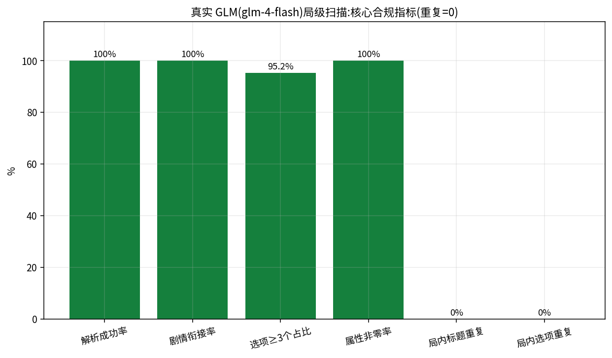

# Phase 1 — 算法/工程大修(dev/v2-overhaul,20 commits + merge f0d9847)

> 时间:2026-08-21 01:32 – 09:02(约 7.5 小时)· 基线:`2596870`(v1 单文件架构)
> 产出:全新引擎/前端/后端模块化架构 + 127 个测试 + 真实浏览器 E2E + 压测 0 错误
> + **真实 GLM(glm-4-flash)三轮 29 局全流程扫描收敛到全指标达标**

## 目录

- [阶段目标:六大诉求 → 修复映射](#goals)
- [阶段成果数字](#results)
- [cecbb0f 测试地基](#cecbb0f) / [80bca04 E2E 与晋升死锁](#80bca04) / [343b952 压测三缺陷](#343b952)
- [83ebda7 风控防护与扫描脚本](#83ebda7) / [ec6bfbb–ee120d0 解析器三连修](#parsers)
- [6f5061b / 9354bf0 / 37687b1 reviewer 三轮安全与质量](#reviewer)
- [bf330c3–431d673 重复文案根因链五连修](#dedup)
- [f13d8f8 reviewer 第三轮去重硬保证](#f13d8f8)
- [cc70ac1 / 82e4bad / 65057fe 三轮真实 GLM 扫描](#scans)
- [8934a52 reviewer 3b 阻断项](#8934a52) / [f0d9847 合入 main](#f0d9847)
- [如何验证本章](#verify)

> 注:本章各节按主题分组呈现;严格时间序以 `git log --oneline --reverse 2596870..f0d9847` 为准(如 reviewer 一轮 6f5061b 实际落在解析器修复 dc68ca7 与 ee120d0 之间)。

<a id="goals"></a>
## 阶段目标:六大诉求 → 修复映射

用户在需求(/goal)中提出六大诉求,Phase 1 的全部工作围绕它们展开:

| # | 用户诉求 | 主要落地 | 最终验证结果(真实 GLM 终扫) |
|---|---|---|---|
| 1 | 故事衔接 | `storyMemory.ts`(NPC 名册延续/淘汰)、`promptBuilder.ts` 剧情衔接字段、`rag.ts` | 剧情衔接覆盖 **100%**,NPC 名册复用率 94.8% |
| 2 | 文案不重复 | `dedup.ts` 去重管线;bf330c3 套话根治、eb5c430/c837bea/456aded 口径校准、f13d8f8/8934a52 兜底硬保证、82e4bad 池截断 | 局内标题重复 **0**、选项重复 **0**(17→3→0)、泛化套话标题 **0** |
| 3 | 属性变化真实生效 | `effects.ts`:每选项 ≥1 非零效果、amplify 幅度放大、boost 循环注入 | 属性非零效果率 **100%**(1207/1207 与 737/737) |
| 4 | 职级事实正确 | `rankRules.ts`(8 组修正/误伤用例)、`departments.ts` 13 部门星级表、引擎自动修正 | 职级错误残留 **0**(且源头 0 错误) |
| 5 | 晋升体验 | `promotion.ts` 绩效点/成本/考核节奏/廉洁门槛(INTEGRITY_GATE);80bca04 修晋升死锁 | 每局晋升 good 均值 3.6 次 / random 2.8 次 |
| 6 | 结局评级 | `ending.ts` 五档结局;cecbb0f 修复 MID2 在 normal/hard 数学不可达 | 8/8 局合法结局(GREAT 7 / GOOD 1;bad 策略由单测覆盖) |

<a id="results"></a>
## 阶段成果数字

| 维度 | 数字 | 来源 |
|---|---|---|
| commit | 20 个功能 commit + 1 个 merge(81 文件,+34,864/−3,909 行) | `git diff 2596870 f0d9847 --shortstat` |
| 自动化测试 | vitest 91 → **127**(单元+集成),typecheck 三配置 0 错,build 绿 | 各 commit message |
| E2E | Playwright(Firefox 真实浏览器)全流程 **3/3** | 80bca04 / f0d9847 |
| 压测 | autocannon 8 worker,4 场景全 **0 错误**;静态首页约 23,700 rps | docs/loadtest-report.md |
| 真实 GLM 扫描 | 三轮 **29 局**(13 初扫 → 8 确认 → 8 终验),约 1300 次上游调用 | docs/diversity-report.md |
| 选项重复收敛 | 17 → 3 → **0**;标题重复、套话标题全程 0 | data/final-*-scan*.json |
| reviewer 审核 | 五轮对抗(1→2/2b→3→3b→3c),P1/P2 全部 PoC 验证后修复,3c 终审 APPROVE | f0d9847 merge message |

---

<a id="cecbb0f"></a>
## cecbb0f 测试地基:vitest 91 用例 + 3 个被测试暴露的引擎缺陷

**动机**。v1 是 3429 行单文件 `index.html` 架构,六大算法诉求无法量化验收。本 commit 一边把系统重构为模块化架构,一边用测试把用户的每条诉求变成可执行的断言。

**改动**(64 文件,+16,486/−3,848):

- 旧版整体移入 `legacy/`(`index-v1.html`、`server-v1.js`、`middleware-v1.js`);
- 新引擎 `src/engine/` 16 个模块:`types/departments/rankRules/effects/promotion/ending/storyMemory/dedup/parser/promptBuilder/rag/llm/rng/gameEngine`;
- 服务端拆为 `server/{app,db,index,llm,mockLLM,static,tracker,adminPage}.js`;前端改为 React 组件树(`src/components/`、`src/hooks/useGame.ts`);
- `tests/unit + tests/integration` 共 **91 用例**:13 部门星级表逐项匹配用户校准值、8 组职级修正/误伤用例(如"县住建局办公室主任=正科级"→股级)、100 组随机输入验证每选项 ≥1 非零属性且 ≥2 正向选项、24 步好/坏玩家全流程(好玩家 ≥3 次晋升+优结局、坏玩家 BAD 结局)、引擎纯函数性、路径穿越/CORS 等服务端集成。

**验证** = 测试本身,并当场暴露 3 个真实缺陷,同 commit 修复:

| 缺陷 | 现象 | 修复 |
|---|---|---|
| parser 效果串不接受 `+5` | 提示词示例即用 `+` 号,正则漏匹配 | 正则补 `[+]` |
| dedup 纯 bigram 对短标题不敏感 | 标题改 2 字相似度仅 0.33,漏检近重复 | 掺入字符重叠系数 `inter/min(len)` |
| ending 的 MID2 档不可达 | normal/hard 下落马阈值 65 与 MID 门槛 35 恰好互斥 | 落马阈值调整为 75 |

另修:effects 的 boost 单次 +4~7 盖不住大负值导致"≥2 正向选项"失守 → 循环注入直到净和真正转正。

---

<a id="80bca04"></a>
## 80bca04 E2E:Playwright 真实浏览器全流程 + 晋升庆祝死锁(严重)

**动机**。单测/集成测都跑在 Node 里,覆盖不了真实 DOM 交互;需要真浏览器完整打一局来验证玩法闭环。

**改动**:`e2e/game.spec.ts`(170 行)+ `playwright.config.ts`(Firefox、mock LLM、独立端口/DB、可反复运行);`scripts/repro-e2e-stall.mts` 死锁复现脚本。E2E 首跑即暴露 4 个缺陷:

1. **晋升庆祝死锁(严重)**:`lastPromotion` 派生自 `feedback?.promoted`,而庆祝弹层只在 toast(feedback)消失后才渲染 → 两个条件互斥,**每次晋升必然卡死**。改为独立的 `lastPromotion` state,与 toast 生命周期解耦;
2. 双计分漏洞:晋升等待期间旧事件按钮恢复可点,可对同一事件重复 `applyChoice` → 增加 `answeredEventRef` 守卫;
3. 错误分支不可达:`currentEvent` 存在时 error 分支永不渲染 → error 优先于过期事件;
4. mock 标题库仅 6 套模板导致局内标题重复 → 30 标题按步索引,一局内唯一。

**验证**:E2E 完整通关——13 部门选择 → 打字机背景 → 24 步抉择 → 3 次晋升庆祝 → 结局屏 → 时间线 → 轨迹入库,全程截图取证;另覆盖 admin 仪表盘/healthz/llm-proxy 契约。

---

<a id="343b952"></a>
## 343b952 压测发现的 3 个服务端缺陷

**动机**。autocannon 压测(8 worker 集群)暴露三个只在并发/长连接下出现的缺陷,单机功能测试完全测不到。

**改动与根因**(`server/db.js`、`server/index.js`、`server/app.js`、`scripts/loadtest.mjs`):

| 缺陷 | 现象 | 修复 |
|---|---|---|
| 多 worker 建库竞态 | 8 worker 冷启动刷 `database is locked`,cluster 反复重启 worker | `busy_timeout` 先于 WAL 设置;建表/PRAGMA 走退避重试;批量写入改 `BEGIN IMMEDIATE` + 整批重试 |
| 单 socket 请求上限 | 20 连接恰好 20,000 个 2xx 后全部 503(Node 的 `maxRequestsPerSocket=1000` 自动回复,服务端日志无痕迹) | 上限设 0(不限制) |
| 提前响应未排空请求体 | 429 在读体前返回,Node 销毁 keep-alive socket,同连接后续请求全挂(500 并发下 1,800 错误) | `early()` 辅助函数:提前返回统一先 `req.resume()` |

另:访问日志只记页面/API,静态资源与探活不入库(首轮压测单场 66 万行写放大)。

**验证**:4 场景全 0 错误(docs/loadtest-report.md):S1 静态首页 473,418 请求 / p99 17ms;S2 三件套 147,308 / 57ms;S3 用户 API 流水线 8,435(p99 18.1s 为 LLM 并发闸门的有意背压);S4 500 并发脉冲 19,152 / 297ms;全程 526,793 条访问落库,无 worker 崩溃。

---

<a id="83ebda7"></a>
## 83ebda7 GLM 内容风控(1301)双级防护 + 多样性验证脚本

**动机**。接真实 GLM 后发现内容风控(error 1301 / contentFilter)会拦截生成:实测未加防护时**第 13 步即被拦截中断整局**。同时需要一条走生产路径的多样性量化扫描工具。

**改动**:`src/engine/promptBuilder.ts` 事件/背景提示词增加廉洁教育基调说明;`server/llm.js` 识别 1301 后以正面基调追加说明重试一次原上游,再进常规故障切换;新增 `scripts/diversity-scan.mts`(320 行)——起真实服务、LLM=real,跑完整对局,量化衔接率/标题与选项重复/属性变化率/职级错误/晋升分布/解析失败率。

**验证**:此后三轮真实扫描 `providerErrorEvents=0`(13 局终扫 JSON 可查),风控不再中断任何一局。

---

<a id="parsers"></a>
## 解析器三连修:ec6bfbb → dc68ca7 → ee120d0

三个 commit 都是**真实 GLM 生产路径实测**暴露的解析层问题,按发现顺序修复:

### ec6bfbb 事件解析失败自动重试(约 7% 格式违规率)

- **动机**:真实 GLM 约 7% 的输出违反格式约定,旧引擎直接冒泡 → 整局中断。
- **改动**:`gameEngine.ts` parseEvent 抛错时携带格式纠错说明重试(MAX_ATTEMPTS 2→3,重试温度降至 0.6 提高格式遵从率);重试提示词由"被判重复"泛化为"未通过系统校验"。
- **验证**:新增 2 个回归测试(损坏两次后恢复 / 连续损坏仍如实抛错);13 局终扫解析成功率 100%。

### dc68ca7 键名变体容错(选项 A/全角Ａ)+ 错误附内容摘录

- **动机**:真实 GLM 偶发键名带空格或全角("选项 A"、"选项Ａ"),旧解析器读不到 → "0 选项"假失败。
- **改动**:`parser.ts` `normalizeKey` 去空白并全角转半角;解析错误携带内容开头 60 字(拒答/跑题/截断可辨);附诊断脚本 `scripts/diag-raw-llm.mts`。
- **验证**:键名变体与摘录断言测试。

### ee120d0 容忍选项正文为空的真实样本

- **动机**:生产路径实测抓到确定性失败样本——风控(1301)触发服务端安全重试后,模型输出的【选项A】**正文为空**、实际内容写在【选项A提示】里;旧解析器跳过空正文选项 → 0 个选项 → 整局中断。
- **改动**:正文缺失时回退用提示文字作为选项文案(hint 置空防重复);该真实样本固化为回归测试;附 `scripts/diag-catch-fail.mts`。
- **验证**:回归测试(真实失败样本原文入测试)。

---

<a id="reviewer"></a>
## reviewer 三轮安全与质量:6f5061b → 9354bf0 → 37687b1

reviewer 以对抗立场审核代码,共五轮(1→2/2b→3→3b→3c);前两轮的安全问题在这三个 commit 修复,每个问题都有 PoC 验证。

### 6f5061b 第一轮 P1 全修复(97 用例)

- **admin XSS 双防线**:`/api/stats` 字符串全部 `esc()` 转义 + endingClass 白名单;tracker 对玩家可控字段截断(64/200 字);
- **伪造 XFF**:`X-Forwarded-For` 仅在 `TRUST_PROXY=1` 时采信,默认用 `socket.remoteAddress`,限流与 IP 计数不可被伪造头绕过;
- **路径前缀穿越**:前缀校验补 `path.sep`,兄弟目录(`distX`)不再放行;`decodeURIComponent` 异常按不存在处理;
- **跨事件选项去重**:新增 `usedChoiceTexts` 滚动池(60 条)+ `checkEventFreshness` 比对 + 提示词注入近期已用选项(诉求 2 的选项维度);
- **TS strict**:三份 tsconfig 全开,修复测试中 3 处真实类型错。
- 顺带 P2:RAG 参考段落改名"仅风格参考"防职级虚高误导、effects 填充幅度下限 3、`applyChoice` 加 ended 守卫、穿越测试改用原始套接字直发(undici 会客户端归一化,测不到真实攻击面)。

### 9354bf0 第二轮 P2 修复(100 用例)

- **静态服务禁回退仓库根**:`dist` 缺失时一律 503——此前 `GET /.env`、`/server/app.js`、SQLite 数据库文件**全部可被读走**;
- **XFF 取最右侧**:反代追加模式下最右才是真实直连地址,取最左可被客户端伪造首段无限轮换限流桶(附 200,200,200,429,429 伪造轮换回归测试);
- 非法请求行 400 路径也走 `early()` 排空请求体;结局文案查表加 `Object.hasOwn` 防原型链;parser 补小写 a-d 键名变体;playwright webServer 先 build 不依赖残留 dist。

### 37687b1 真实 README + 防变异掩蔽断言

- README 替换 vite 模板残留:快速开始/环境变量表/架构/验证命令,**明确 `TRUST_PROXY` 只能在可信反代后开启**(reviewer 建议);
- parser 测试小写变体断言 `choices[0].text`:reviewer 用变异测试(删除归一分支)证明旧的数量断言仍通过——数量断言会被"提示回退"掩蔽,文本断言才能防住。

---

<a id="dedup"></a>
## 重复文案根因链五连修:bf330c3 → eb5c430 → c837bea → 456aded → 431d673

这是 Phase 1 最长的一条收敛链:先由 13 局真实扫描暴露系统性问题,再用连续 3 局探针(probe)扫描逐个击破残余。

### bf330c3 套话标题根治(暗流涌动在 9 部门复现 14 次)

- **动机**:13 局真实扫描(312 事件)暴露诉求 2 残留——局内标题重复 37 次(bigram≥0.55 口径 12/13 局命中);泛化四字标题(暗流涌动类)跨 9 部门复现 14 次;dedup 其实检测到了(86% 事件触发重试),但 glm-4-flash 对套话标题有强先验,重试后仍原样放行。
- **改动**(三层):
  1. 供给端:提示词硬性要求标题含具体要素(项目/文件/场合/人名/数字,按步轮换)+ 套话黑名单 + 正反示例;
  2. 校验端:`isGenericTitle` 短标题(≤6 字)命中套话词即判不新鲜;
  3. 兜底端:重试用尽后**绝不原样放行**——标题改写为描述首句具体化摘句,极端同质时叠加类型标签与幕数保证全字符串唯一;雷同选项直接剔除(保底 2 个);
  - 重试温度分流:格式违规收敛 0.6,内容撞车发散 0.95;扫描脚本新增 genericTitleEvents / withinGameTitleDup / withinGameChoiceDup 三个硬指标(全 0 才算过)。
- **验证**:108/108 vitest;后续扫描泛化标题 0。

### eb5c430 去重阈值再校准 + 兜底不放行逐字重复(探针 1)

- **动机**:1 局探针(真实 GLM 24 事件)暴露三个问题——(a) 标题阈值 0.45 过严,同故事线不同事件(连续性系统本就要求围绕同一项目展开)全部误判,18/24 事件被打入兜底改写;(b) 选项阈值 0.7 把正常措辞重叠误判;(c) 致命:兜底剔除后不足 2 个时**整组原样放行**,「将信息上报给领导,请求指示。」逐字重复 3 次照发。
- **改动**:标题阈值 0.45→0.72、选项 0.7→0.8(只拦照抄);兜底改为保留碰撞最轻 2 个、全等重复排最后;解析器剥离混入正文的「选项A：/A./（B）」标签前缀(实测污染去重池);兜底截断优先落标点边界、窗口 16→18。
- **验证**:110/110 vitest。

### c837bea 标题相似度改词组级口径 + 撞车选项点名重试(探针 2)

- **动机**:探针 2 暴露——(a) 字符包含口径把「老城区改造项目会议」判成任何同项目长标题的 1.0 子串,而"围绕同一项目展开"是连续性系统的设计,不是重复;(b) 事件 10 整组选项全是逐字重复,保底 2 个时全是照抄。
- **改动**:标题口径改 **bigram Jaccard**(阈值 0.72→0.55:"暗流涌动 vs 再现"=0.60 仍拦,同弧不同事件≈0.25 放行);`MAX_ATTEMPTS` 3→4,末次重试点名列出撞车选项原文并「严禁原样或微调后再输出」;`findMostSimilar` 按域拆分(标题用 bigram / 选项含字符包含)。
- **验证**:112/112 vitest。

### 456aded 剥离格式模板回声(探针 3)

- **动机**:探针 3 只剩 2 对 ≥0.8 的选项重复,全是「选项文字描述：」「这个选项的提示或暗示:」等格式说明行被 glm-4-flash 原文抄进选项正文,制造假性相似度(语义本不相同)。
- **改动**:`parser.ts` 剥离该类前缀回声。
- **验证**:探针 3 局内指标——标题重复 0/24、泛化 0、属性非零 100%、解析 100%、职级残留 0;112/112 vitest。

### 431d673 mock 选项文案按步供给 24 组互异文案

- **动机**:E2E(用 mock LLM)等待 choice-3 超时——mock 仅 6 套选项文案轮换,第 7 步起重复,被引擎去重管线**正确地**过滤掉第 4 个选项。
- **改动**:`server/mockLLM.js` 新增 `CHOICE_BANK` 每槽 24 条互异文案(效果数值仍从模板轮换,去重只看文案),mock 作为产品契约替身同样保证步步新鲜。

---

<a id="f13d8f8"></a>
## f13d8f8 reviewer 第三轮 P2 全修复:去重兜底的硬保证自验

**动机**。reviewer 第三轮用引擎级 PoC 证明:去重兜底路径存在"无验证放行"的漏洞——凡是"保留/放行"而不是"合成后验池"的分支都可能逐字重复。

**改动**(`src/engine/dedup.ts` 为主,120/120 vitest):

- P2-1 事件内部槽位互抄袭重:LLM 把同一文案写进 A/B 槽时旧逻辑原样放行两张一样的选项卡;
- P2-2 干净选项 <2 的退化输出改为**引擎合成一对互异且与池零碰撞的选项**,不再"保留碰撞最轻 2 个"逐字放行历史重复;
- P2-3 标题兜底候选阶梯逐级自验(非空/非套话/与历史 <0.55),终极候选「第N幕」结构性唯一;无可摘短句时绝不把被封禁的原标题嵌进兜底标题(旧逻辑可放行 0.68 撞车标题);
- P3-4~P3-8:摘句截断认半角标点、两个套话词标题库改名、补全角「A．」标签剥离、泛化 reason 截断 30 字、扫描脚本去按步增量统计。
- 新增 8 个回归测试(每个 PoC 一个),E2E 3/3。

**验证**:该引擎随即进入 8 局确认扫描(见 cc70ac1/82e4bad),选项重复 17 → 3。

---

<a id="scans"></a>
## 三轮真实 GLM 扫描:cc70ac1 → 82e4bad → 65057fe

三轮扫描全部走生产路径(`scripts/diversity-scan.mts`,真实服务 + glm-4-flash),原始 JSON 全部入库,是诉求 1–6 的最终证据链。



### cc70ac1 13 局终扫报告(原始数据入库)

- **改动**:`data/final-scan-13games.json`(7,324 行)+ `docs/diversity-report.md`。13 局 × 24 步,13 部门全覆盖,good/random 混合,312 事件 / 1207 选项 / 574 次 LLM 调用,墙钟 64 分钟。
- **结果**:泛化标题 0、局内标题重复 0、属性非零 100%(1207/1207)、职级残留 0、解析 100%、衔接 100%、NPC 复用 94.2%;晋升 good 均值 3.6 / random 2.8;**遗留 17 次选项重复(1.4%)**,定性为兜底放行的逐字重复与阈值边缘的包含式近似——交由下一轮根治。

### 82e4bad 确认扫描暴露的两处根因(17 → 3)

- **动机**:8 局确认扫描(f13d8f8 引擎)结果 7 通关 + 1 中断(ABORTED),选项重复 17 → 3,残留 3 例与中断均定位出根因:
  1. **去重池 60 条截断**:24 步 × 4 选项 = 96 条,第 15 步起开局文案被挤出池,与早期文案 1.00 全等的照抄查不出来——3 例残留全部撞的是早期文案(实测定位)。修复:池上限提至 200(提示词只读最近 12 条,扩大零成本),附 96 文案零重叠构造回归测试;
  2. **超时语义不可重试**:上游 60s 超时的 AbortError 原消息「This operation was aborted」不含 timeout 字样,扫描端重试正则失配,瞬时超时被当致命错误中断整局。修复:`server/llm.js` 统一改写为「upstream … timeout after Xms」,重试正则补 abort,附 2 例集成测试。
- **验证**:123/123 vitest;该引擎进入终验扫描。

### 65057fe 终验扫描全指标达标(17 → 3 → 0)

- **改动**:`data/final-confirm-scan.json` 入库,报告回填。
- **结果**(8 局 × 24 步,8/8 通关 0 中断 0 上游错误):

| 指标 | 结果 |
|---|---|
| 局内标题重复 / 泛化套话 | **0 / 0** |
| 局内选项重复 | **0**(三轮收敛 17→3→0) |
| 属性非零效果 | 100%(737/737) |
| 职级错误残留 / 解析成功率 / 剧情衔接 | 0 / 100% / 100% |
| NPC 名册复用率 | 94.8% |
| 延迟 p50/p95 | 28s / 82s |
| 结局 | GREAT 7 / GOOD 1(bad 策略 BAD 结局由单测覆盖) |

三轮合计 29 局(各轮 totalEvents:312 / 184 / 192,直接读 JSON 可复验;docs/diversity-report.md 总述 696 事件、约 1300 次上游调用)。

---

<a id="8934a52"></a>
## 8934a52 reviewer 3b 阻断项:合成选项逐级验池(骨架轮换)

**动机**。reviewer 3b 以引擎级 PoC ×3 阻断合入:82e4bad 之前修复的"引擎合成一对互异选项"只做互检、**从不与历史池比对**——池中有「暂缓观察留待」时,「暂缓观察留待第6幕再议(…)」1.00 全等照放;连续退化事件同标签风味下 0.93 撞车。

**改动**(`src/engine/dedup.ts`):合成选项与标题兜底同款的候选阶梯——每槽 4 候选(3 个风味骨架 + 1 个无风味保底),候选须**同时**通过与历史池、与本事件已选文案的 <0.8 验证;风味词本身撞池即弃用;全部候选撞池的极端对抗下取碰撞最轻者,不无验证硬放。P3:标题终极兜底「第N幕」也过 acceptable(历史出现逐字第N幕时用后缀变体);「（事件描述缺失）」占位符不再成为玩家可见标题。

**验证**:新增 4 个回归测试(含连续退化事件序列);127/127 vitest;typecheck/build 绿。

---

<a id="f0d9847"></a>
## f0d9847 合入 main:Phase 1 收口

merge commit(父母 2596870 + 8934a52),`git diff 2596870 f0d9847 --shortstat` = **81 文件,+34,864/−3,909**。合入时质量关卡(merge message 记载):

- vitest **127/127**(单元+集成),typecheck 三配置零错误,build 绿;
- Playwright E2E **3/3**(Firefox 真实浏览器全流程);
- autocannon 压测 500 并发 0 错误(8 worker);
- reviewer 五轮对抗审核(1→2/2b→3→3b→3c),全部 P1/P2 经 PoC 验证修复,3c 终审 APPROVE;
- 真实 GLM 终验扫描 8 局 × 24 步全指标达标(docs/diversity-report.md)。


> 图:引擎 `effects.ts` 的 amplify 机制(幅度 <3 放大到 3–6 同号)产出的效果分布——负值槽位(D 槽"省事但有代价")与正值槽位分离清晰,是诉求 3"属性变化真实生效"的供给面证据。该机制在 Phase 2 的 27e8c08 中还会被审计抓出一次语义倒挂。

---

<a id="verify"></a>
## 如何验证本章

```bash
# Phase 1 全部 commit(20 个 + merge)
git log --oneline --reverse 2596870..f0d9847

# 单个 commit 的动机与改动清单
git show cecbb0f            # 完整 commit message + diff
git show bf330c3 --stat     # 只看文件清单
git show f0d9847 --stat     # merge 的全量改动(81 文件)

# 合入时的整体差异
git diff 2596870 f0d9847 --shortstat

# 真实 GLM 三轮扫描原始数据(指标见各 JSON 的 summary 字段)
python3 -c "import json;print(json.load(open('data/final-scan-13games.json'))['summary'])"
python3 -c "import json;print(json.load(open('data/confirm-scan-8games.json'))['summary'])"
python3 -c "import json;print(json.load(open('data/final-confirm-scan.json'))['summary'])"

# 重跑质量关卡(工作区即终态代码)
npm run typecheck && npx vitest run && npx playwright test

# 重跑 Phase 1 口径压测(docs/loadtest-report.md)
npm run build && DURATION=20 npm run loadtest
```

结论性报告:[docs/diversity-report.md](../diversity-report.md)(多样性)、[docs/loadtest-report.md](../loadtest-report.md)(Phase 1 口径压测)。下一阶段:[phase-2.md](phase-2.md)。
