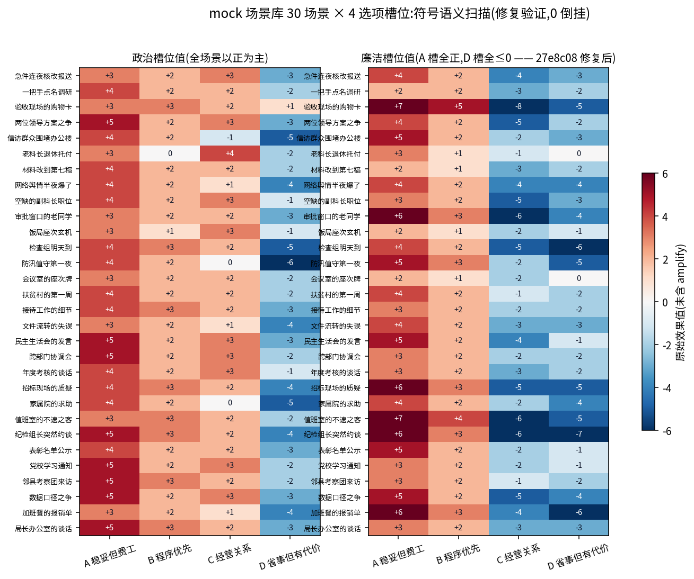
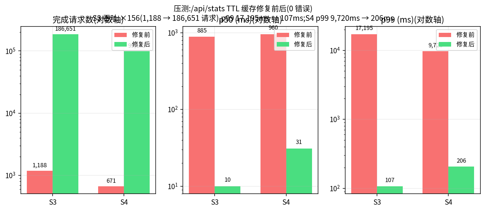

# Phase 2 — 19,500 玩家大规模用户测试(feat/mass-rollout,11 commits + merge e4fa8f5)

> 时间:2026-08-21 10:15 – 14:50 · 基线:`f0d9847`(Phase 1 合入点)
> 产出:19,500 名模拟玩家走生产 HTTP 路径完整通关 + 双重独立复核(drift=0)
> + 39 个审计 subagent 全 PASS + 压测容量缺陷修复(S3 p99 17.2s→107ms)

## 目录

- [阶段规模与结果](#scale)
- [测试方法与 mock 的诚实边界](#method)
- [ea7c17d rollout 系统](#ea7c17d) / [5e5ddce 夹取边界与独立复核](#5e5ddce) / [539250b 审计模板](#539250b)
- [6015d2e 审计返工 #1:30 场景单元](#6015d2e) / [34dec68 行序陷阱](#34dec68) / [27e8c08 审计返工 #2:D 槽倒挂](#27e8c08)
- [9007585 最终报告与 39 审计](#9007585) / [17e764f TTL 缓存](#17e764f) / [62d805b 全量 gate](#62d805b)
- [a382d8e / 318fffc 评审收尾](#review) / [e4fa8f5 合入 main](#e4fa8f5)
- [如何验证本章](#verify)

<a id="scale"></a>
## 阶段规模与结果

| 维度 | 数字 | 来源 |
|---|---|---|
| 玩家 | **19,500** = 13 部门 × 3 难度 × 500 人,每组合 good/bad/random/mixed 各 125 | data/rollout.db(players 表实测 19,500) |
| 完整对局 | **19,500/19,500**(24 步全通关),meets_requirements 全 1 | 同上 |
| 步数 / 选项卡 | 468,000 步 / 187.2 万张选项卡 | 同上(steps 表实测 468,000) |
| 六大诉求违例 | **11 项违规计数全 0**(driver 与 recheck 双口径,漂移 0) | data/rollout-summary.json |
| 独立复核 | rollout-recheck 从原始 JSONL 轨迹全量重算,driftBetweenDriverAndRecheck = 0 | 同上 |
| 审计 | 39 个 subagent(每组合一个)**全 PASS**;624 人逐字深读 / 14,976 步全文 / 0 违例 | data/rollout-audit-summary.json |
| 晋升 | 55,880 个晋升步(占 468,000 步的 11.95%) | DB 实测 SUM(promotions)=55,880 |
| 服务器侧 | 994,501 visits / 19,501 独立 IP / HTTP 4xx、5xx = 0 / 峰值 32,383 rpm | data/rollout-server.db 实测 |
| llm-proxy | 487,500 次调用(19,500 局 × 25 次),0 解析错误 | docs/rollout-report.md |
| 全量重跑 | **3 次**(v1 → v2 → v3,两轮审计返工各触发一次) | 6015d2e / 27e8c08 |
| 压测 | S1–S4 全 0 错误;S3 吞吐 156 倍修复(1,188 → 186,651 请求) | data/loadtest-report.json |
| 单局耗时 | 平均 6.3s;全量 rollout 实测 1,962s ≈ 33 分钟 | docs/rollout-report.md |


> 图(诉求 5/6 宏观证据):好好玩家全 GREAT(4,875/4,875);堕落玩家落马率 100%(bad 策略持续压廉洁,`(100−廉洁)×难度系数` 任意难度都 ≥75);random 玩家落马 easy 0 → normal 11 → hard 66 人,难度系数真实生效。DB 实测结局分布:GREAT 13,008 / GOOD 1,212 / MID 325 / MID2 3 / BAD 4,952。

<a id="method"></a>
## 测试方法与 mock 的诚实边界

与真实浏览器玩家**完全同构**(docs/rollout-report.md 方法表):引擎是 `src/engine/` 同一份代码跑在 driver;LLM 走生产 `POST /api/llm-proxy`(含解析/重试/去重全管线);每步 `POST /api/track/start|choice|end` 逐字段对齐 `useGame.ts`;19,500 个互不相同 IP(X-Forwarded-For)+ 5 种 UA + 独立种子。

**唯一简化项是 LLM 上游用 mock**:19,500 局 × ~26 次调用 ≈ 50 万次请求,真实 glm-4-flash 单次 ~20 秒,全量真跑需数月。**文案多样性已在 Phase 1 用真实 GLM 29 局单独验证**(见 [phase-1.md](phase-1.md));因此 Phase 2 审计口径明确规定:**跨玩家**出现相同罐装文案是预期行为,用户要求的是**一局之内**三层(标题/选项/正文)不重复。

---

<a id="ea7c17d"></a>
## ea7c17d 大规模用户模拟 rollout 系统

**动机**。Phase 1 证明了算法在 29 局真 API 扫描下达标,但"几千名真实玩家同时在线"是另一回事:需要验证生产 HTTP 路径在数万并发会话下的正确性与容量。

**改动**(`scripts/mass-rollout.mts`,546 行):

- 每位玩家与浏览器玩家同构:引擎跑在 driver、LLM 走 `/api/llm-proxy`、每步上报 `/api/track/*` 入服务器 DB;
- 19,500 个独立玩家:唯一 IP(X-Forwarded-For + TRUST_PROXY)/ UA / 种子,策略 good/bad/random/mixed 各 125 per 组合;
- 六大诉求随跑随算:衔接缺失/标题重复/选项重复/泛化标题/属性零值/属性未生效/职级残留/非法职级跳变,全部要求 0 违例;
- 产出三层数据:`data/rollout.db`(players+steps)、`data/rollout-traj/*.jsonl` 全量轨迹(39 文件)、`data/rollout-summary.json`。

**验证**:v1 全量跑完后即进入下述复核与审计——复核与审计各自动暴露了真实问题(这正是本阶段的价值)。

---

<a id="5e5ddce"></a>
## 5e5ddce 属性生效判定考虑 0/100 夹取边界 + 独立复核与审计汇总脚本

**动机**。rollout 首跑的 driver 把"属性已顶在 100 再加成"也标成"属性未生效"——属性域是 0..100,顶格后数值不变是数学正常,不是引擎缺陷。commit 记录修复当轮实测 19,500 局中的 539 次标记逐例核查全部为边界饱和;最终报告(docs/rollout-report.md)将初版 driver 该误判类别的总量如实记载为 **4,354 次误报**。

**改动**:

- `mass-rollout.mts`:`attrNotApplied` 只在"本可改变却没变"时计违例;属性数学 `clamp(prev+effect)` 在 81,408 步(含 11,532 晋升步)全量验算 0 偏差;
- 新增 `scripts/rollout-recheck.mts`(170 行):**不信任 driver 运行时计数**,从存储的 JSONL 轨迹独立重算全部六大诉求指标,回写 DB 并重生成汇总(双重复核);
- 新增 `scripts/rollout-audit-collect.mjs`:汇总 39 个 subagent 审计结论入 audits 表;
- `.gitignore` 排除约 800MB 全量轨迹 JSONL(留盘不入库)。

**验证**:recheck 重算 19,500 人,driver 与 recheck 两套口径逐玩家完全一致(drift=0)——该 0 一直保持到最终数据(data/rollout-summary.json 的 `driftBetweenDriverAndRecheck: 0`)。

---

<a id="539250b"></a>
## 539250b 39 个审计 subagent 统一提示词模板

**动机**。19,500 人的正确性不能只靠开发者自证;给每个部门×难度组合派一个**独立审计 subagent**,用统一模板+对抗立场审轨迹。

**改动**(`docs/audit-prompt-template.md`,137 行):39 个审计员共用一个模板,仅替换组合占位符。双层审计设计:

- **(A) 全量机械核验**:500 名玩家全量 SQL 核验(11 项违规计数)+ 30 人独立脚本重算;
- **(B) 逐字深读**:≥15 名玩家 × 24 步全文阅读,结局阈值/职级阶梯/属性数学亲手验算;
- 明确对抗立场:**"你的任务是发现问题,不是背书"**,凡有疑点追查到底;
- 口径说明前置:mock 跨玩家重复豁免、0/100 夹取正常、JSONL 行序陷阱(34dec68 补入)。

**验证**:模板直接催生了下述两次真实返工——审计制度有效。

---

<a id="6015d2e"></a>
## 6015d2e 审计返工 #1:mock 重写为 30 个连贯场景单元(全量重跑 v2)

**动机**。第一轮 39 组合审计深读发现**真实违例(mock 层)**:初版 mock 的正文模板只有 6 套,一局内正文逐字重复 4–13 次;标题与正文独立轮换导致题文错配;衔接语凭空捏造从未登场的人名。机械指标全绿,但"玩家直接阅读的正文层"不合格(2 个组合判 FAIL)——**这正是"机械指标不能替代深读"的实证**。

**改动**(`server/mockLLM.js` 重写,+235/−119):

- `SCENE_BANK` 30 个完整场景单元(tag/标签/标题/正文/格言/人物/效果一体供给),一局 24 步按 `(step-1)%30` 取景 → 局内 24 场景互不相同且题文一致。刻意**不用 prompt 哈希做偏移**——哈希随历史每步变化,24 取 30 必撞车;
- 效果数值绑定槽位语义(A 稳妥正面 / B 程序 / C 关系 / D 消极),杜绝「婉拒报备却扣廉洁」式语义倒挂(这一设计随后在 27e8c08 又被审计抓出残留例外);
- 衔接语只回引 prompt 中真实存在的上一步标题;场景人物在正文中真实出场;
- driver 与 recheck 新增 `descDup` 一等指标(正文相似度 ≥0.8 计违例,必须 0)。

**验证**:全门禁 vitest 127/127、E2E 3/3、typecheck×3、build;**19,500 玩家全量重跑(v2)**。

---

<a id="34dec68"></a>
## 34dec68 审计模板按 playerIdx 取样(行序陷阱)+ recheck 排序回写轨迹

**动机**。审计 subagent 实测发现:JSONL 的**行序是并发完成序,与 playerIdx 无关**——按行号取样会取错玩家、误报"策略错配"(如把 bad 玩家的轨迹当成 good 玩家审计)。

**改动**(`docs/audit-prompt-template.md`、`scripts/rollout-recheck.mts`):

- 模板取样脚本改为按行内 `playerIdx` 字段键控过滤,并在口径说明中显著警告该陷阱;
- 机械核验加入 `desc_dup` 列;
- recheck 完成后按 playerIdx 排序回写全部 39 个轨迹文件(此后行号 == playerIdx,取样陷阱被结构性消除)。

**验证**:39 个审计员此后取样零错位;`data/rollout-traj/*.jsonl` 终态即排序后版本。

---

<a id="27e8c08"></a>
## 27e8c08 审计返工 #2:场景 1/3 的 D 槽廉洁 +1 改为 −2(全量重跑 v3)

**动机**。v2 数据的审计中,**fuban-easy 与 weiban-hard 两个审计 subagent 独立发现**同一处语义倒挂:`SCENE_BANK[1]/[3]` 的 D 槽(省事但有代价,如「睁一只眼闭一只眼」「把责任推给前任」)廉洁**原始值 +1**,被引擎 `amplify()`(幅度 <3 放大到 3–6 同号)放大为 **+3~+6**——语义上应损廉洁的选择反而奖励廉洁 3–6 点。机械指标(非零、生效、符号)全绿,只有逐字深读语义才能抓到。

**改动**(`server/mockLLM.js`,2 行):D 槽廉洁 +1 → **−2**(放大后 −3~−6,与其余 28 个场景的 D 槽符号一致)。

**验证**:

- 对全部 30 场景做槽位符号模式扫描:**0 违例**(A 槽廉洁全正、D 槽全 ≤0,见下图);
- vitest 127/127 通过;
- **19,500 玩家第三次全量重跑(v3)**——保证代码/数据/审计三者一致,本文所有最终数字均出自 v3。



> 图:30 个场景 × 4 个选项槽位的效果符号扫描(左:政治槽位值,右:廉洁槽位值)。27e8c08 修复后廉洁列 A 槽全正、D 槽全 ≤0,无符号倒挂。

---

<a id="9007585"></a>
## 9007585 rollout 最终报告(v3 数据)+ 39 组合审计全部 PASS

**改动**:`docs/rollout-report.md` 终版 + 全部审计证据入库(`data/rollout-audit/` 39 组合 JSON+MD、`data/rollout-audit-summary.json`)。

**结果**(audit-summary 实测:auditedCombos 39 / pass 39 / fail 0 / violations 0 / verdict ALL PASS):

- 每组合双层审计:(A) 全量 500 人 SQL 核验 + 30 人独立脚本重算——29 个组合自发加做了**全量 500 人**从原始 JSONL 的不信任式重算;(B) 16 人 × 24 步逐字深读,合计 **624 人 / 14,976 步全文**;
- 审计员共同确认的抽样证据:衔接引用与真实上一步标题 11,500/11,500 精确一致;全库次高相似度远低于阈值(标题 0.18/阈 0.55,正文 0.40、选项 0.50/阈 0.8);12,000 步 clamp(prev+effect) 数学 0 偏差;晋升 100% 落在考核步且廉洁 <35 被 INTEGRITY_GATE 暂缓(多个组合亲眼验证 bad 玩家晋升被冻结);
- 边界案例全部与引擎阈值一致:廉洁 69 差 1 分判 GOOD、廉洁恰 35 放行、p449 廉洁 34 后晋升戛然而止;
- 审计员遗留 5 条**产品级观察(均判非违例,如实入档)**:衔接语固定模板、选项池偶与场景语义错位、跨玩家叙事流逐字节相同(mock 确定性取景)、easy 下属性顶格/hard 下 MID2 数学不可达等游戏平衡问题、同局 NPC 同名不同身份——建议接真实 GLM 后重点回归。


> 图:13 部门 × 3 难度 39 格全 PASS(每格 = 500 人 SQL 核验 + 16 人逐字深读)。

---

<a id="17e764f"></a>
## 17e764f /api/stats 加 10s TTL 缓存(压测 S3 吞吐 156 倍)

**动机**。合入前压测复测(与 Phase 1 同口径)暴露一处真实容量缺陷:S3 用户流水线每轮以 `GET /api/stats` 收尾,而 `stats()` 要在 visits 表(压测中累积到约 47 万行)上做多组**无索引同步聚合**,`node:sqlite` 同步执行阻塞 worker 事件循环约 1.2s——首测 S3 仅完成 **1,188 个请求(p50 885ms、p99 17.2s)**,而玩家路径本身只有 0.2–0.6ms。

**改动**(`server/tracker.js`):stats 结果加 10s TTL 缓存(管理面板容忍秒级陈旧,`generatedAt` 如实标注;`STATS_TTL_MS` 可调);报告压测表更新为修复后数字并**如实记录该缺陷**。

**验证**(data/loadtest-report.json,127 测试全绿后复测):

| 场景 | 修复前 | 修复后 |
|---|---|---|
| S3 完成请求 | 1,188 | **186,651**(吞吐 156 倍) |
| S3 p50 / p99 | 885ms / 17,195ms | **10ms / 107ms** |
| S4 完成请求 / p99 | — | 99,163 / 206ms |
| 错误 | 0 | **0** |



> 图:S3/S4 场景修复前后吞吐与 p90/p99 对比(对数轴)。残余 max≈2.2s 是每 worker 每 10s 一次的冷聚合(同步 SQLite 无法避免),已不影响 p99。

---

<a id="62d805b"></a>
## 62d805b 报告补记合入前全量 gate + E2E 截图证据入库

**动机**。合入前的质量关卡需要留档可查,不能只写在 commit message 里。

**改动**:`data/e2e-final-results/` 入库 8 张 Playwright 全流程截图(部门选择 → 背景 → 首事件 → 属性 toast → 两次晋升庆祝 → 结局屏 → admin 仪表盘)+ `.last-run.json`;rollout-report 补记 gate:typecheck ✓ / vitest 127/127 ✓ / build ✓(dist 253.90KB,gzip 84.91KB)/ Playwright E2E 3/3 ✓。

---

<a id="review"></a>
## 评审收尾:a382d8e → 318fffc

### a382d8e 评审 P3 四项(127 → 130 用例)

- **P3-1** 报告三处 v2 残留数字改为终版数据(SQL 重验):晋升步 55,880(11.94%)、mixed 99.98%(4,874/4,875)、random 67.7/24.0/8.3;
- **P3-2** 新增 `tests/unit/trackerStatsCache.test.ts`:TTL 缓存命中/过期刷新/`STATS_TTL_MS=0` 三边界(127→130 全绿);
- **P3-3** 脚本幂等:`mass-rollout.mts` 去残留空语句;`audit-collect` 先清空再插入,可重复运行;
- **P3-4** 口径对齐:recheck 的 attrNotApplied 计数单位与 driver 对齐(每步 ≤1 次);报告如实区分"轨迹可重算指标"与"仅运行时计数"(`llm_errors`/`track_failures` 无法从轨迹反推,仅 driver 计数,全量均为 0,服务器侧 994,501 请求 0 错误交叉印证);
- **验证**:重跑 recheck(19,500 人,drift=0,全指标 0 不变)与 collect(39 PASS 幂等)。

### 318fffc 晋升占比 11.94% → 11.95%

评审指正:55,880 / 468,000 = 11.9487…%,四舍五入应为 **11.95%**。一行修正——数字必须精确,哪怕只影响小数点后第三位的舍入方向。

---

<a id="e4fa8f5"></a>
## e4fa8f5 合入 main:Phase 2 收口

merge commit(父母 f0d9847 + 318fffc),`git diff f0d9847 e4fa8f5 --shortstat` = **99 文件,+8,192/−107**。合入时口径(merge message 记载):

- 19,500 玩家走生产 HTTP 路径完整通关;轨迹 JSONL + rollout.db 双入库;recheck 独立重算 **drift=0**;
- 39 个审计 subagent 全量机械核验 + 624 人逐字深读,**0 真实违例**;
- 审计驱动两轮真实返工(desc 模板重写 / D 槽廉洁倒挂修复)后第三次全量重跑;
- /api/stats TTL 缓存修复压测容量缺陷(S3 p99 17.2s → 107ms);
- reviewer 两轮审核 APPROVE + CONFIRM;gate:typecheck / vitest 130 / build / E2E 全绿。

---

<a id="verify"></a>
## 如何验证本章

```bash
# Phase 2 全部 commit(11 个 + merge)
git log --oneline --reverse f0d9847..e4fa8f5

# 单个 commit
git show 6015d2e --stat        # mock 重写 30 场景单元
git show 27e8c08               # D 槽廉洁 +1 → −2 的 2 行 diff
git show e4fa8f5 --stat        # merge 全量(99 文件)

# 直接查最终数据库(所有汇总数字的一手来源)
node --experimental-sqlite -e "
const {DatabaseSync}=require('node:sqlite');
const db=new DatabaseSync('data/rollout.db');
console.log(db.prepare('SELECT COUNT(*) players, SUM(meets_requirements) meets FROM players').get());
console.log(db.prepare('SELECT SUM(promotions) promo FROM players').get());
console.log(db.prepare('SELECT ending_type, COUNT(*) c FROM players GROUP BY ending_type').all());
console.log(db.prepare('SELECT SUM(continuity_missing)+SUM(title_dup)+SUM(choice_dup)+SUM(desc_dup)+SUM(generic_titles)+SUM(attr_zero_offered)+SUM(attr_not_applied)+SUM(rank_residual)+SUM(illegal_rank_change)+SUM(llm_errors)+SUM(track_failures) violations FROM players').get());"

# 服务器侧留存库(生产路径入库)
node --experimental-sqlite -e "
const {DatabaseSync}=require('node:sqlite');
const db=new DatabaseSync('data/rollout-server.db');
console.log(db.prepare('SELECT COUNT(*) visits, COUNT(DISTINCT ip) ips FROM visits').get());
console.log(db.prepare('SELECT COUNT(*) s, SUM(ended) ended FROM sessions').get());"

# 独立复核与审计汇总
python3 -c "import json;s=json.load(open('data/rollout-summary.json'));print(s['meetsRate'],s['driftBetweenDriverAndRecheck'])"
python3 -c "import json;print(json.load(open('data/rollout-audit-summary.json'))['verdict'])"

# 重跑(工作区即终态代码)
NODE_OPTIONS=--experimental-sqlite npx tsx scripts/rollout-recheck.mts   # 独立复核
NODE_OPTIONS=--experimental-sqlite node scripts/rollout-audit-collect.mjs
npm run build && npm run loadtest                                          # 压测
```

结论性报告:[docs/rollout-report.md](../rollout-report.md)。上一阶段:[phase-1.md](phase-1.md)。
