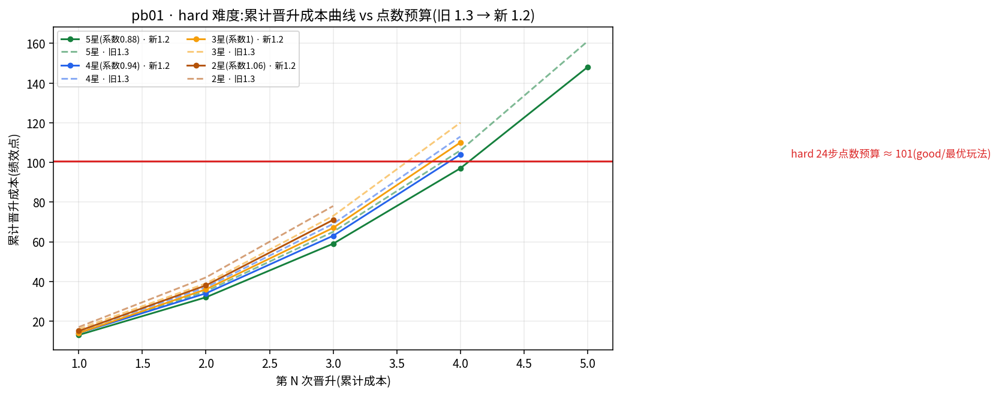

# Phase 3 — 全套文档 + 前端官职显示 + E4 晋升平衡调优(docs/full-docs / feat/rank-position-ui / feat/promotion-balance,合入 c6e6ddf)

> 时间:2026-08-21 晚 – 2026-08-23 · 基线:`e4fa8f5`(Phase 2 合入点)
> 产出:三条线——①全套开发文档与「活文档」维护制度;②每年界面常驻显示官职与职级;
> ③晋升平衡调优(hard 成本系数 1.3→1.2)+ **19,500 人 v4 全量重跑验证**与定点审计。
> 测试地基:vitest 143 用例全绿(Phase 2 收官 130)+ typecheck + build + Playwright E2E 3/3。

## 目录

- [阶段总览](#scale)
- [146004a 文档基建:latest 活文档与 57 图](#docs)
- [d2654e0 前端官职职级显示](#ui)
- [c6e6ddf E4 晋升平衡调优与 v4 重跑](#e4)
- [如何验证本章](#verify)

<a id="scale"></a>
## 阶段总览

| 维度 | 数字 | 来源 |
|---|---|---|
| 总差异 | 133 文件 +11,943/−83(e4fa8f5 → c6e6ddf) | git diff --shortstat |
| 文档 | 91 文件 +6,367 行:latest 活文档 ×5、13 部门 Demo、实验报告 README、开发史、用户旅程,57 图 | 706d523 |
| 前端 | HUD 双项 + 事件卡徽标 + 晋升/结算官职;组件测试 146 行 + E2E 断言 | be73cb5 |
| 平衡修正 | `DIFFICULTY_FACTOR.hard` 1.3→1.2(+8 行 JSDoc 论证)+ 2 个回归锚点测试 | 755e211 |
| 上界分析 | `scripts/promotion-ceiling.mts`:200 种子 × 39 组合,收入侧预算与成本侧累计逐级对比 | 755e211 |
| v4 重跑 | **19,500/19,500** 通关,11 项违规/错误计数全 0,driver/recheck 漂移 0,1,942s | data/rollout-summary.json |
| 隔离证明 | easy/normal 26 组合终局分布**逐组合零变化**;13 个 hard 组合全部变化;结局分布 v3=v4 完全相同 | §7.2 复核 SQL |
| hard 晋升 | good 2.923→3.156 / mixed 2.802→2.896 / random 2.164→2.383 / bad 0.997→0.999;全体 2.221→2.359 | DB 实测 |
| 4 次晋升者 | 0 人 → **386 人**(weiban/zuzhiB/jiwei hard good 精确 4.000) | DB 实测 |
| 总晋升步 | 55,880(11.95%)→ 56,772(12.13%) | DB 实测 |
| 服务器侧 | 994,501 visits / 19,501 独立 IP / 非 200 = 0 / 峰值 32,029 rpm | data/rollout-server.db |
| 定点审计 | 3 组合(委办/组织部/发改委 hard)全 PASS,48 人逐字深读 0 违例 | data/rollout-audit-v4/summary.json |
| 评审 | 两轮共 10 项修正(UI 4 项 + 平衡 6 项,全部 P3/P4 文档与注释级) | e7d16e3 / 5b1e1c9 |



> 图(E4 的核心证据):hard 难度 24 步最优收入预算 ≈101(种子间 97.5–104,收入侧涌现属性);
> 1.3 时代五星部门前四级累计成本 106 **高于任何种子的收入上限**,完美发挥也拿不到第 4 次晋升;
> 1.2 后五星 97 ≤ 预算,四星 104 / 三星 110 保留星级分层——「五星保底通道、四星留好种子窗口、三星三次封顶」。

<a id="docs"></a>
## 146004a 文档基建:latest 活文档与 57 图

Phase 2 收官后,仓库代码与数据已经齐备,但文档只有零散报告。`docs/full-docs` 分支一次补齐
(706d523,91 文件 +6,367 行)并经一轮评审修正(6d2adf4,五项:峰值 32,285 笔误→32,235、
压测落库双口径、行号漂移、pyc 出库、219/500 精确口径),`--no-ff` 合入为 `146004a`:

- **`docs/latest/` 活文档五篇**(overview / engine / server / frontend / data-assets):
  当前最新设计的唯一权威来源,**改代码必须同 commit 同步**,文中行号锚点直接指向源码。
- **13 部门轨迹 Demo**(`docs/demos/`):每部门 2 名玩家全景展示 + 24 步轨迹表 + 1,500 人统计。
- **三份实验报告**(E1 19,500 玩家 rollout / E2 真 GLM 多样性 / E3 压测)+ 实验总索引。
- **开发史**(phase-1/phase-2)与**用户旅程**(E2E 全程截图 walkthrough)。
- **57 张图**全部由 `scripts/docs-gen/` 脚本从 `data/` 原始数据生成,可复算、可再生成;
  依赖的 /tmp 中间产物(/tmp/guantu-depts.json 等)此后改为**自愈式导出**。

这一步确立了本仓库的文档制度(详见 docs/README.md 文末维护规则),Phase 3 后续两条线的
每次代码改动都遵守「同 commit 同步 latest 活文档」。

<a id="ui"></a>
## d2654e0 前端官职职级显示(feat/rank-position-ui)

用户诉求:每年界面(游戏中主屏)应常驻显示当前官职与职级,此前玩家只能靠记忆或结算页才知道自己升到了哪级。

- **a5f8c43** 前置修复:事件卡入场动画导致内容**永久透明**的旧 bug(动画 opacity 未回落)。
- **be73cb5** 主体:HUD 常驻双项(官职名 + 职级「第 N 年 · M 级」)、事件卡右上角职级徽标、
  晋升庆祝浮层与结算页补官职;`src/engine/departments.ts` 增加统一的官职取值出口,
  组件测试 `tests/unit/ui/rankDisplay.test.tsx`(146 行)与 departments 单测、E2E 断言同步加入,
  E2E 全套截图重拍入库。
- **e7d16e3** 评审修正四项(删「与 rankRules 同源」失实声称、基线改 a5f8c43、修反引号、
  移动端官职全名换行)。
- **d2654e0** `--no-ff` 合入 main(27 文件 +296/−23)。

<a id="e4"></a>
## c6e6ddf E4 晋升平衡调优与 19,500 人 v4 重跑(feat/promotion-balance)

### 起点与诊断(755e211)

用户观察「有的情况下十分难以晋升」。对 Phase 2 的 v3 库(`data/rollout.db`,19,500 人)做
全量 SQL 分析(结论归档 `data/promo-balance/old-sql-summary.md` + `old-dist-by-combo.csv`):

- hard 下 good 玩家在 12 个 L≥4 部门**精确 3.00 次**(125 人/格零偏差),
  **rank≥4 计数全库为 0**,L5-L7 部门到顶率全部 0%——难度是唯一主导变量,策略近乎失敏;
- 用新脚本 `scripts/promotion-ceiling.mts`(200 种子 × 39 组合,与模拟同源取成本公式)
  把「收入侧预算」与「成本侧累计」逐级对比:**hard 最优预算均值 ≈101(97.5–104)**,
  而 1.3 时代前四级累计成本五星 106 / 四星 113 / 三星 120——五星 106 已**高于收入上限 104**,
  属结构性不可达,不是运气问题。

### 修正与验证闭环

- **修正**:`DIFFICULTY_FACTOR.hard` 1.3→1.2(源码 8 行 JSDoc 论证;`ending.ts` 的落马难度
  系数独立为 1.3,不受影响)。新成本:五星 [13,19,27,38] 累计 97、四星 104、三星 110;
  两个回归锚点测试钉住「97 ≤ 101」与「104 > 101」。
- **v4 全量重跑**(6901ab9):19,500 人再次走生产 HTTP 路径全部通关,11 项违规计数全 0,
  driver/recheck 独立重算漂移 0,1,942s;服务器侧 994,501 visits / 19,501 IP / 非 200 = 0 / 峰值 32,029 rpm。
- **隔离证明**:easy/normal 26 组合终局分布与 v3 **逐组合零变化**(改动只应影响 hard 的直接
  证据);13 个 hard 组合全部按预测方向变化(预测 3.155 vs 实测 3.156);结局分布完全相同
  (GREAT 13,008 / BAD 4,952 / GOOD 1,212 / MID 325 / MID2 3)——晋升节奏变了,结局评级不受扰动。
- **效果**:hard good 2.923→3.156(委办/组织部/纪委精确 4.000,四星部门 3.008-3.016,
  三星 3.000,政协 L3 上限 2.000);rank≥4 从 0 → 386 人;组织部/hard 秩次直方图
  125/77/298/0 → 125/32/217/126(「卡死副处级」的 298 人分流到 126 人到顶+91 人上移);
  全库总晋升步 55,880(11.95%)→ 56,772(12.13%)。
- **定点审计**:v3 的 39 组合审计全量归档不动;v4 只对三个代表性组合(委办=恰好踩线 97、
  组织部=到顶开放、发改委=四星窗口)重审,3/3 PASS、48 人逐字深读 0 违例、每人 500 全量
  晋升重放 0 偏差;其余 36 组合不重审的理由(26 个可证零变化 + 10 个同机制 + recheck 全量
  机械复核)写入实验报告 §7.5。审计产物 `data/rollout-audit-v4/`,采集脚本改为
  `AUDIT_DIR`/`OUT` 环境变量参数化。
- **文档与图**:新增实验报告 `docs/experiments/exp-promotion-balance.md`(§1-9:动机→改前
  分布→上界分析→修正→重跑→隔离→效果→审计→结论)与 promo-balance 四图(pb01-04);
  g02/g10 等 7 张全局图、13 篇部门 Demo、engine/server/data-assets 活文档全部同步 v4 数字。
- **评审**(5b1e1c9):六项修正——engine.md 行号锚点 +7 漂移(源码加 JSDoc 后未随动)、
  demos README v3→v4 标头、「全部 13 部门 3.00」→「12 个 L≥4(政协 L3 上限 2.00)」、
  bad「精确 1.00」→「≈1.00(0.997)」、归档文件清单标注(v3 库已被 v4 覆盖,四个未入库
  分析文件不可再导出,关键数字已抄录)、测试锚点注明预算≈101 属收入侧涌现属性。
- **c6e6ddf** `--no-ff` 合入 main(49 文件 +5,347/−127),合并点全量 gate
  (typecheck ✓ / vitest 143/143 ✓ / build ✓ / E2E 3/3 ✓)。

### 保留的产品级观察(不在本阶段处理)

- 四星部门 hard 拿第 4 次晋升需要「恰好 104」的好种子(发改委 #164 总分恰 104,
  第 24 步余额 41.0 对 41,终局余额 0)——窗口极窄但保留是**设计意图**(星级分层);
- 廉洁门槛 35 的「缓升→回血→补升」完整链路在受审 1,500 人中仅 1 例(委办 random #162),
  概率极低,与 B1 NPC 台账/A1 后果队列一起列入叙事改进储备,不在 E4 动。

<a id="verify"></a>
## 如何验证本章

```bash
git log --oneline --reverse e4fa8f5..c6e6ddf   # 本章全部 commit(含三条线三个 merge)
git diff e4fa8f5 c6e6ddf --shortstat           # 总差异:133 文件

# 平衡修正与锚点
npx vitest run tests/unit/promotion.test.ts    # 两个锚点:97≤101 / 104>101
NODE_OPTIONS=--experimental-sqlite npx tsx scripts/promotion-ceiling.mts 200 \
  && jq '.combos[] | select(.deptId=="zuzhiB" and .difficulty=="hard") | {costs, cumCosts, good_points}' \
     data/promo-balance/ceiling-hard1.2.json

# v4 重跑结果(独立 SQL 复核)
node --experimental-sqlite -e '
const {DatabaseSync}=require("node:sqlite");const db=new DatabaseSync("data/rollout.db");
console.log(db.prepare("SELECT difficulty, policy, AVG(promotions) m FROM players GROUP BY 1,2 ORDER BY 1,3 DESC").all());
console.log(db.prepare("SELECT COUNT(*) n FROM players WHERE promotions>=4").get());'

# 定点审计汇总
AUDIT_DIR=data/rollout-audit-v4 OUT=/tmp/audit-v4.json node scripts/rollout-audit-collect.mjs && cat /tmp/audit-v4.json

# 完整报告与图
open docs/experiments/exp-promotion-balance.md   # E4 全文(§7.5 含 36 组合不重审理由)
```
