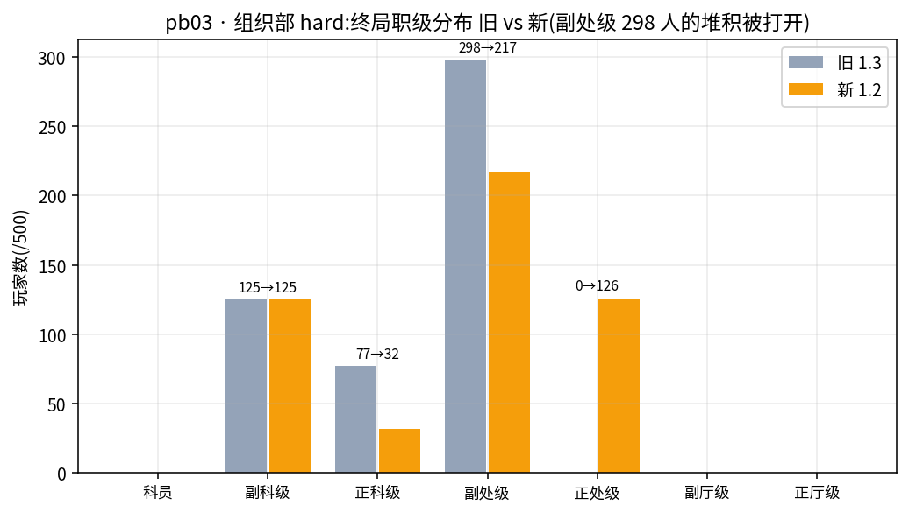
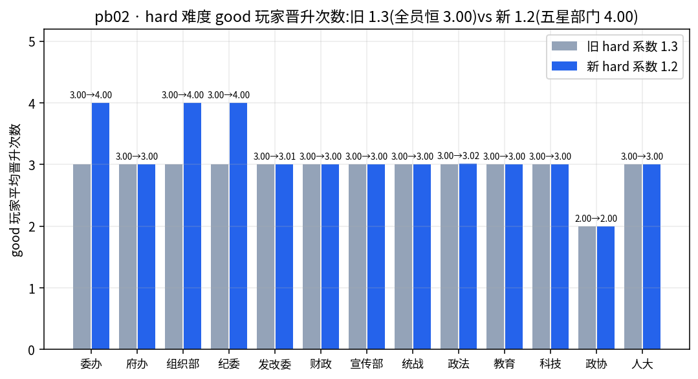
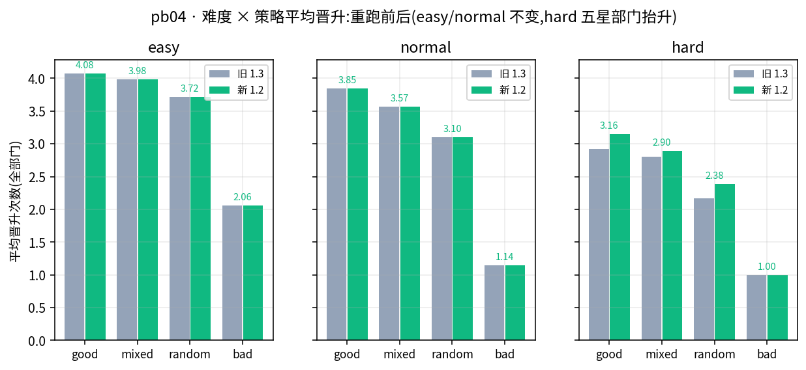

# 实验报告:晋升平衡分析与 hard 难度系数调优(1.3 → 1.2)

> 2026-08-22 · 分支 feat/promotion-balance · 起因:用户观察「有的情况下十分难以晋升」。
> 本文事无巨细:现象 → 数据定位 → 机制推导 → 方案取舍 → 修改 → 全量重跑验证。
> 数据:旧分布 = 重跑前 `data/rollout.db`(系数1.3,v3 数据);新分布 = 重跑后
> `data/rollout.db`(系数1.2,v4 数据)。`data/*.db*` 不入 git,重跑会覆盖旧库,
> 因此旧分布的**部门×难度×策略聚合快照**已作为 CSV 存入 `data/promo-balance/old-dist-by-combo.csv`
> (含 rank0-rank6 终局秩次计数与 good/mixed/random/bad 均值,重跑前对旧库导出)。
> 旧库的原始逐人记录不可再现 —— 本文所有「改前」数字均出自该快照。

## 目录

1. [结论](#1-结论)
2. [现象与数据定位(改前)](#2-现象与数据定位改前)
3. [机制推导:为什么 hard 恒等于 3 次](#3-机制推导为什么-hard-恒等于-3-次)
4. [合理性判定](#4-合理性判定)
5. [方案取舍:为什么是 1.2](#5-方案取舍为什么是-12)
6. [修改内容](#6-修改内容)
7. [全量重跑验证(19,500 人)](#7-全量重跑验证19500-人)
8. [遗留观察(不改,记录在案)](#8-遗留观察不改记录在案)
9. [复现](#9-复现)

## 1. 结论

**「十分难以晋升」属实,且是确定性的机制问题,不是运气**:hard 难度下点数预算
均值 ≈101(上界模拟 100.6,种子方差 ±3,实测上限 104),而所有 ≥5 级阶梯部门的
第 4 次晋升累计成本 ≥106 —— **即使最好种子也差 2 分**,导致 hard 下 good 玩家在
全部 L≥4 部门精确等于 3.00 次(1,500 人零
偏差;政协 L3 阶梯上限本就是 2.00),晋升星级完全失去区分度。将 `promotion.ts`
的 hard 成本系数从 1.3 调
至 **1.2** 后:五星部门(委办/组织部/纪委)good 玩家可达 4.00 次(符合设计期望
「优秀玩家升 4-5 级」),四星及以下仍为 ≈3.00(星级分层恢复;四星存在极少数
好种子的险胜通道,§7.4),bad 玩家仍被廉洁
闸门冻结在 1.00(堕落惩罚不变)。easy/normal 完全不受影响。19,500 人全量重跑验证
六诉求 0 违例。

## 2. 现象与数据定位(改前)

### 2.1 阶梯事实(以 departments.ts 为准,逐部门核对)

13 部门职级阶梯长度:L7=组织部;L6=委办/纪委/发改委/政法;L5=府办/财政/宣传部/科技;
L4=统战/教育/人大;L3=政协(委员→常委→副主席)。晋升次数上限 = L−1,即 6/5/4/3/2。

### 2.2 终局分布的关键数字(改前,19,500 人)

对重跑前旧库的完整 SQL 聚合(39 组合 × 500 人)保存在
`data/promo-balance/old-dist-by-combo.csv`(逐组合)与 `data/promo-balance/old-sql-summary.md`
(全局结论,含 `promotions ≡ final_rank 秩次` 19,500/19,500 映射验证)。关键事实:

- **hard 下 good 玩家在 12 个 L≥4 部门精确 3.00 次**(每格 125 人,均值零偏差;
  政协 L3 为阶梯上限 2.00);bad 精确 1.00。晋升次数在 hard 下对策略几乎不敏感,
  只对难度敏感,且**全库没有任何一名 hard 玩家晋升超过 3 次**(rank≥4 计数 = 0)。
- **hard 下 L5-L7 部门到顶率全部 0%**:组织部 298/500(59.6%)、纪委 299、委办 295
  人卡死在**副处级**(秩3)—— hard 的「顶」实际是正科级/副处级,顶格奖励形同虚设。
- 对照:zuzhiB easy 到顶率仅 27.0%,7 级阶梯全用上,good-bad 极差 3.87(全库最大,
  健康样本);normal 全体均值 2.92,落在「普通玩家 2-3 次」的设计期望内。
- easy/normal 的 good 玩家:L≥5 部门 4-5 次 ✓ 符合「优秀 4-5 级」;L4 部门恒 3.00、
  政协恒 2.00 = **阶梯上限封顶**(结构性,与难度无关)。

改前难度 × 策略平均晋升次数(全部门聚合,每格 1,625 人;策略排序恒定 good > mixed >
random >> bad;本文 pb04 图的「旧」柱即此表):

| 难度 | good | mixed | random | bad | 全体均值 |
|---|---|---|---|---|---|
| easy | 4.077 | 3.985 | 3.716 | 2.062 | 3.460 |
| normal | 3.847 | 3.568 | 3.105 | 1.143 | 2.916 |
| hard | **2.923** | 2.802 | 2.164 | 0.997 | 2.221 |

(hard 的 2.923 是 3.00 × 9 个 L≥5 部门 + 3.00 × L4 上限部门 + 2.00 × 政协 的加权,
不是有人升到 4 级:hard 下没有任何玩家超过 3 次晋升,最大值 = 3。)

## 3. 机制推导:为什么 hard 恒等于 3 次

晋升引擎(`src/engine/promotion.ts`)的三要素:

1. **点数收入**:每次选择 `gainPromotionPoints = clamp(0..5, 2+净效果/8) + 廉洁正加1
   + 机遇加1`,再乘难度系数(easy ×1.2 / hard ×0.8),四舍五入到 0.5。
2. **点数支出**:第 N 次晋升成本 = `PROMOTION_COSTS[N] × 难度系数 × 星级系数`,
   基数 [12,18,26,36,48,62,78],星级系数 = 1−(星−3)×0.06(5星 0.88,2星 1.06)。
3. **考核步**:每 3 步一次年度考核(24 步共 8 次),点数够成本且廉洁 ≥35 才晋升。

用 `scripts/promotion-ceiling.mts` 做**确定性上界模拟**(与 mass-rollout 完全同构的
mock 管线:场景按步轮换 → parseEvent → rebalanceEffects → gainPromotionPoints →
tryPromote,200 个种子覆盖 amplify 的 3-6 随机放大),得到两个关键事实:

- **点数预算按难度锁死,与部门无关**:24 步最优点数玩法(good 策略恰好就是它,二者的
  argmax 选择重合)总收入恒为 easy ≈151 / normal ≈127 / hard ≈101(上界模拟均值
  100.6;amplify 放大系数 3-6 的种子方差使单人预算在 ≈97.5-104 浮动,v4 实测最贪的
  good 种子恰得 104,见 §7.4)。mock 场景固定轮换,所以这是上界也是 good 玩家的实际收入。
- **hard 的死局**:五星部门第 4 次晋升累计成本(系数1.3):
  round(12×1.3×0.88)+round(18×…)+round(26×…)+round(36×…) = 14+21+30+41 = **106**。
  预算均值 101 差 5 分;即使按种子方差上限 104 计仍差 2 分——**任何种子都跨不过**。
  四星(0.94)= 15+22+32+44 = 113,三星 = 120,更不可及。


## 4. 合理性判定

设计期望写在 `promotion.ts` 头注释:「普通玩家升 2-3 级,优秀玩家升 4-5 级」。逐条判定:

| 检验项 | 改前 | 判定 |
|---|---|---|
| normal 普通玩家 2-3 次 | 2.92(全体均值) | ✓ 合理 |
| easy/normal 优秀玩家 4-5 次 | L≥5 部门 4-5 次(L4/政协被阶梯上限封死,结构性) | ✓ 基本合理 |
| **hard 优秀玩家 4-5 次** | **L≥4 部门恒 3.00,第 4 级数学不可达** | ✗ 不合理 |
| **晋升星级的区分作用** | hard 下 5星/2星 同为 3.00,星级无效 | ✗ 不合理 |
| 堕落玩家惩罚 | bad 全难度 ≈1.00,廉洁<35 冻结生效 | ✓ 合理 |
| 「差一点够得着」的挫败感 | 预算均值差 5 分、最好种子仍差 2 分,玩家感知为「十分难以晋升」 | ✗ 用户实际反馈 |

结论:hard 需要调;easy/normal 不动;短阶梯(L3/L4)的上限封顶是阶梯设计属性,
不属难度失衡(遗留观察,见 §8)。

## 5. 方案取舍:为什么是 1.2

| 方案 | 效果 | 取舍 |
|---|---|---|
| **hard 成本系数 1.3→1.2(采纳)** | 五星累计 97≤101 可达(余4分,险胜感);四星 104、三星 110 在预算均值 101 下仍不可达 → 星级分层恢复(四星留有 1-2/125 的好种子通道,见 §7.4) | 单行改动;只影响支出侧;ending.ts 的难度系数是独立常量,落马判定不受影响 |
| hard 点数系数 0.8→0.9 | 预算 101→≈114,四星(104)也可达 | 收入侧普涨,bad/random 同步抬升,惩罚变弱;两档分层变一档 |
| 调低 PROMOTION_COSTS 尾部(36/48) | 同等预算下后段变便宜,但 easy/normal 一并受影响 | 波及已验证合理的难度 |
| 考核间隔 3→2 步 | 晋升机会变多,但改变全局节奏与「年度考核」语义 | 改动面过大 |

选 1.2 的决定性理由:**它恰好把「不可达」变成「勉强可达」**(97 vs 101,余 4 分),
只有持续正确选择的玩家才摸得到第 4 级 —— hard 依旧是 hard,但努力有了上界回报;
同时四星及以下部门保持 3 次,「去五星部门更难升」的梯度重新成立。

## 6. 修改内容

- `src/engine/promotion.ts`:「难度成本系数」`hard: 1.3 → 1.2`,注释写明依据与本报告
  指针。**仅此一行引擎改动**(easy 0.8 / normal 1.0 不变)。
- `tests/unit/promotion.test.ts`:新增两个回归锚点用例——
  - 五星(委办)hard 前四级成本 = [13,19,27,38],累计 97 ≤ 预算 101;
  - 四星(发改委)hard 前四级累计 = 104 > 101(星级分层保留)。
- 新增 `scripts/promotion-ceiling.mts`(上界分析脚本,复现 §3 的事实)。
- 新增 `scripts/docs-gen/gen_promo_balance.py`(本报告四张图)。

## 7. 全量重跑验证(19,500 人)

### 7.1 方法与总量指标

改完立即用同一 driver(`mass-rollout.mts`)、同一生产路径(真实引擎 + 生产 HTTP +
双 SQLite,mock LLM)全量重跑:39 组合 × 500 人,墙钟 1,942s(≈32 分钟),
19,500/19,500 完成、`meets_requirements` 19,500(100%),六大诉求 9 项违例计数
**全 0**(continuity/title/choice/desc/generic/attrZero/attrNotApplied/rankResidual/
illegalRank),`llm_errors` 0、`track_failures` 0;`rollout-recheck.mts` 从 526MB
JSONL 轨迹独立重算全部指标回写,**driver↔复核 drift = 0**;服务端终库 994,501 次
请求(19,501 独立 IP,含 driver 健康检查)全 200、0 错误,与 v3 同量级
(driver 收尾时的 `/api/stats` 快照读数 994,500/19,500,系最后一条请求尚未落库,
以终库直查为准;峰值 32,029 req/min vs v3 32,235)。

### 7.2 改动隔离性:easy/normal 逐组合零变化

对 39 个组合逐一比对 v3(旧 CSV 快照)与 v4(新库)的终局秩次分布与 good 均值:

- **26 个 easy/normal 组合:完全一致**(每格 500 人的秩次直方图与策略均值逐项相等)——
  mock 管线按玩家种子确定性生成,难度系数只作用于 hard,证据链闭合;
- 13 个 hard 组合:全部发生变化(成本下降改变了各策略的点数购买力,不止 good);
- **结局分布 v3 = v4 完全一致**:GREAT 13,008 / BAD 4,952 / GOOD 1,212 / MID 325 /
  MID2 3——`ending.ts` 难度系数独立于本次改动,GREAT 只要求秩 ≥2(3→4 不影响),
  落马判定与晋升成本无关。

### 7.3 hard 的变化(核心结果)

难度 × 策略平均晋升次数(v3 → v4,每格 1,625 人;括号内为上界模拟预测):

| 难度 | good | mixed | random | bad | 全体 |
|---|---|---|---|---|---|
| easy | 4.077 → 4.077 | 3.985 → 3.985 | 3.716 → 3.716 | 2.062 → 2.062 | 3.460 |
| normal | 3.847 → 3.847 | 3.568 → 3.568 | 3.105 → 3.105 | 1.143 → 1.143 | 2.916 |
| hard | **2.923 → 3.156**(预测 3.155) | 2.802 → 2.896(2.910) | 2.164 → 2.383(2.417) | 0.997 → 0.999(1.000) | 2.221 → 2.359 |

hard good 逐部门(v4):**委办/组织部/纪委(五星)精确 4.000**——125 人全员跨过
第 4 级;政法委 3.016、发改委 3.008(四星 104 分门槛被极少数好种子跨过,见 §7.4);
其余 3.000;政协 2.000(阶梯上限)。全库 hard 晋升 4 次的玩家 **386 人(v3 为 0)**,
构成:五星部门 good 375 + 五星部门 mixed 8(幸运种子)+ 四星部门 good 3
(发改委 1、政法委 2,amplify 放大系数偏高的好种子)。

组织部(hard,最长 7 级阶梯)终局秩次分布:v3 = 125/77/298/0(副处级堆积 298 人,
到顶率 0)→ **v4 = 125/32/217/126**——298 人的「副处级天花板」被打开,126 人
升到正处级(秩4),五星部门的 hard 阶梯重新有了向上的层次:



部门维度 good 玩家 hard 均值全景(v3 → v4):



难度 × 策略全景(easy/normal 纹丝不动,hard 全策略抬升但 bad 仍被廉洁闸门按住):



### 7.4 「四星不可达」的精确表述

§5 说「四星 104、三星 110 仍不可达」需要修正为:**预算均值 101(100.6)下不可达,
但 amplify 效果放大系数(3-6)带来的种子方差使少数玩家的预算能到 104**。v4 实测
发改委 good 125 人中 1 人、政法委 2 人跨过四星门槛(上界模拟预测 good=3.005,
即平均每 200 种子约 1 个,与实测同量级)。fagaB 审计员找到了那名玩家并逐步验算:
**#164 总收入恰为 104 = 四星累计成本,第 24 步余额 41.0 对第 4 级成本 41 踩线达成,
终局余额归零** —— 不是引擎缺陷,是「预算 101」本就是均值的精确注脚。这不是漏洞
而是「险胜感」的自然延伸:四星部门第 4 级对 good 玩家近乎不可达(1-2/125),
对 mixed/random 完全不可达(实测 0 人),星级梯度依然成立。回归锚点测试
(四星累计 104 > 预算均值 101)继续有效。

### 7.5 定点深审(3 组合 subagent)

对行为实际变化的代表性格子用 v4 审计模板(`docs/audit-prompt-template-v4.md`,
基于 v3 模板增加晋升专项核验)各派一名独立审计 subagent:

| 组合 | 角色 | verdict | 深读 | 发现 |
|---|---|---|---|---|
| 委办/hard(combo 2) | 五星,good 3→4 的直接样本 | **PASS** | 16 | good 125 人全部恰好 4 次,总点数 100.39(97-103);第 4 升 100% 压哨第 24 步;找到受审三组合中唯一「缓升→回血→补升」完整实例(random #162:S18/S21 点数够但廉洁 34/31 被闸,S24 回血 37 补升,终局仍 BAD) |
| 组织部/hard(combo 8) | 五星+最长阶梯,堆积打开 | **PASS** | 16 | good 125 人全部恰好 4 次(模式 {3,9,15,24}×79 / {6,9,15,24}×46);126 人终局正处级(125 good + 1 mixed#487);good 总点数 100.42(97.5-103)对上界 100.6;全量 500 人×24 步晋升重放 0 偏差 |
| 发改委/hard(combo 14) | 四星对照组,应仍 ≈3.00 | **PASS** | 16 | good 124×3 + 1×4(3.008)= 预测 3.005;唯一 4 升者 #164 总点恰 104=四星累计成本踩线(§7.4);bad 125/125 在 S18 点数够但廉洁 0-7 被闸,「回血补升」0 例(9 人有回血窗口,均未与考核步+足点重合) |

汇总:`rollout-audit-v4/summary.json` —— 3/3 PASS,覆盖 1,500 人,逐字深读 48 人,
0 违规;三名审计员均额外做了超纲全量重放(500 人 × 24 步的晋升点数/成本/闸门
逐步复算),DB↔JSONL 交叉比对 0 不一致。

其余 36 组合不重审的理由:26 个 easy/normal 轨迹与 v3 逐分布一致(§7.2);
hard 其余 10 个部门的变化机制与深审组合相同(成本下降 → 购买力上升),且全部
19,500 人已过 recheck 机械核验(含职级/属性逐人重算)。v3 的 39 组合全量审计
结论(624 人逐字深读,0 真实违例)归档于 `data/rollout-audit/`,v4 定点结论在
`data/rollout-audit-v4/`(汇入 rollout.db audits 表与 `summary.json`)。

### 7.6 改后合理性判定(复验 §4)

| 检验项 | 改后 | 判定 |
|---|---|---|
| normal 普通玩家 2-3 次 | 2.916(全体均值,不变) | ✓ |
| easy/normal 优秀玩家 4-5 次 | L≥5 部门 4-5 次(逐组合与 v3 一致) | ✓ |
| **hard 优秀玩家 4-5 次** | **五星部门 4.000;四星 3.008-3.016(近乎不可达的险胜通道);短阶梯部门仍受阶梯上限** | ✓ 五星可达,梯度恢复 |
| 晋升星级的区分作用 | hard good:5星 4.00 vs 4星 3.01 vs 3星 3.00 vs 2星 3.00(政协 2.00 为阶梯上限) | ✓ 恢复 |
| 堕落玩家惩罚 | bad hard 0.999(廉洁闸门仍冻结;全库结局分布不变) | ✓ |
| 「差一点够得着」 | 五星 97 vs 预算 101(余 4 分,需持续正确选择);四星 104 vs 101(1-2/125 的运气通道) | ✓ 有险胜感 |

**结论:用户观察的「十分难以晋升」在 hard 难度成立且已修复;修复不外溢
(easy/normal 逐组合零变化、结局分布不变);hard 内部形成 5星>4星≥3星≥2星 的
成本梯度,优秀玩家的努力重新有上界回报,堕落玩家仍被廉洁闸门锁定。**

## 8. 遗留观察(不改,记录在案)

1. **短阶梯上限封顶**:政协(L3)三档难度 good 恒 2.00、easy 下 500/500 全员到顶
   (含 bad 玩家,四策略全部精确 2.00,零区分度);统战/教育/人大(L4)easy/normal
   good 恒 3.00。这是阶梯长度 × 点数收入的合订结果,不是难度系数问题。若要改,
   属于「短阶梯部门加长或加结局分支」的产品设计题,建议单独立项。
2. **hard 下 MID2 结局数学不可达**(继承自 v3 审计观察,与本次改动无关)。
3. easy 下 good/mixed 中盘属性顶格(fuban-easy 219/500 人第 12-24 步四维全满),
   属效果分布问题,与晋升成本无关。
4. **NPC 同名不同身份 / 选项槽位语义错位**(叙事问题 1/2)已另立改进方案
   (2026-08-21 brainstorm,优先 B1+A1),按用户指示暂不实施。
5. **v4 定点审计的三个设计观察**(非违例,记录在案):
   - hard 五星部门的第 4 次晋升**恒落在第 24 步**(组织部 good 125 人的晋升模式只有
     {3,9,15,24}×79 与 {6,9,15,24}×46 两种)——预算直到终局考核才凑满 97,提拔是
     「压哨」的;该次晋升不进入场景叙事,由结局文本兜底。若希望玩家在局内实际
     「坐上」正处级,需把预算再抬 ≈10 分或把第 4 级成本降到 ≈85(有违险胜感,慎重)。
   - **廉洁闸门实际主要打击 bad 玩家**(组织部 bad 125 人累计 442 次暂缓,廉洁单调
     归零);good/mixed 无人触发。「廉洁回血后补升」在受审三组合 1,500 人中仅 1 例完整实例
     (委办 random #162:S18/S21 两次点数够但廉洁 34/31 被闸,S24 回血至 37 补升正科级,
     终局廉洁 37 仍落马)——机制描述成立,但作为玩家体验路径极罕见(fagaB 的 9 名
     有回血窗口的 bad 均未与考核步+足点重合)。
   - **fagaB #164 的踩线晋升**(§7.4)是上界模拟均值口径的完美实证,同时提示:
     若未来调整 PROMOTION_COSTS 或 amplify 范围,「四星 ~1/125 的险胜通道」宽度
     会随之变动,回归锚点测试(104 > 101)是守门员。

## 9. 复现

```bash
# 上界分析(改前/改后各跑一次,分别存 JSON;脚本与 promotion.ts 同源取系数)
NODE_OPTIONS=--experimental-sqlite npx tsx scripts/promotion-ceiling.mts 200
# 全量重跑(约 32 分钟,重建 data/rollout.db 与 data/rollout-traj/)
NODE_OPTIONS=--experimental-sqlite npx tsx scripts/mass-rollout.mts
# 独立复核(从轨迹重算全部指标,drift 应为 0)
NODE_OPTIONS=--experimental-sqlite npx tsx scripts/rollout-recheck.mts
# v4 定点审计汇总(3 组合 → rollout.db audits 表 + summary.json;
# v3 的 39 组合审计用默认参数汇总,见 data/rollout-audit/)
NODE_OPTIONS=--experimental-sqlite AUDIT_DIR=data/rollout-audit-v4 \
  OUT=data/rollout-audit-v4/summary.json node scripts/rollout-audit-collect.mjs
# 本文图表(旧分布 CSV + 新 rollout.db + 两份上界 JSON,均在仓库 data/promo-balance/ 与 data/)
python3 scripts/docs-gen/gen_promo_balance.py
```
```
