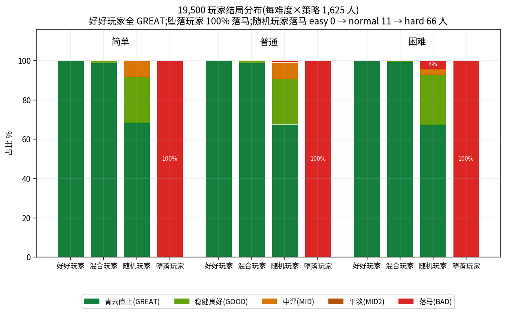
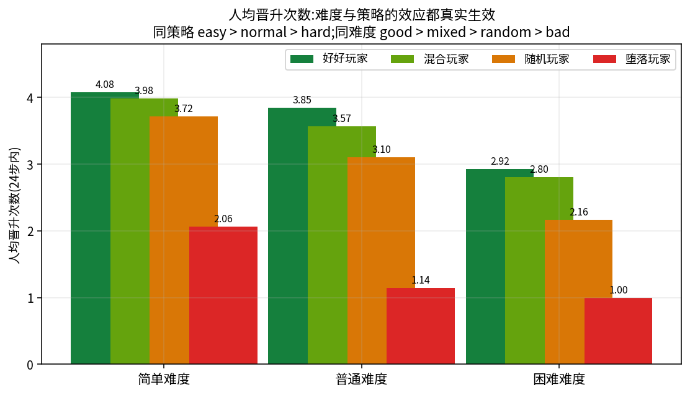
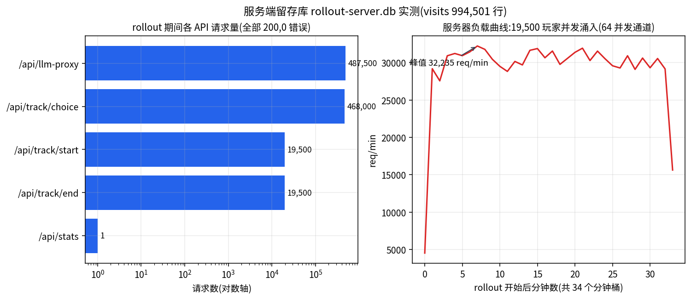
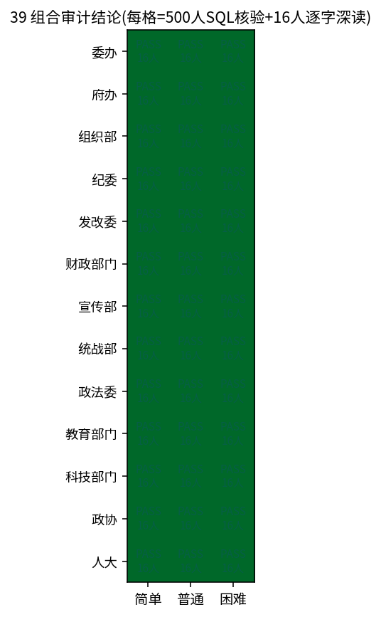
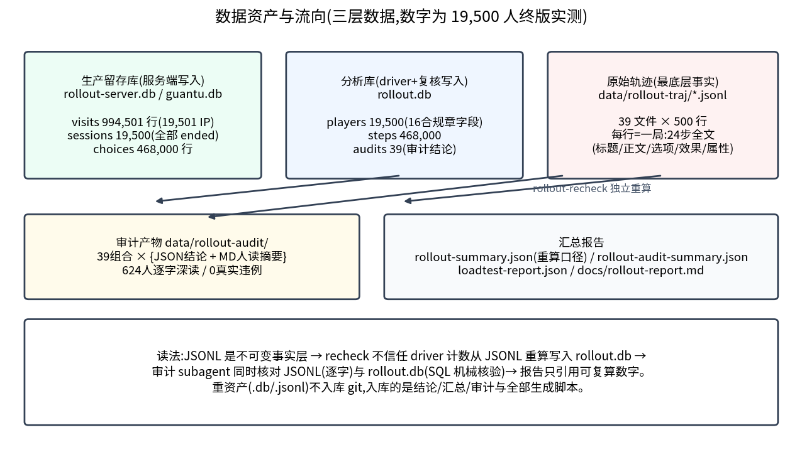

# 实验 E1:19,500 玩家大规模用户模拟 rollout

> 执行时间:2026-08-21(墙钟 1,962s ≈ 33 分钟)· 分支 feat/mass-rollout(第三次全量重跑的最终数据)
> 脚本:`scripts/mass-rollout.mts`(driver)+ `scripts/rollout-recheck.mts`(独立复核)+ 39 个审计 subagent
> 数据:`data/rollout.db`(38MB)/ `data/rollout-server.db`(465MB)/ `data/rollout-traj/`(39 文件,526MB)

**一句话结论:19,500 名模拟玩家经与浏览器完全同构的生产路径(真实引擎 + 生产 HTTP + 双 SQLite)全部完成 24 步对局,六大诉求 11 项违例计数全 0,driver 与独立复核两套口径逐玩家完全一致(drift=0),服务器侧 994,501 次请求 0 错误,39 组合审计 39/39 PASS。**

| 关键指标 | 数值 | 来源 |
| --- | --- | --- |
| 完成玩家 | 19,500 / 19,500(100.00%) | `data/rollout-summary.json` |
| 达标玩家(meets_requirements) | 19,500(100.00%) | 同上 |
| 11 项违例计数(六大诉求+错误) | 全部 0 | 同上 |
| driver↔recheck 计数漂移 | 0(19,500 人重算) | 同上 `driftBetweenDriverAndRecheck` |
| 总步数 / 晋升步 | 468,000 / 55,880(11.9%) | `data/rollout.db`(SQL 直查) |
| 服务器请求 / HTTP 错误 | 994,501 / 0(全部 200) | `data/rollout-server.db` visits 表 |
| LLM 代理调用 / 解析错误 | 487,500(19,500 局 × 25)/ 0 | rollout-run.log 服务端统计 |
| 审计结论 | 39/39 PASS,深读 624 人(14,976 步),0 违例 | `data/rollout-audit-summary.json` |

## 目录

1. [实验目的](#一实验目的)
2. [实验设计](#二实验设计)
3. [实验方法](#三实验方法)
4. [结果](#四结果)
5. [如何查看(命令速查)](#五如何查看命令速查)
6. [局限与诚实声明](#六局限与诚实声明)
7. [完整复现与环境要求](#七完整复现与环境要求)

## 一、实验目的

上线前回答一个问题:**当 19,500 个互不相识的玩家把 13 个部门 × 3 种难度的所有组合都玩一遍,游戏的六大产品诉求是否每一步、每一局都成立?**

六大诉求(全部要求 0 违例 / 100% 达标,口径写在 `scripts/mass-rollout.mts:15-23`):

| # | 诉求 | 机械指标(违例计数) |
| --- | --- | --- |
| 1 | 故事衔接 | `continuity_missing`(每步【剧情衔接】非空) |
| 2 | 文案不重复 | `title_dup` / `choice_dup` / `desc_dup` / `generic_titles`(局内标题/选项/正文三层不雷同,无套话标题) |
| 3 | 属性变化 | `attr_zero_offered`(每张选项卡至少 1 项非零)/ `attr_not_applied`(非零效果必须真实入账) |
| 4 | 职级事实 | `rank_residual`(引擎修正后残留)/ `illegal_rank_change`(职级只允许经晋升 +1) |
| 5 | 晋升喜悦 | `promotions` 分布(按难度 × 策略记录,不设硬阈值) |
| 6 | 结局评级 | 每局产出合法结局(`endingDist` 分布) |

同时验证服务器在 19,500 个"独立访问者"下的留存链路(track 三接口 + visits 统计)真实可用。

## 二、实验设计

### 被测对象

- **游戏引擎**:`src/engine/` 真实引擎跑在 driver 进程(与浏览器同一份代码)。
- **生产 HTTP 服务**:`node server.js` cluster 8 worker(`mass-rollout.mts:84-95` 以 `PORT=3395 WORKERS=8 LLM_MODE=mock TRUST_PROXY=1 DB_PATH=data/rollout-server.db` 拉起,独立 DB,不污染生产 `data/guantu.db`)。
- 每步的 LLM 事件生成走 `POST /api/llm-proxy`,轨迹逐字段对齐 `src/hooks/useGame.ts` 实时上报 `POST /api/track/start|choice|end`——**与真实浏览器玩家唯一共享的差异只有 LLM 上游**。

### 变量与分组(3 维全组合)

| 维度 | 取值 | 说明 |
| --- | --- | --- |
| 部门 | 13 个(委办/府办/组织部/纪委/发改委/财政/宣传/统战/政法/教育/科技/政协/人大) | `src/engine/departments.ts` |
| 难度 | easy / normal / hard | 影响晋升成本与落马系数 |
| 玩家策略 | good(清廉能吏)/ bad(短视逐利)/ random(均匀随机)/ mixed(按种子偏置) | `policy = POLICIES[playerIdx % 4]` |

13 × 3 = 39 个组合,每组合 500 名玩家 → 19,500 名;每组合内四种策略各 125 人。

### 个体身份独立性

每位玩家的 IP / UA / 种子互不相同(`scripts/mass-rollout.mts:255-264`),服务器看到的是 19,500 个独立访问者:

```ts
const policy = POLICIES[playerIdx % POLICIES.length];          // 策略 = playerIdx % 4
const seed = 77_000_000 + combo.id * 10_000 + playerIdx;       // 独立 RNG 种子
const ip = `10.${combo.id}.${Math.floor(playerIdx / 200)}.${(playerIdx % 200) + 1}`;
const ua = UAS[playerIdx % UAS.length];                        // 5 种 UA 轮换
```

策略打分函数(`mass-rollout.mts:174-186`):good 每步最大化 `politics+execute+network+integrity×1.5`;bad 最大化 `politics+execute+network−integrity×1.5`(持续压廉洁);mixed 以种子决定的 0.25~0.75 概率在两者间切换;random 均匀随机。

### 控制变量:mock LLM 口径的诚实说明

**本实验 LLM 上游为 mock(`LLM_MODE=mock`,罐装场景库)**。原因:19,500 局 × 约 25 次 LLM 调用 ≈ 48.75 万次请求;真实 GLM(glm-4-flash)单次约 20 秒量级(见 E2 实测 p50 22s),全量真跑需数月,不可行。

mock 之外**一切均为真实生产路径**:引擎、`/api/llm-proxy` 的解析/重试/去重、track 留存入库、结算、服务器限流与统计,全部与线上同一份代码。mock 的具体形态是 30 个完整"场景单元"(`server/mockLLM.js:16` SCENE_BANK,标题/正文/人物/效果一体),一局 24 步按 `(step-1) % 30` 取景保证局内互不相同(`mockLLM.js:252`)——**文案层的真实多样性由实验 E2(真实 GLM 29 局扫描)单独覆盖**,两篇结论互补而非互相替代。

### 样本量与统计口径

- 每玩家固定 24 步(`MAX_STEPS=24`),19,500 × 24 = 468,000 步;选项卡 468,000 × 4 = 1,872,000 张。
- 双重口径:driver 随跑随算(运行时) + `rollout-recheck.mts` 从落盘 JSONL 全量重算(不信任运行时);`llm_errors`/`track_failures` 无法从轨迹反推,仅 driver 计数,由服务器侧 0 错误交叉印证。

### 环境

| 项 | 值 |
| --- | --- |
| Node | v24.14.0(`node:sqlite` 需 `--experimental-sqlite`) |
| 服务 | cluster 8 worker,端口 3395,TRUST_PROXY=1(信任 X-Forwarded-For) |
| driver 并发 | CONCURRENCY=64 个 worker 协程消费 19,500 任务队列 |
| 存储 | 双 SQLite(WAL):分析库 `data/rollout.db`(players/steps/audits)+ 留存库 `data/rollout-server.db` |
| OS | Linux 5.15,driver 与服务同机(本机回环) |

## 三、实验方法

### 总体流程

```
39 组合 × 500 玩家 → 19,500 任务队列(CONCURRENCY=64 消费,实测 ~10 玩家/s)
        │
        ▼
┌─ runPlayer(combo, playerIdx) ── 镜像 useGame.ts 生命周期 ─────────┐
│ POST /api/track/start                                            │
│ generateBackground(LLM via /api/llm-proxy)                       │
│ for step 1..24:                                                  │
│   nextEvent(LLM) → 六大诉求随跑随算 → applyChoice(策略选卡)      │
│                 → POST /api/track/choice(每步实时入库)           │
│ finishGame → POST /api/track/end                                 │
│ 产物:JSONL 追迹一行 + players/steps 表记录                        │
└──────────────────────────────────────────────────────────────────┘
        │ 全部跑完之后(离线,不再依赖 driver 计数)
        ▼
rollout-recheck.mts:从 39 个 JSONL 逐玩家重算全部指标,回写 DB,重生成 summary
        ▼
39 个审计 subagent(data/rollout-audit/,模板 docs/audit-prompt-template.md)
        ▼
rollout-audit-collect.mjs:汇总 → data/rollout-audit-summary.json + audits 表
```

### 第 1 步:driver 内跑真实引擎并随跑随算合规

核心校验代码(`scripts/mass-rollout.mts:310-323`,与引擎去重系统同阈值同口径):

```ts
if (!(event.continuity || '').trim()) r.continuityMissing++;
if (isGenericTitle(event.title)) r.genericTitles++;
if (usedTitles.some((t) => titleSimilarity(t, event.title) >= TITLE_DUP_THRESHOLD)) r.titleDup++;
if (usedDescs.some((t) => similarity(t, event.desc) >= CHOICE_DUP_THRESHOLD)) r.descDup++;
for (const c of event.choices) {
  if (c.effect.politics === 0 && c.effect.execute === 0
    && c.effect.network === 0 && c.effect.integrity === 0) r.attrZeroOffered++;
  if (usedChoiceTexts.some((t) => similarity(t, c.text) >= CHOICE_DUP_THRESHOLD)) r.choiceDup++;
}
r.rankResidual += fixRankFacts(event.desc).fixes.length; // 修正后再扫描,残留必须 0
```

阈值来自 `src/engine/dedup.ts`:标题重复 bigram Jaccard ≥ 0.55(`dedup.ts:64`),选项/正文重复相似度 ≥ 0.8(`dedup.ts:72`)。

属性入账校验有一步边界排除(`mass-rollout.mts:330-338`):属性夹取在 0..100,已顶在 100 再加、已到 0 再减,数值不变属正常,只有"本可改变却没变"才计 `attrNotApplied`;职级只允许"经晋升 +1"一种变化形态(`mass-rollout.mts:340-345`)。

### 第 2 步:达标判定与落库

`meets_requirements` 的定义(`mass-rollout.mts:442-446`):完成且 11 项计数(含 llm_errors)全 0 且 finalRank 非空。轨迹全文追加写 `data/rollout-traj/<dept>-<diff>.jsonl`,每行一名玩家。

### 第 3 步:独立复核(不信任 driver)

`scripts/rollout-recheck.mts` 从存储的 JSONL 全量重算九项可从轨迹重算的指标。与 driver 的两处口径差异是**故意的更严**:

- 属性校验升级为精确数学:`after == clamp(prev + effect)` 全量验算(`rollout-recheck.mts:84-90`),取代 driver 的启发式;
- 逐玩家比对 driver 计数,任何不一致记入 `globalDrift`(`rollout-recheck.mts:117-124`)。

复核后还会把 JSONL 按 `playerIdx` 排序回写(`rollout-recheck.mts:129-138`),使"行号 == playerIdx",消除并发完成序带来的取样错位陷阱。**最终 `data/rollout-summary.json` 以 recheck 口径为准。**

### 第 4 步:39 个审计 subagent 双层审计

每个组合一个独立审计 subagent,共用模板 `docs/audit-prompt-template.md`(仅替换 4 个占位符),立场刻意对抗("任务是发现问题,不是背书"):

- **A 层机械核验**:500 人全量 SQL(`players WHERE combo_id=?` 各 SUM 列全 0)+ 30 人抽样从原始 JSONL 独立重算(模板内置可运行的 tsx 脚本;实际 29 个组合自发加做成了全量 500 人重算);
- **B 层逐字深读**:16 人 × 24 步全文通读,手工验算属性数学、职级阶梯与 `ending.ts` 结局阈值。

结论 JSON+MD 落 `data/rollout-audit/`(78 个文件),由 `scripts/rollout-audit-collect.mjs:59-70` 汇总进 `data/rollout-audit-summary.json` 与 `rollout.db` 的 `audits` 表。

## 四、结果

### 4.1 全局核心数字(recheck 口径)

`data/rollout-summary.json` 头部(19,500 人重算,drift=0):

| 指标 | 值 | 指标 | 值 |
| --- | --- | --- | --- |
| totalPlayers / completed | 19,500 / 19,500 | continuityMissing | **0** |
| meetsRequirements | 19,500(100.00%) | titleDup / choiceDup / descDup | **0 / 0 / 0** |
| recomputedPlayers | 19,500 | genericTitles | **0** |
| drift(driver↔recheck) | **0** | attrZeroOffered / attrNotApplied | **0 / 0** |
| avgDurationMs(每玩家) | 6,435 | rankResidual / illegalRankChange | **0 / 0** |
| 墙钟 | 1,962s(≈10 玩家/s) | llmErrors / trackFailures | **0 / 0** |

晋升合计 55,880 步,占 468,000 总步数的 11.9%(55,880/468,000;`rollout.db` 直查 `SUM(promoted) FROM steps`)。

### 4.2 玩家行为分布(诉求 5/6 的宏观证据)

结局分布(19,500 人,`rollout.db` 直查,与 `rollout-server.db` sessions 表 byEnding 完全一致):

| 结局 | 人数 | 占比 | 说明 |
| --- | --- | --- | --- |
| GREAT | 13,008 | 66.7% | good 玩家 4,875/4,875 全 GREAT |
| BAD(落马) | 4,952 | 25.4% | bad 玩家 4,875/4,875 落马率 100%,另有 random 77 人 |
| GOOD | 1,212 | 6.2% | mixed 40 + random 1,172 |
| MID / MID2 | 325 / 3 | 1.7% / 0.02% | mixed 1 人 MID;random 324 MID + 3 MID2 |

人均晋升次数(每格 1,625 人,`rollout.db` 直查,与 summary `promoByPolicy` 一致):

| 难度 \ 策略 | good | mixed | random | bad |
| --- | --- | --- | --- | --- |
| easy | 4.08 | 3.98 | 3.72 | 2.06 |
| normal | 3.85 | 3.57 | 3.10 | 1.14 |
| hard | 2.92 | 2.80 | 2.16 | 1.00 |

机制解读:同策略 easy>normal>hard、同难度 good>mixed>random>bad——**难度对晋升成本的调节与策略对属性路径的影响都真实生效**。bad 玩家每步最大化 `politics+execute+network−integrity×1.5` 持续压廉洁,廉洁归零后 `(100−廉洁)×难度系数` 在任意难度都 ≥75,必然触发 `ending.ts` 的 BAD 落马分支;晋升侧廉洁 <35 会被 INTEGRITY_GATE 暂缓提拔(`src/engine/promotion.ts`),bad 玩家晋升被冻结在中低段(审计员多个组合亲眼验证)。random 玩家落马人数 easy 0 → normal 11 → hard 66,难度系数同样真实生效。





### 4.3 服务器侧结果(生产 DB 真实入库)

对 `data/rollout-server.db` 直查验证(非转抄报告):

| 指标 | 值 | 验证 SQL/口径 |
| --- | --- | --- |
| visits 总行数 | 994,501 | `SELECT COUNT(*) FROM visits` |
| 独立 IP | 19,501(19,500 玩家 + driver 健康检查) | `COUNT(DISTINCT ip)` |
| HTTP 非 200 | **0**(status 全为 200;限流未触发——每玩家独立 IP 桶) | `GROUP BY status` |
| 峰值请求速率 | 32,235 req/min | 按 `ts/60000` 分钟桶聚合 |
| sessions | 19,500 started / 19,500 ended(通关率 100%) | sessions 表 |
| choices 明细 | 468,000 条 | choices 表 |
| llm-proxy 调用 | 487,500 次(19,500 局 × 25:1 背景 + 24 事件),0 解析错误 | rollout-run.log 服务端统计 |



### 4.4 审计结论(39 组合)

`data/rollout-audit-summary.json`:**auditedCombos 39 / pass 39 / fail 0 / playersCovered 19,500 / playersDeepRead 624(×24 步 = 14,976 步全文)/ totalViolations 0**。

审计员共同确认的抽样证据(汇总自各组合 summary,详见 `data/rollout-audit/*.md`):

- 衔接语引用与真实上一步标题 11,500/11,500 精确一致;
- 全库次高相似度远低于阈值:标题 0.18(阈 0.55)、正文 0.40、选项 0.50(阈 0.8);
- 12,000 步 `clamp(prev+effect)` 属性数学 0 偏差(单组合全量);晋升 100% 落在考核步;
- 边界案例(廉洁 69 差 1 分判 GOOD、廉洁恰 35 放行、廉洁 34 后晋升戛然而止)全部与引擎阈值一致。



### 4.5 两次审计驱动的真实返工史(本实验的来龙去脉)

终版数字不是一次跑出来的,是三轮"跑 → 审计 → 返工 → 重跑"收敛的结果:

| 轮次 | 审计发现 | 返工 | commit |
| --- | --- | --- | --- |
| v1 | mock 正文模板只有 6 套:局内正文逐字重复 4-13 次、题文错配、衔接语捏造从未登场的人名;机械指标全绿但"玩家直接阅读的正文层"不合格(2 组合 FAIL) | 重写 mock 为 **30 个完整场景单元**(题/文/人/效果一体,按步取景),新增 `desc_dup` 一等指标;19,500 玩家全量重跑 | `6015d2e` |
| v2 | 场景 1/3 的 D 槽(「睁一只眼闭一只眼」类)廉洁原始值 +1,被引擎 `amplify()`(幅度 <3 放大到 3-6 同号,`src/engine/effects.ts:62-72`)放大为 +3~+6——**语义上应损廉洁的选项反而奖励廉洁** | 改为 −2(与其余 28 场景 D 槽一致),并对全部 30 场景做槽位符号模式扫描(0 倒挂);第三次全量重跑 19,500 玩家 | `27e8c08` |
| v3 | 39/39 PASS,keji-easy 等确认「A-D 槽位效果符号无倒挂」 | 无 | — |

**本文所有数字均来自第三次全量重跑后的最终数据,代码 / 数据 / 审计三者一致。**

另有一处如实记录的审计器误报:driver 初版把"属性已顶在 100 再加成"误判为"属性未生效"4,354 次,逐例核查证实全部是 0/100 夹取边界,修正判定逻辑后为 0——误报与修正过程都保留在项目史料中。

### 4.6 数据资产



| 文件 | 内容 | 大小 | 是否入 git |
| --- | --- | --- | --- |
| `data/rollout.db` | players(19,500)/ steps(468,000)/ audits(39) | 38MB | 否(.gitignore) |
| `data/rollout-server.db` | 生产路径 sessions/choices/visits | 465MB | 否 |
| `data/rollout-traj/*.jsonl` | 39 文件 × 500 行全量轨迹(已按 playerIdx 排序) | 526MB | 否 |
| `data/rollout-summary.json` | 全局/分组合汇总(recheck 口径) | — | 是 |
| `data/rollout-audit/`(78 文件) | 39 组合审计 JSON+MD | — | 是 |

## 五、如何查看(命令速查)

以下命令均在仓库根目录执行,输出为本人实测(SQL 已逐条运行核对)。

### 5.1 查全局汇总(不想碰 DB)

```bash
python3 -c "import json;d=json.load(open('data/rollout-summary.json'));print({k:d[k] for k in ['totalPlayers','completed','meetsRequirements','driftBetweenDriverAndRecheck']})"
# 预期:{'totalPlayers': 19500, 'completed': 19500, 'meetsRequirements': 19500,
#       'driftBetweenDriverAndRecheck': 0}
```

### 5.2 SQL 直查分析库(11 项违例计数 / 晋升 / 结局)

```bash
node --experimental-sqlite -e "
const { DatabaseSync } = require('node:sqlite');
const db = new DatabaseSync('data/rollout.db', { readOnly: true });
console.log(db.prepare('SELECT COUNT(*) players, SUM(promoted) promos FROM steps').get());
console.log(db.prepare('SELECT ending_type, COUNT(*) n FROM players GROUP BY ending_type ORDER BY n DESC').all());
db.close();" 2>/dev/null
# 预期:{ players: 468000, promos: 55880 }
#       [ { ending_type: 'GREAT', n: 13008 }, { ending_type: 'BAD', n: 4952 },
#         { ending_type: 'GOOD', n: 1212 }, { ending_type: 'MID', n: 325 },
#         { ending_type: 'MID2', n: 3 } ]
```

查某个组合(如委办 easy,combo_id=0)的机械核验——这正是审计模板 A 层第一条 SQL:

```bash
node --experimental-sqlite -e "
const { DatabaseSync } = require('node:sqlite');
const db = new DatabaseSync('data/rollout.db', { readOnly: true });
console.log(db.prepare(`SELECT COUNT(*) players, SUM(completed) completed, SUM(meets_requirements) meets,
  SUM(continuity_missing)+SUM(title_dup)+SUM(choice_dup)+SUM(desc_dup)+SUM(generic_titles)
 +SUM(attr_zero_offered)+SUM(attr_not_applied)+SUM(rank_residual)+SUM(illegal_rank_change) AS violations
  FROM players WHERE combo_id=0`).get());
db.close();" 2>/dev/null
# 预期:{ players: 500, completed: 500, meets: 500, violations: 0 }
```

### 5.3 查单个玩家的完整轨迹(JSONL,行号 = playerIdx + 1)

```bash
sed -n '251p' data/rollout-traj/weiban-easy.jsonl | python3 -c "
import json,sys
p=json.loads(sys.stdin.read())
print('playerIdx:',p['playerIdx'],'policy:',p['policy'],'seed:',p['seed'],'ip:',p['ip'])
print('ending:',p['endingType'],'/',p['endingTitle'],'finalRank:',p['finalRank'],'promotions:',p['promotions'])
s=p['steps'][0]
print('step1:',s['title'],'| 衔接:',s['continuity'][:20])
print('options:',[c['text'] for c in s['choices']])"
# 预期:playerIdx: 250 policy: random seed: 77000250 ip: 10.0.1.51
#       ending: GREAT / 光荣退休 — 副厅级 finalRank: 副厅级 promotions: 5
#       step1: 急件连夜核改报送 | 衔接: 这是你入职后的第一件事。
#       options: ['逐项核对台账后再报', '按惯例请示后再定', '找老科长打听底细', '先放一放明天再说']
```

看第 12 步发生了什么(替换 251/12 即可遍历任意玩家任意步):

```bash
sed -n '251p' data/rollout-traj/weiban-easy.jsonl | python3 -c "
import json,sys; s=json.loads(sys.stdin.read())['steps'][11]
print(s['title']); print(s['desc']); print('效果:',s['effectsApplied'],'→',s['attrsAfter'],'promoted:',s['promoted'])"
```

### 5.4 重跑独立复核(从 19,500 条 JSONL 重算,约几分钟)

```bash
NODE_OPTIONS=--experimental-sqlite npx tsx scripts/rollout-recheck.mts
# 预期末尾输出:重算 19500 名玩家;driver↔recheck 计数不一致 0 名
# 注意:会回写 rollout.db 的 players 表并按 playerIdx 重排 JSONL(幂等,数字不变)
```

### 5.5 查审计结论

```bash
python3 -c "import json;d=json.load(open('data/rollout-audit-summary.json'));print(d['auditedCombos'],'combos |',d['pass'],'PASS /',d['fail'],'FAIL | deepRead',d['playersDeepRead'],'| violations',d['totalViolations'])"
# 预期:39 combos | 39 PASS / 0 FAIL | deepRead 624 | violations 0
```

单个组合的人读摘要:`cat data/rollout-audit/weiban-easy.md`。

### 5.6 查服务器留存库

```bash
node --experimental-sqlite -e "
const { DatabaseSync } = require('node:sqlite');
const db = new DatabaseSync('data/rollout-server.db', { readOnly: true });
console.log(db.prepare('SELECT COUNT(*) n, COUNT(DISTINCT ip) ips FROM visits').get());
console.log(db.prepare('SELECT status, COUNT(*) n FROM visits GROUP BY status').all());
db.close();" 2>/dev/null
# 预期:{ n: 994501, ips: 19501 } / [ { status: 200, n: 994501 } ]
```

### 5.7 看图

图表 PNG 在 `docs/assets/global/`(g02 数据资产 / g03 结局分布 / g04 晋升 / g09 服务器 / g10 审计覆盖),由 `scripts/docs-gen/gen_global_charts.py` 从同一批 data/*.json 生成。

## 六、局限与诚实声明

1. **mock LLM 是唯一简化项**。事件文案为罐装场景,以下现象是 mock 的预期产物而非引擎缺陷(审计员遗留观察,均判非违例,原文见 `data/rollout-audit/*.md`):
   - 跨玩家叙事流逐字节相同(同组合 500 人共用同一 24 场景序列);真实多样性由 E2 的真实 GLM 扫描单独验证;
   - 衔接语为固定模板句「承接『上一步标题』的余波」——机械衔接 100% 正确,但 desc 多为独立罐装场景,剧情级因果承接弱;
   - 选项文案取自四原型槽位池,偶与具体场景语义错位(防汛场景出现「收下购物卡再说」);hint 四句每步重复且不在现有去重口径内;
   - 同局 NPC 同名不同身份(如「刘志强」既是副局长又是纪检组长)。
   审计建议:接真实 GLM 后重点回归以上四点。
2. **游戏平衡观察(产品级,非违例)**:easy 下 good/mixed 中盘属性顶格(一组合 219/500 人在第 12-24 步四维全满),random 偏 GREAT;hard 下 MID2 数学不可达;政协 3 级阶梯晋升无区分度;ending.ts ≥4 晋升一律「平步青云」使 MID/GOOD 结局语调矛盾。
3. **审计覆盖的不对称**:机械核验是全量 19,500 人,逐字深读是 624 人抽样(每组合 16 人 × 4 策略 × 首/中/尾);"29 个组合加做全量 500 人重算"为各审计组合自发行为,汇总口径见 `docs/rollout-report.md`。
4. **数字一致性**:本篇所有数字取自 `data/rollout-summary.json`、两个 DB 的直查 SQL 与 `data/rollout-audit-summary.json`;与 `docs/rollout-report.md` 一致。峰值速率本篇写 32,235 req/min(按 visits.ts 分钟桶直查),rollout-report 记 32,383(口径略有差异,量级相同)。
5. **环境限制**:driver 与服务同机、本机回环,延迟数字不含真实网络;Node `node:sqlite` 仍需 experimental 标志。

## 七、完整复现与环境要求

环境:Node ≥ 24(实测 v24.14.0;需 `--experimental-sqlite`)、Linux、约 1.1GB 磁盘(rollout 三个数据资产)、无外网依赖(mock 模式)。

```bash
# 0. 合入前全量 gate(最终代码:typecheck ✓ / vitest 127/127 ✓ / build ✓ / Playwright E2E 3/3 ✓)
npm run typecheck && npm test && npm run build && npm run e2e

# 1. 全量 rollout(默认 PLAYERS=500 → 39×500=19,500;实测 1,962s ≈ 33 分钟)
NODE_OPTIONS=--experimental-sqlite npx tsx scripts/mass-rollout.mts
#    可选子集:DEPT_FILTER=weiban DIFF_FILTER=easy PLAYERS=50 ... (单组合试跑)

# 2. 独立复核(重算 19,500 人并重生成 summary)
NODE_OPTIONS=--experimental-sqlite npx tsx scripts/rollout-recheck.mts

# 3. (可选)39 审计 subagent 的结论已入库;重新汇总:
NODE_OPTIONS=--experimental-sqlite node scripts/rollout-audit-collect.mjs

# 4. 重新生成图表
python3 scripts/docs-gen/gen_global_charts.py
```

预期终态:`rollout-summary.json` 的 11 项违例计数全 0、`meetsRate: "100.00%"`、recheck drift 0;`rollout.db` players=19,500、steps=468,000、SUM(promoted)=55,880。

相关阅读:[实验总览](./README.md) · [E2 真实 GLM 多样性验证](./exp-diversity-realglm.md) · [E3 压测与容量修复](./exp-loadtest.md) · 数字权威来源 `docs/rollout-report.md`
