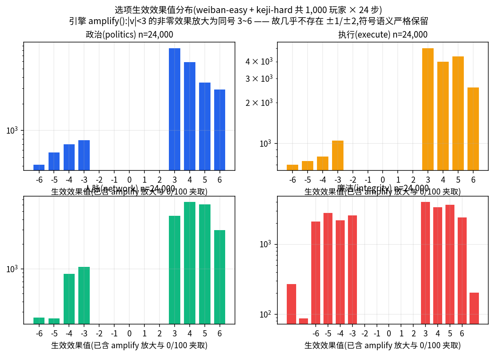

# 官途模拟器 · 游戏引擎与算法详解

> 活文档:代码变更时必须同步更新本文,维护规则见 [docs/README.md](../README.md)。基线:main@e4fa8f5(2026-08-21)

**读者画像:要修改算法的人。** 本文按「数据模型 → 一轮完整流程 → 各子系统算法」组织,所有代码块均为仓库真实代码(标注 `文件:行号`,基于基线 e4fa8f5),所有机制均可在对应文件中逐行核对。

## 目录

- [1. 设计原则:引擎是纯函数](#1-设计原则引擎是纯函数)
- [2. 数据模型(src/engine/types.ts)](#2-数据模型srcenginetypets)
- [3. 一局完整流程](#3-一局完整流程)
- [4. 效果系统:normalize → amplify → 再平衡](#4-效果系统normalize--amplify--再平衡)
- [5. 选项槽位语义与 mock 场景库](#5-选项槽位语义与-mock-场景库)
- [6. 晋升算法(src/engine/promotion.ts)](#6-晋升算法srcenginepromotionts)
- [7. 结局算法(src/engine/ending.ts)](#7-结局算法srcengineendingts)
- [8. 文案治理三件套:dedup / rankRules / storyMemory](#8-文案治理三件套dedup--rankrules--storymemory)
- [9. 属性 clamp 边界:不是 bug](#9-属性-clamp-边界不是-bug)
- [10. 引擎测试即规格](#10-引擎测试即规格)
- [11. 已知边界与产品注记](#11-已知边界与产品注记)
- [12. 数据来源与复现](#12-数据来源与复现)

## 1. 设计原则:引擎是纯函数

`src/engine/` 下没有任何 I/O:不发请求、不碰 DOM、不读时钟。所有入口函数对输入状态做 `structuredClone` 后在新对象上修改并返回,**绝不原地修改入参**(有单测断言,见第 10 节)。三个直接后果:**同构**(同一份代码跑在浏览器与 Node,19,500 玩家 rollout 与线上玩家逐字节同逻辑)、**可测**(注入种子 `RNG` 与 mock `LLMClient` 即可完整复现一局)、**可回放**(状态是普通 JSON,落盘轨迹可离线重算任何指标)。修改算法时的纪律:**入口处先 clone、通过返回值交付结果、随机数一律走注入的 `rng`**——违反任何一条都会破坏测试与回放。

## 2. 数据模型(`src/engine/types.ts`)

四维属性与选项效果是整个数值系统的原子:

```ts
/** 玩家四维属性。 */
export interface Attrs {
  politics: number;   // 政治嗅觉
  execute: number;    // 执行力
  network: number;    // 人脉资源
  integrity: number;  // 廉洁度
}

/** 选项效果:四维属性变化 + 晋升点奖励(0 或 1)。 */
export interface ChoiceEffect {
  politics: number;
  execute: number;
  network: number;
  integrity: number;
  promotion: number;
}
```
(`src/engine/types.ts:18-35`)

一个事件由 LLM 生成、经引擎修复,带修复审计 trail:

```ts
export interface GameEvent {
  id: string;
  tag: EventTag;            // daily/opportunity/temptation/politics/crisis/interpersonal
  tagLabel: string;
  title: string;
  desc: string;
  hint: string;
  /** 剧情衔接:本事件如何承接上一事件(展示给玩家,强化连续性)。 */
  continuity: string;
  npcs: string[];           // 形如 "王建国(县政府办公室主任)"
  choices: Choice[];
  aiGenerated: boolean;
  /** 生成后的修复记录(用于统计与调试)。 */
  repairs: EventRepair[];
}

export interface EventRepair {
  kind: 'rank-fix' | 'effect-rebalance' | 'dedup-retry' | 'parse-fallback';
  detail: string;
}
```
(`src/engine/types.ts:44-66`)

游戏全量状态(引擎函数的全部输入输出):

```ts
export interface GameState {
  sessionId: string;
  deptId: string;
  dept: Dept;
  difficulty: Difficulty;         // easy | normal | hard
  attrs: Attrs;
  rank: number;                   // 当前职级索引(dept.ranks 下标)
  promotionPoints: number;        // 晋升绩效点数
  promotionPointsSpent: number;
  year: number;                   // 2015 开局,每步 +1
  step: number;                   // 已完成步数(0-24)
  maxSteps: number;               // 固定 24
  background: Background | null;
  currentEvent: GameEvent | null;
  timeline: TimelineEntry[];      // 完整轨迹(逐选择落库)
  npcs: NPC[];                    // 剧情人物名册
  summary: string;                // 剧情摘要(引擎自动维护)
  threads: string[];              // 未决剧情线索
  usedTitles: string[];           // 标题去重池(整局全量)
  usedChoiceTexts: string[];      // 跨事件选项去重池(上限 200)
  usedDirectives: string[];
  directiveBag: string[];         // 叙事指令抽取袋(ShuffleBag 语义)
  usedThemes: string[];
  promotions: PromotionRecord[];
  repairs: EventRepair[];
  ended: boolean;
}
```
(`src/engine/types.ts:143-179`,注释有精简)

`applyChoice` 的返回值同时驱动 UI 动画(属性浮层、晋升庆祝、进度条):

```ts
export interface ApplyResult {
  state: GameState;
  effects: ChoiceEffect;
  attrsBefore: Attrs;
  attrsAfter: Attrs;
  promoted: boolean;
  promotion: PromotionRecord | null;
  promotionProgress: number;   // 当前点数 / 下一级成本,0-1
  pointsGained: number;
}
```
(`src/engine/types.ts:182-192`)

结局五档(`'GREAT' | 'GOOD' | 'MID' | 'MID2' | 'BAD'`)见 `src/engine/types.ts:208-215`,判定算法在第 7 节。

## 3. 一局完整流程

主循环由 `src/engine/gameEngine.ts` 编排,UI 侧 `src/hooks/useGame.ts` 只是它的状态机壳。一次「选择 → 生成下一事件」的完整链路:

```text
applyChoice(state, idx)                     gameEngine.ts:237
  ├─ clamp 四维属性(0-100)                 :249-252
  ├─ gainPromotionPoints(effect, tag, diff) :255   promotion.ts:28
  ├─ effect.promotion>0 → tryPromote        :259   (突出表现即时考核)
  ├─ step+1 / year+1                        :262-263
  ├─ isReviewStep(step) → tryPromote        :266-268 (每 3 步年度考核)
  ├─ timeline.push / buildSummary           :271-282
  ├─ 重大事件(诱惑/站队/危机 且 廉洁≤-3)→ addThread :285-290
  └─ ended = step >= 24                     :292
nextEvent(state, llm, rag, rng)             gameEngine.ts:130
  ├─ drawDirective(叙事指令)+ buildEventPrompt(提示词组装) :139 / promptBuilder.ts:72
  ├─ 循环 ≤4 次:llm.generate → parseEvent(parse 失败→format 重试 temp 0.6) :157-177
  │    ├─ fixRankFacts(职级纠错)            :180-184
  │    ├─ checkEventFreshness(查重) → dedup 重试(temp 0.95),末次仍撞
  │    │    → enforceFreshness 硬改写       :187-204
  │    └─ rebalanceEffects(效果再平衡)      :207-209
  └─ usedTitles/usedChoiceTexts 入池 + mergeNPCs + repairs  :218-229
```

### 3.1 创建对局

```ts
export const DEFAULT_MAX_STEPS = 24;   // gameEngine.ts:38

export function createGame(
  deptId: string,
  difficulty: Difficulty,
  rng: RNG = new MathRandom(),
): GameState {
  const dept = getDeptById(deptId);
  return {
    sessionId: `s_${Date.now().toString(36)}_${Math.floor(rng.next() * 1e9).toString(36)}`,
    deptId, dept, difficulty,
    attrs: { politics: 50, execute: 50, network: 50, integrity: 80 },
    rank: 0, promotionPoints: 0, promotionPointsSpent: 0,
    year: 2015, step: 0, maxSteps: DEFAULT_MAX_STEPS,
    ...
    directiveBag: rng.shuffle(NARRATIVE_DIRECTIVES.map((d) => d.text)),
    ...
  };
}
```
(`src/engine/gameEngine.ts:61-94`,节选)

要点:初始属性 **50/50/50/80**(廉洁起步高,是「守得住的资本」);`year=2015、step=0`,此后每次选择 `year+1`,所以第 1 步事件发生在 **2016 年**,第 24 步在 **2039 年**。叙事指令袋开局即整体洗牌,一局 24 步内 15 条指令不会短期重复。

### 3.2 事件生成:重试与温度分流

`nextEvent` 的核心是「生成 → 解析 → 修复」管线,失败可重试,最多 `MAX_ATTEMPTS = 4` 次(`src/engine/gameEngine.ts:156`):

```ts
for (let attempt = 0; attempt < MAX_ATTEMPTS; attempt++) {
  // 温度分流:格式违规要收敛(0.6),内容撞车要发散(0.95)——
  // 实测 glm-4-flash 对「暗流涌动」类套话标题有强先验,低温重试只会原地打转。
  const temperature =
    attempt === 0 ? 0.85 : retryKind === 'dedup' ? 0.95 : 0.6;
  const content = await llm.generate(buildEventPrompt({ ...promptParams, avoidNote: avoidNote || undefined }), {
    maxTokens: 1600,
    temperature,
  });
```
(`src/engine/gameEngine.ts:157-165`)

三类修复按顺序执行,每次都会往 `event.repairs` 写审计记录(`rank-fix` / `dedup-retry` / `effect-rebalance`),整局累计在 `state.repairs`,可直接统计修复率:

1. **职级事实修正**(`:180-184`):`fixRankFacts` 对 desc 做规则替换,见第 8.2 节;
2. **去重检查**(`:187-204`):不新鲜则带 `avoidNote` 重试;末次重试的 `avoidNote` 会**点名列出撞车的选项文案**(glm-4-flash 对程序性套话有强先验,不点名会原样重发);重试用尽仍撞车时调 `enforceFreshness` 硬改写,绝不放行;
3. **效果再平衡**(`:207-209`):见第 4 节。

通过后更新记忆池。跨事件选项池有一步关键扩容:

```ts
next.usedTitles.push(event.title);
// 跨事件选项去重池:上限 200(一局 24 步 × 4 选项 = 96,留足余量)。
// 曾用 60 条滚动窗口——第 15 步起早期文案被挤出池,与开局选项的包含式
// 照抄(实测 1.00 全等)查不出来,8 局确认扫描捕获 3 例。提示词只取
// 最近 12 条,池本身仅用于内存比对,扩大无成本。
for (const c of event.choices) next.usedChoiceTexts.push(c.text);
if (next.usedChoiceTexts.length > 200) {
  next.usedChoiceTexts.splice(0, next.usedChoiceTexts.length - 200);
}
```
(`src/engine/gameEngine.ts:218-226`)

注意不对称性:**标题池全量保留(一局 ≤24 条),选项池只保留最近 200 条**(整局 96 条,留一倍余量;提示词里只展示最近 12 条防 token 膨胀)。

### 3.3 提示词如何拼(`src/engine/promptBuilder.ts`)

`buildEventPrompt`(`:72`)注入的上下文包括:

- **15 条叙事指令**(`NARRATIVE_DIRECTIVES`,`:10`):基层工作细节、人际博弈、突发危机、权力运作、道德抉择、跨部门协调、派系政治、信息战、群众路线、数字化改革、纪检风险等;经 `drawDirective` 从抽取袋取出,决定本步事件的 `tag`;
- **四幕剧情弧**(`storyArcPrompt`,`:29`):按进度四分位切换适应期(<25%)/成长期(<50%)/博弈期(<75%)/决战期,每幕给出主题、道德灰度、晋升机会与描述长度约束;
- **标题角度轮换**(`:107-108`):`state.step % 5` 轮换五种具体化角度(具体项目名称 / 具体文件材料 / 具体场合地点 / 具体人物称呼 / 具体时间节点数字),对冲 LLM 的抽象标题先验;
- **连续性上下文**(第 8.3 节)+ 属性态势提示 + 全量 `usedTitles` + 最近 12 条 `usedChoiceTexts`(`:103`,截 20 字)+ RAG 案例区(`src/engine/rag.ts`:同职级 2 例风格参考,进度过半或诱惑/危机时加 1 个反面案例)+ 职级红线全文;
- **纠错便签**(`:154`):上一轮未过校验时,`avoidNote` 以「⚠ 上一次生成未通过系统校验」注入,写明原因与封禁清单。

输出格式约定为 **`【字段名】内容` 的标记格式而非 JSON**(`src/engine/parser.ts` 解析,键名做 `选项A/选项 A/选项Ａ/选项a` 归一化;少于 2 个选项或缺标题直接抛错触发重试)——LLM 输出天然带叙述中文,JSON 转义错误率高,标记格式可增量容错解析。

## 4. 效果系统:normalize → amplify → 再平衡

`src/engine/effects.ts` 保证「每个选项都有可感知的属性变化,且整组选项有升有降、存在好选择」。

### 4.1 amplify:为什么没有 ±1/±2

```ts
/** 幅度增强:非零但 <3 的变化放大到 3-6(保持符号)。 */
function amplify(effect: ChoiceEffect, rng: RNG): boolean {
  let changed = false;
  for (const k of ATTR_KEYS) {
    const v = effect[k];
    if (v !== 0 && Math.abs(v) < 3) {
      const magnitude = rng.int(3, 6);
      effect[k] = v > 0 ? magnitude : -magnitude;
      changed = true;
    }
  }
  return changed;
}
```
(`src/engine/effects.ts:62-73`)

设计动机:**符号语义是叙事承诺,幅度是体验契约。** LLM 写「廉洁度 +1」时,符号(该行为有益/有损廉洁)是它真正理解的东西,但 ±1/±2 在 0-100 量表上玩 24 步毫无感知——引擎于是**严格保留符号,把幅度下限抬到 3**,让「这一年的得与失」在属性条上看得见。而 **0 是合法值且语义不同**(「此事与该属性无关」),所以只放大非零项,绝不把 0 强行变成 ±3。

前置步骤 `normalizeEffect`(`:43-59`)先做取整与限幅:属性变化夹到 **[-10, 10]**,`promotion` 归一到 {0,1}。实测分布(1,000 名玩家 × 24 步 × 4 属性,共 n=24,000/属性):



四个子图中 **±1、±2 区间完全没有柱子**(0 值不计入该分布图,绘图脚本显式排除);柱子集中在 ±3~±6,正是 `amplify` 的注入区间;对数纵轴下可以看到负值侧远少于正值侧——那是 mock 场景库槽位语义(第 5 节)与再平衡「至少 2 个净正选项」共同作用的结果。

### 4.2 再平衡的四条保底(`rebalanceEffects`,`src/engine/effects.ts:86`)

对一组(≤4 个)选项依次保证:

1. **规范化 + amplify**:如上;
2. **全零选项补齐**(`:103-121`):从洗过牌的 6 个行为原型(`ARCHETYPES`,`:20`:实干型/经营关系/坚守原则/同流合污/谨慎观望/担当碰硬)轮流取一个,加 ±1 抖动、幅度下限 3;
3. **至少 2 个净正选项**(`:124-140`):不足时给净和最接近 0 的选项循环注入 +4~7,直到净和转正(三维非廉洁属性最多 +30,足以盖过任何负值组合);
4. **至少 1 个廉洁为正的选项**(`:143-149`):全组廉洁都 ≤0 时,取最不负的选项赋 `rng.int(4, 7)`。

这四条对应大规模测试的硬指标:「全零属性选项卡 = 0 / 187.2 万张选项卡」(rollout 报告)。

## 5. 选项槽位语义与 mock 场景库

LLM 真实生成时四个选项没有固定语义(由提示词要求覆盖「稳妥/程序/关系/代价」不同取向);但 **mock 模式**(`LLM_MODE=mock`,大规模测试用)把槽位语义固化下来,`server/mockLLM.js`:

- **`SCENE_BANK`(`:16`)**:30 个完整场景单元,每个含 `{tag, tagLabel, title, desc, hint, npc, effects}`,其中 `effects` 是 **4 槽位 × 四维数值**的矩阵。生成时按 `(step - 1) % 30` 轮换取场景(`:252`)——一局 24 步取到 30 个场景中互不相同的 24 个,标题/正文天然不重复;
- **`CHOICE_BANK`(`:203`)**:4 个槽位各 24 条选项文案,按 `(step - 1 + 24) % 24` 轮换,同一局内每槽 24 步也步步不同。

四个槽位带固定提示语(`server/mockLLM.js:270`):**A「稳妥但费工」/ B「程序优先」/ C「经营关系」/ D「省事但有代价」**。效果数值绑定场景与槽位语义供给,因此槽位符号模式可以全库扫描:


右面板(廉洁维度)是重点:**A 槽全正、D 槽全 ≤0**。这不是初始就对的——commit `27e8c08` 之前,场景 1/3 的 D 槽(「省事但有代价」,如「睁一只眼闭一只眼」)廉洁原始值是 **+1**,语义倒挂;更糟的是它会被 `amplify()` 放大成 **+3~+6**——「和稀泥反而奖励廉洁」。rollout 第二轮审计中两个 subagent 独立发现,修正为 −2 并对全部 30 场景做槽位符号扫描(0 倒挂)后第三次全量重跑,上图右面板即修复验证:**省事的选项在廉洁维度上绝不能是正收益**。

mock 的衔接语也只回引 prompt 中真实存在的上一步标题(`server/mockLLM.js:259`):`承接「上一步标题」的余波,事情还没完。`——不捏造人名(第一轮审计曾抓到 v1 mock 凭空捏造人名)。

## 6. 晋升算法(`src/engine/promotion.ts`)

设计目标(文件头注释):24 步一局,普通玩家升 2-3 级,优秀玩家升 4-5 级,消除「选了半天级别不变」的旧痛点。

```ts
export const PROMOTION_COSTS = [12, 18, 26, 36, 48, 62, 78]; // :16 索引=当前职级
export const REVIEW_INTERVAL = 3;                            // :19 每 3 步年度考核
const DIFFICULTY_FACTOR = { easy: 0.8, normal: 1.0, hard: 1.3 }; // :22 成本系数
const INTEGRITY_GATE = 35;                                   // :25 廉洁门槛
```

**挣点**(`gainPromotionPoints`,`:28-43`):基础分 `max(0, min(5, 2 + net/8))`(net=四维净和,−20..+25 映射到 0..5);廉洁行为 +1;机遇类事件 +1;难度乘系数(easy ×1.2 / hard ×0.8);四舍五入到 0.5。**清廉能吏的单步典型值约 3.5-7 分(基础封顶 5,廉洁与机遇加成、easy 乘数可再抬高),和稀泥的 D 槽选项净和低且无廉洁加分,典型约 0-2.5 分。**

**成本**(`promotionCost`,`:46-54`):

```ts
const base = PROMOTION_COSTS[Math.min(state.rank, PROMOTION_COSTS.length - 1)];
const diff = DIFFICULTY_FACTOR[state.difficulty];
// 部门晋升星级:5星便宜 12%,2星贵 6%。
const deptFactor = 1 - (state.dept.ratings.promotion - 3) * 0.06;
return Math.max(6, Math.round(base * diff * deptFactor));
```
(`src/engine/promotion.ts:49-53`)

部门星级真实生效:委办/组织部(晋升 5 星)升一级便宜 12%,政协/人大(2 星)贵 6%。已到阶梯顶端返回 `Infinity`。

**触发节奏**(编排在 `gameEngine.applyChoice` 里,见第 3 节流程图):

- 每次选择先挣点;`effect.promotion > 0` 的「突出表现」选项**立即**触发考核(`gameEngine.ts:259`);
- 否则每逢 `step % 3 === 0` 的年度考核步触发(`isReviewStep`,`:64-66`;考核步为第 3/6/…/24 步);
- `tryPromote`(`:72-95`)依次检查:未到顶、点数够、**廉洁度 ≥ 35**——廉洁不足时**暂缓提拔且点数保留**(`:81`),等廉洁回血后下一次考核照常晋升。审计曾逐例验证坏玩家的晋升在廉洁跌破 35 后「戛然而止」。

实测节奏(19,500 玩家,每格 1,625 人):


同策略 easy > normal > hard、同难度 good > mixed > random > bad,两个效应都单调——难度系数(成本 ×0.8/×1.0/×1.3 与挣点 ×1.2/×1.0/×0.8)和策略(净效果与廉洁加分)各自真实生效。数值表见 `docs/rollout-report.md`(easy 4.08/3.98/3.72/2.06,normal 3.85/3.57/3.10/1.14,hard 2.92/2.80/2.16/1.00)。

## 7. 结局算法(`src/engine/ending.ts`)

`computeEnding`(`:8`)按**固定顺序**短路判定,先算两个派生量:

```ts
const totalScore = (attrs.politics + attrs.execute + attrs.network + attrs.integrity) / 4;
const rankRatio = rank / Math.max(1, dept.ranks.length - 1);
const diffFactor = difficulty === 'easy' ? 0.8 : difficulty === 'hard' ? 1.3 : 1.0;
const adjustedRisk = (100 - attrs.integrity) * diffFactor;
```
(`src/engine/ending.ts:10-14`)

五档判定顺序与阈值(逐行核对):

| 顺序 | 档位 | 条件 | 结局标题 | 图标 |
|---|---|---|---|---|
| 1 | **BAD 落马** | `adjustedRisk >= 75`(`:28`) | 落马——双规室里的人生终点 | ⚖️ |
| 2 | **GREAT 光荣退休** | `integrity >= 70 && totalScore >= 60 && rank >= 2`(`:38`) | 光荣退休 — {最终职级} | 🌟 |
| 3 | **GOOD 平稳落幕** | `integrity >= 50 && totalScore >= 45`(`:48`) | 平稳落幕 — {最终职级} | 📋 |
| 4 | **MID 调任闲职** | `integrity >= 35 \|\| rankRatio >= 0.5`(`:58`) | 调任闲职，颐养天年 | 🌿 |
| 5 | **MID2 受到处分** | 其余全部(`:68`) | 受到处分，仕途受阻 | ⚡ |

**为什么落马阈值是 75 而不是 65**(代码注释 `:26-27` 原文):若取 65,normal 难度下廉洁度 <35 必然 `(100−35)×1.0 = 65 ≥ 65` 落马,MID2(受处分但保住自由)在 normal/hard 永远不可触发。取 75 后 MID2 在 normal 可达——这是「档位可达性」优先于「落马更严」的一个显式取舍。

实测结局分布(19,500 玩家):


两个端点可以用阈值机制**逐项验算**:

- **堕落玩家 100% 落马(4,875/4,875)**:bad 策略每步最大化 `politics+execute+network−integrity×1.5`,持续选压廉洁的选项(D 槽)使廉洁在 24 步内归零。此时 `adjustedRisk = (100−0)×diffFactor`,easy ×0.8 = **80 ≥ 75**,normal = **100**,hard = **130**——三档难度全部过线,落马率必然 100%。这不是巧合而是不等式:`(100−0)×0.8 = 80 > 75`,只要廉洁接近归零,最便宜的 easy 也救不回来。
- **随机玩家落马 easy 0 → normal 11 → hard 66(各 500 人)**:落马等价于 `integrity ≤ 100 − 75/diffFactor`,即 easy 需 **廉洁 ≤ 6**(近乎归零)、normal 需 **≤ 25**、hard 需 **≤ 42**。mock 场景库里 A/B 槽廉洁全正(各 30/30)、C 槽全负(30/30)、D 槽 ≤0(28 负 2 零),随机四选一的廉洁漂移只是温和下行:easy 下没人跌到 ≤6(0 人);normal 下 11 人跌破 25;hard 下门槛抬到 42,足够多的随机局已过线,66 人落马。**难度系数不是玄学调参,而是直接平移落马的廉洁分界线。**

GREAT 的三重门槛(清廉 + 全能 + 至少升 2 级)让「光有能力不行,光有清廉也不行」;好好玩家 4,875/4,875 全 GREAT,mixed 玩家 99.98% GREAT/GOOD(仅 1 人 MID),与阈值结构一致。

## 8. 文案治理三件套:dedup / rankRules / storyMemory

### 8.1 防重复(`src/engine/dedup.ts`)

两套相似度口径,刻意不同:

```ts
/**
 * 文本相似度(0-1):bigram Jaccard 与字符重叠系数(inter/min)取较大者。
 * 用于选项文案:字符包含(「提出解决方案」⊂「…等待他人提出解决方案。」)
 * 也算照抄,必须抓住。
 */
export function similarity(a: string, b: string): number { ... }

/**
 * 标题相似度:只用词组级 bigram Jaccard。字符重叠会把「老城区改造项目
 * 会议」(7字)判成任何提到该项目的长标题的 1.0 子串——但围绕同一项目
 * 展开正是连续性系统的设计,不是重复文案。
 */
export function titleSimilarity(a: string, b: string): number {
  return jaccard(bigrams(a), bigrams(b));
}

export const TITLE_DUP_THRESHOLD = 0.55;   // :64
export const CHOICE_DUP_THRESHOLD = 0.8;   // :72
```
(`src/engine/dedup.ts:34-72`)

- **标题 0.55**:换尾缀仍算重复(「暗流涌动」vs「暗流涌动再现」= 0.60);同一条故事弧的不同事件(0.2-0.4)放行;
- **选项 0.8** 且取两口径较大值:只拦近乎照抄/包含,「向李明汇报这个问题」vs「主动向李明汇报核实情况」(0.6-0.7)是正常叙事,放行。

**泛化套话标题**单独一票否决(`:79-87`):

```ts
const GENERIC_TITLE_WORDS =
  /暗流|暗影|暗夜|深夜|午夜|抉择|邀约|来电|电话|诱惑|风波|疑云|博弈|考验|阴影/i;
const GENERIC_TITLE_MAX_LEN = 6;

export function isGenericTitle(title: string): boolean {
  const clean = cleanText(title);
  return clean.length <= GENERIC_TITLE_MAX_LEN && GENERIC_TITLE_WORDS.test(clean);
}
```

依据是真实 GLM 大规模扫描(312 事件)的实测:glm-4-flash 对短抽象标题有强先验,「暗流涌动」曾在 9 个不同部门复现 14 次。

`checkEventFreshness`(`:116`)做三查:标题 vs 历史、泛化标题、选项 vs 历史池 + 事件内两两互查。重试用尽后 `enforceFreshness`(`:157`)兜底改写:标题候选阶梯为「从 desc 首句摘 ≤18 字窗口内标点边界处的具体短句 → `{tagLabel}·第{N}幕` → `第{N}幕` → 变体」,**每个候选都要回头验证**(非空非套话、与历史 < 0.55);雷同选项剔除,干净选项不足 2 个时从两组互异骨架(`:251`,「从严处置」系/「暂缓观察」系)合成顶上,同样过验池。极端同质化测试(永远输出「暗流涌动」的顽固 LLM)下一局标题仍全局唯一(有单测,见第 10 节)。

### 8.2 职级事实(`src/engine/rankRules.ts`)

8 条正则规则(`RANK_RULES`,`:40`)编码中国公务员体系的层级事实,例如「县住建局是正科级单位,其内设办公室主任只能是股级」:

```ts
{
  id: 'county-bureau-internal-office',
  pattern: /(县|区)([一-龥]{1,10}?局)((?:办公室(?:主任|副主任)|[一-龥]{1,8}科(?:科长|副科长)))[（(]\s*(正科级|副处级|正处级|副厅级|正厅级)\s*[）)]/g,
  correctLevel: '股级',
  reason: '县/区直局为正科级单位，其内设办公室或科室的负责人是股级，不能是正科及以上',
}
```
(`src/engine/rankRules.ts:42-47`)

双层防御:`RANK_REFERENCE_TEXT`(`:131`,含单位级别对照表与 7 条职级逻辑红线)注入每条事件提示词做**事前预防**;`fixRankFacts`(`:116`)在解析后做**事后兜底**,替换括号内级别并写入 `rank-fix` 修复记录。实测 19,500 玩家 46.8 万步,引擎修正后残留违例 0。特别注意规则只匹配「X局/X厅」的内设机构——县委办/县政府办本身的办公室主任是单位正职(正科级合法),不能误伤。

### 8.3 剧情连续性(`src/engine/storyMemory.ts`)

四个机制,全部零额外 LLM 调用:

1. **NPC 名册**(`NPC_CAPACITY=12`、`NPC_PROMPT_LIMIT=6`,`:14-17`):`parseNPCField` 解析「王建国(县政府办公室主任)」格式,`guessRelation` 从职务推断关系(书记/常委→核心领导,副职→上级,科员/秘书→同事/下属);`mergeNPCs`(`:44`)按姓名合并、`appearances++`,超容量按 `lastStep` 淘汰最久未出场者;
2. **运行摘要**(`buildSummary`,`:73`):早期经历压成一行「此前你经历了 N 次考验,从「X」一路走到现在」,最近 5 步逐条保留,廉洁受损(<−3)与获得晋升打上标注;
3. **未决线索**(`addThread`,`:90`):诱惑/站队/危机事件中做出压廉洁的选择时登记「「X」中你…,留下隐患」,最多 4 条挤掉最旧的——伏笔不丢也不无限堆积;
4. **连续性上下文**(`buildContinuityContext`,`:96`):注入下一提示词四个段落——`## 剧情摘要(必须保持一致的事实基线)`、`## 已出场人物名册(优先复用这些人物…)`(最近出场 6 人,附出场次数)、`## 上一事件全文(本事件必须自然承接它)`(标题+desc+玩家所选项)、`## 未决剧情线索(应择机呼应或收束)`。

同时提示词强制 LLM 输出 `【剧情衔接】` 字段(parser 解析进 `GameEvent.continuity`),衔接语缺失是硬伤——rollout 全量 468,000 步衔接缺失 0,衔接引用与真实上一步标题 11,500/11,500 精确一致(审计抽样核验)。

## 9. 属性 clamp 边界:不是 bug

属性施加时夹取到 0-100:

```ts
next.attrs.politics = clamp(next.attrs.politics + effect.politics);
next.attrs.execute = clamp(next.attrs.execute + effect.execute);
next.attrs.network = clamp(next.attrs.network + effect.network);
next.attrs.integrity = clamp(next.attrs.integrity + effect.integrity);
```
(`src/engine/gameEngine.ts:249-252`;`clamp` 定义在 `:311-313`)

推论:**属性已顶在 100 时再加分、或已归 0 时再扣分,数值都不再变化——这是设计而非缺陷**。19,500 玩家 rollout 的 driver 初版曾把这判定为「属性未生效」,误报 **4,354 例**;逐例核查证实全部是 0/100 夹取边界(按 `clamp(prev+effect)` 数学验算 81,408 步 0 偏差),修正判定逻辑后为 0。该误报在 `docs/rollout-report.md` 中如实记录。**写统计/校验代码时,「应用前后属性相等」必须先排除夹取边界再下结论。**

## 10. 引擎测试即规格

`tests/unit/gameEngine.test.ts`(412 行)与 `tests/unit/storyMemory.test.ts` 用注入的 mock LLM + 种子 RNG 把引擎行为钉死——改算法前先读测试,它们就是行为规格(`npm test` 运行,rollout 报告记录 127 个用例全绿):

| 测试(`gameEngine.test.ts`) | 钉死的行为 |
|---|---|
| `createGame:初始状态符合设计`(`:163`) | 属性 50/50/50/80、rank 0、step 0、24 步上限 |
| `generateBackground:LLM 失败 → 回退预设背景`(`:181`) | 背景生成失败不掉线,回退 `FALLBACK_BACKGROUNDS` |
| `nextEvent/applyChoice 不修改传入状态(纯函数)`(`:189`) | 第 1 节的纯函数纪律 |
| `错误路径:无事件/非法选项/已结束`(`:202`) | 三类非法输入必须抛错,不静默 |
| `第 0 步:"县住建局办公室主任(正科级)"被自动修正为股级`(`:212`) | rankRules 事后兜底 + `rank-fix` 修复记录 |
| `第 1 步:全零效果被再平衡补齐为非零`(`:221`) | 第 4.2 节保底 2 |
| `好玩家全流程:24步无重复标题、100%属性变化、≥3次晋升、优结局`(`:235`) | 24 个标题全唯一(Set size 24);每事件每选项非零、≥2 净正、≥1 廉洁正;职级违例 0;timeline 24 条全有属性变化;晋升 ≥3 次、rank ≥3;结局 ∈ {GREAT, GOOD};廉洁 ≥60;**year === 2039** |
| `坏玩家全流程:廉洁崩盘 → BAD 结局,晋升明显更少`(`:274`) | 廉洁 ≤30、BAD、晋升 ≤2 |
| `跨事件选项去重池覆盖整局:96条全程可查(60截断回归)`(`:282`) | 第 3.2 节的 200 上限回归(旧 60 截断窗口漏抓包含式照抄) |
| `格式违规自动重试:前两次输出损坏 → 第三次成功`(`:332`) | 损坏输出触发 format 重试,LLM 恰被调 3 次 |
| `格式违规连续三次 → 仍向上层抛出解析错误`(`:368`) | 不静默兜底劣质输出 |
| `顽固泛化标题 LLM(永远输出「暗流涌动」)→ 引擎兜底改写`(`:374`) | enforceFreshness 之后全局标题仍唯一,套话绝不放行 |

`storyMemory.test.ts` 钉住:名册超 12 人淘汰最久未出场、摘要只保留最近 5 步且早期被压缩、`(廉洁受损)/(获得晋升)` 标注、线索最多 4 条、连续性上下文四段落齐全。

## 11. 已知边界与产品注记

以下是大规模测试后**确认过、暂不修**的边界(详见 `docs/rollout-report.md` 审计员遗留观察与 `data/rollout-audit/*.md`),改算法前应知道:

1. **hard 难度 MID2 数学不可达**:MID2 要求廉洁 <35 且未落马;但 hard 下廉洁 <35 ⇒ `adjustedRisk ≥ (100−35)×1.3 = 84.6 ≥ 75` 必落马。要可达需把落马阈值提到 >84.6,代价是 easy 几乎无法落马——当前取舍保住「hard 必须严酷」。
2. **easy 难度属性顶格**:good/mixed 玩家中盘起四维常全满 100(fuban-easy 组合 500 人中 219 人:good 125 + mixed 88 + random 6),clamp 边界大量出现(第 9 节);mock 效果多为正和是放大因素,真实 GLM 分布更分散。
3. **mock 提示语每步重复**:四槽位 hint(「稳妥但费工」等)固定,不在去重口径内;跨玩家叙事流逐字节相同(mock 确定性取景,口径内豁免)。
4. **政协 3 级阶梯**晋升无区分度;`ending.ts` ≥4 晋升一律「平步青云」使 MID/GOOD 结局语调偶有矛盾。接真实 GLM 后应重点回归以上各项。

## 12. 数据来源与复现

本文撰写时执行过的核对(均可重跑):

```bash
git log -1 --format='%h %ad %s' --date=short   # e4fa8f5 2026-08-21(docs/full-docs 分支)
wc -l src/engine/*.ts tests/unit/*.test.ts     # 行号锚点的文件规模
grep -n "amplify\|rebalanceEffects" src/engine/effects.ts              # amplify → :62
grep -n "TITLE_DUP_THRESHOLD\|CHOICE_DUP_THRESHOLD" src/engine/dedup.ts
grep -n "PROMOTION_COSTS\|REVIEW_INTERVAL\|INTEGRITY_GATE" src/engine/promotion.ts
grep -n "adjustedRisk >= 75\|integrity >= 70\|integrity >= 50\|integrity >= 35" src/engine/ending.ts
grep -n "SCENE_BANK\|CHOICE_BANK\|mockGenerate" server/mockLLM.js
npm test                                       # vitest(rollout 报告记录 127/127 全绿)
python3 scripts/docs-gen/gen_global_charts.py  # 重绘本文四张图(数据源见下)
```

关键数字的出处:g03/g04 的分布与晋升均值见 `docs/rollout-report.md` 与 `data/rollout-summary.json`;g05 来自 `data/rollout-traj/weiban-easy.jsonl + keji-hard.jsonl`(1,000 玩家 × 24 步,绘图脚本显式排除 0 值桶);g06 是 `SCENE_BANK` 槽位符号扫描(27e8c08 修复的验证产物);4,354 例夹取误报见 rollout 报告「六大诉求核验」;bad/random 结局的阈值验算(80/100/130 与 6/25/42)可由第 7 节公式手工复算。

---

*本文基线为 `main@e4fa8f5`;修改 `src/engine/` 或 `server/mockLLM.js` 的任何行为变更,必须在同一 commit 更新本文对应小节并刷新基线。*
