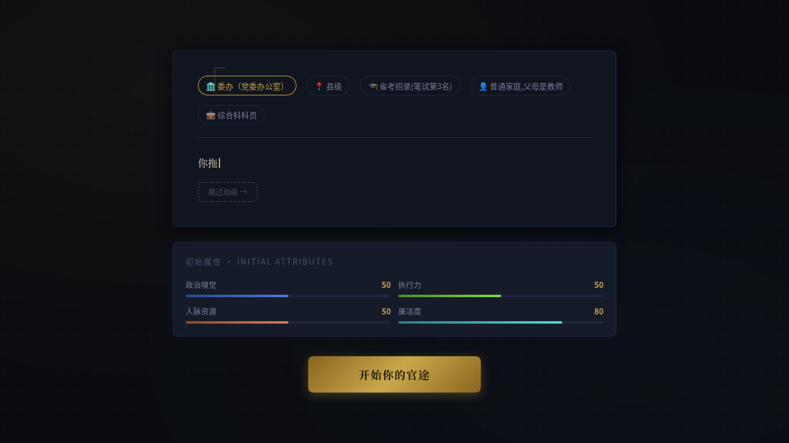
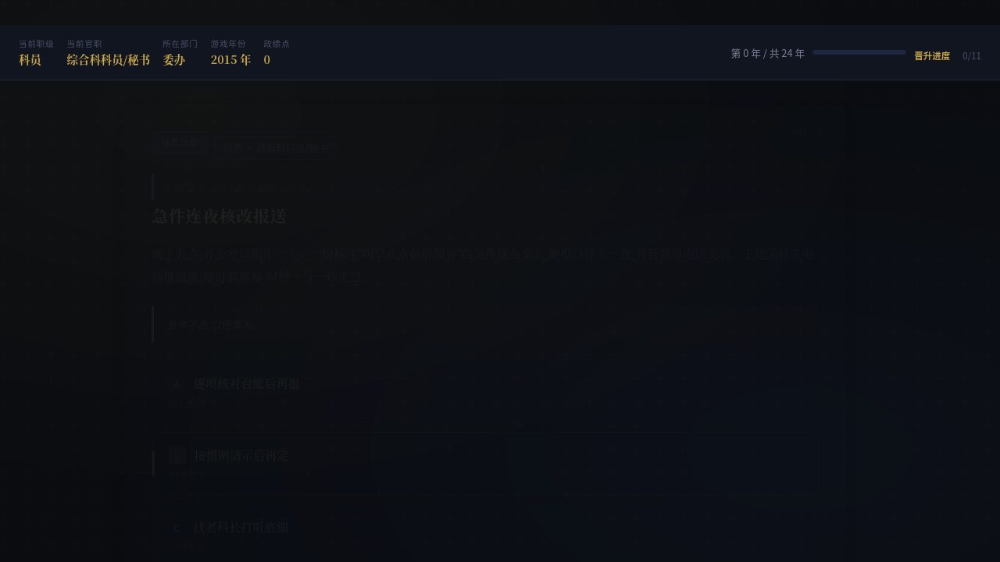
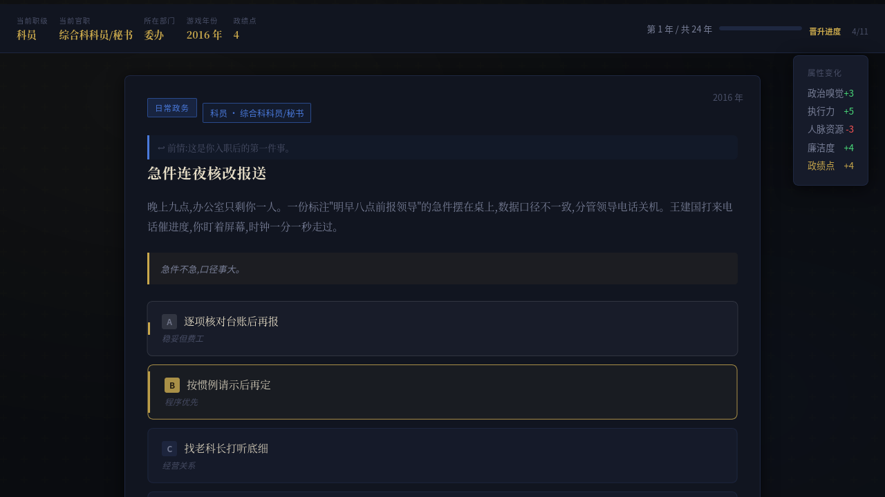
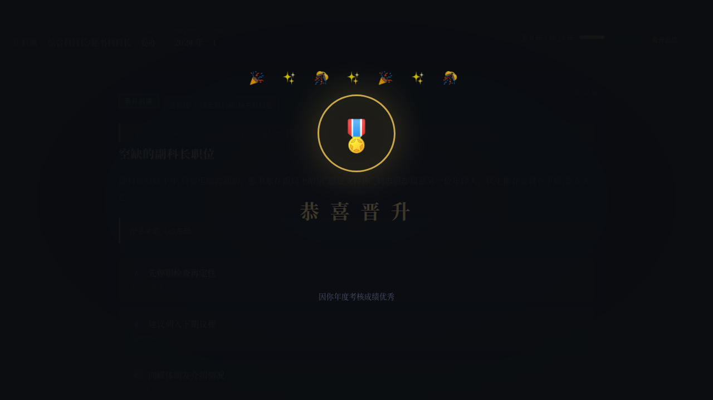
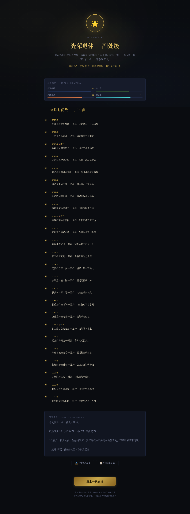

# 前端详解(latest)

> 活文档:代码变更时必须同步更新本文,维护规则见 [docs/README.md](../README.md)。基线:main@146004a + 官职/职级显示改造(feat/rank-position-ui,2026-08-22)

本文描述 `src/` 下的前端:技术栈与构建产物、组件树、`useGame` 状态机与后端 API 的对应关系、玩家可见的关键交互、类型严格模式与 E2E。所有断言以 `src/` 当前代码为准;游戏规则逻辑(事件生成/去重/晋升/结局)在 `src/engine/` 纯 TS 引擎中,可脱离浏览器单测,本文只涉及表现层用到的部分。

## 目录

1. [技术栈与构建产物](#1-技术栈与构建产物)
2. [组件树与职责](#2-组件树与职责)
3. [useGame 状态机与 API 对应](#3-usegame-状态机与-api-对应)
4. [玩家可见的关键交互](#4-玩家可见的关键交互)
5. [一次完整对局(真实 E2E 截图)](#5-一次完整对局真实-e2e-截图)
6. [类型严格模式](#6-类型严格模式)
7. [测试](#7-测试)
8. [数据来源与复现](#8-数据来源与复现)

## 1. 技术栈与构建产物

- **React 19.1 + TypeScript 5.8(strict)+ Vite 7**(`package.json`)。无路由库、无状态管理库——五个屏幕由 `useGame` 的 `screen` 字段手工流转;无 UI 组件库,样式为手写 CSS(`src/styles/base.css`、`src/styles/app.css`,经 `src/main.tsx:4-5` 引入)。
- 入口 `src/main.tsx`:`createRoot(...).render(<StrictMode><App/></StrictMode>)`,根节点 `#root`(由根 `index.html` 提供)。
- **开发模式**:Vite dev server(5173)把 `/api` 代理到本地后端 3000(`vite.config.ts:10-16`),前端热更新、后端 `npm run dev:server`。
- **构建**:`vite build` 产出 `dist/`,`manualChunks` 把 `react`/`react-dom` 拆为 vendor 包,不产 sourcemap(`vite.config.ts:18-28`)。

当前构建产物体积(`dist/assets/`,2026-08-21 实测):

| 文件 | 原始体积 | gzip |
| --- | --- | --- |
| `index-D__OHDFh.js`(应用+引擎) | 253,896 B ≈ **253.9 KB** | 84,480 B ≈ 84.5 KB |
| `vendor-xESKVwWO.js`(react/react-dom) | 11,213 B ≈ 11.2 KB | — |
| `index-DnA9viED.css` | 24,456 B ≈ 24.5 KB | — |

> 合入前全量 gate 记录为 "253.90KB / gzip 84.91KB"(`docs/rollout-report.md`);本次实测 gzip 84.5 KB,差异来自 gzip 实现版本,原始字节数完全一致。`dist/rag_knowledge.json`(约 271 KB)随构建分发,供 RAG 检索(§3)。

## 2. 组件树与职责

以 `src/App.tsx:13-50` 的实际渲染结构为准(`game.screen` 决定挂载哪个屏幕):

```
App (src/App.tsx)
├── DeptSelectScreen            screen='select'
│   ├── StarRating ×13部门×4维   权力/繁忙/晋升/风险 五星条
│   └── HowToPlayModal          "玩法说明"四步弹层(内部函数组件)
├── LoadingScreen               screen='loading'   转珠动画+文案
├── BackgroundScreen            screen='background'
│   └── AttrBars                初始四维属性条
├── GameScreen                  screen='game'
│   ├── HUD                     职级/官职/部门/年份/政绩点 + 双进度条
│   ├── EventCard               事件卡(或错误重试卡;头部官职徽标)
│   │   └── AttrBars            卡底"当前属性"
│   ├── AttrChangeToast         属性变化浮动反馈(诉求3)
│   └── PromotionOverlay        晋升庆祝弹层(职级+官职双变迁)
└── ResultScreen                screen='result'
    └── AttrBars                最终属性条
```

| 组件 | 文件 | 职责要点 |
| --- | --- | --- |
| App | `src/App.tsx` | 只做屏幕流转分发,持 `useGame()` 单一状态源 |
| DeptSelectScreen | `src/components/screens/DeptSelectScreen.tsx` | 13 部门星级卡(`DEPARTMENTS`)、三档难度、开始按钮;含玩法说明弹层 |
| LoadingScreen | `src/components/screens/LoadingScreen.tsx` | 主文案+副文案(缺省时按时钟轮换 8 条官场闲话) |
| BackgroundScreen | `src/components/screens/BackgroundScreen.tsx` | 开场白打字机动画(18ms/字,可"跳过动画")、身份徽章、初始属性 |
| GameScreen | `src/components/screens/GameScreen.tsx` | 组装 HUD+事件卡+反馈层;`error` 优先于 `currentEvent` 渲染错误卡;选中项高亮 1s 并禁用全部选项 |
| ResultScreen | `src/components/screens/ResultScreen.tsx` | 结局 hero(GREAT/BAD/其他三配色)、统计行含**终局官职**(`data-testid="final-position"`)、最终属性、24 步时间线、官途评语、分享/复制/重开 |
| HUD | `src/components/game/HUD.tsx` | **当前职级**(`#hud-rank`)+**当前官职**(`#hud-position`,如"综合科科员/秘书",长名截断+悬停全称)/部门/年份/政绩点;第 N/24 年进度条;晋升进度条(点数/成本,到顶显示"已到顶") |
| EventCard | `src/components/game/EventCard.tsx` | 类型标签+**官职徽标**(`data-testid="event-position`",`科员 · 综合科科员/秘书`)+年份、"↩ 前情"衔接语、标题/描述/格言、A-D 选项(文案+提示)、入场滑动动画;`data-testid="choice-N"` |
| AttrBars | `src/components/game/AttrBars.tsx` | 四维属性条(政治嗅觉/执行力/人脉资源/廉洁度),可选差值闪光 |
| AttrChangeToast | `src/components/game/AttrChangeToast.tsx` | 选择后弹出非零属性变化+政绩点,2800ms 自动消失;`data-testid="attr-toast"` |
| PromotionOverlay | `src/components/game/PromotionOverlay.tsx` | 晋升庆祝:徽标、"恭喜晋升"、旧→新职级、**官职变迁行**(`data-testid="promo-position"`,如"综合科科员/秘书 → 综合科副科长/副主任科员")、晋升原因、"继续仕途"(Enter/Space 可关) |
| StarRating | `src/components/common/StarRating.tsx` | 纯展示五星星级 |

组件普遍埋了 `data-testid` 供 E2E 定位:`choice-0..3`(选项)、`attr-toast`(属性反馈)、`promo-overlay`/`promo-continue`/`promo-position`(晋升)、`error-card`/`retry-btn`(错误重试)、`current-attrs`(属性面板)、`event-position`(事件卡官职徽标)、`final-position`(结算屏终局官职);HUD 另有 `hud-rank`/`hud-position`/`hud-year`/`hud-points` 等 id。

官职名与职级的对照统一来自 `departments.ts` 的 `rankPositions` 表,取值入口是 `rankPositionOf(dept, rankIdx)`(`src/engine/departments.ts:456`,缺映射回退职级名、索引越界取首/末级)——HUD、事件卡徽标、晋升庆祝、结算屏四处展示与 `rankRules.ts` 职级事实校验**同源**,保证界面所见即引擎事实。

引擎侧模块速览(表现层经 `useGame` 间接使用,全部可在 Node 单测):`gameEngine.ts`(编排)、`parser.ts`(【】标记解析与修复)、`promptBuilder.ts`(提示词+叙事指令库)、`dedup.ts`(标题/选项去重)、`rankRules.ts`(职级事实校验)、`effects.ts`(效果再平衡)、`promotion.ts`(绩效点/考核/晋升成本)、`ending.ts`(结局判定)、`storyMemory.ts`(NPC 名册/摘要/线索)、`rag.ts`(真实案例检索)、`rng.ts`(可注入随机源)、`departments.ts`(13 部门数据)、`llm.ts`(三种 LLM 客户端)、`types.ts`(全部类型)。

## 3. useGame 状态机与 API 对应

`src/hooks/useGame.ts` 是唯一状态编排层:包装 `src/engine/gameEngine.ts` 的纯函数引擎,桥接 React UI 与网络。核心状态:`screen`(5 阶段)、`state: GameState|null`、`ending`、`error`、`feedback`(属性 toast 数据)、`lastPromotion`、`pendingNext`,以及防重复计分的 `answeredEventRef`(`src/hooks/useGame.ts:70-85`)。

**阶段流转**:

```
select ──startGame──▶ loading ──背景生成成功──▶ background
   ▲                    │失败:回 select            │beginGame
   │                    ▼                          ▼
restart            (错误)                     loading ──▶ game ◀─┐
   │                                                   │ │       │retryEvent
   └──────────────── result ◀──1200ms────── choose(第24步)┘ choose(非晋升:
                                     │                    900ms 后 generateNext)
                                     └── choose 途中 promoted:game 内先弹
                                         PromotionOverlay,关闭后 generateNext
```

**动作 ↔ 引擎调用 ↔ 网络请求一一对应**(网络层:`ProxyLLMClient` → `POST /api/llm-proxy`,`src/engine/llm.ts:13-39`;上报层:`src/services/tracking.ts`,失败静默降级):

| 玩家动作(useGame) | 本地引擎调用 | 发出的 HTTP 请求 |
| --- | --- | --- |
| 踏入官场 `startGame` | `createGame`(初始属性 50/50/50/80,2015 年起)、`generateBackground`(maxTokens 1000,temp 0.75,失败回退预设背景) | `POST /api/track/start`;`POST /api/llm-proxy` ×1(背景) |
| 开始你的官途 `beginGame` | `nextEvent`(首个事件) | `POST /api/llm-proxy` ×1~4(见下) |
| 点击选项 `choose` | `applyChoice`:属性结算→绩效点→(突出选项即时考核/每 3 步年度考核)→时间线/摘要;`ended` 时 `finishGame` 算结局 | `POST /api/track/choice`;未终局→`/api/llm-proxy` ×1~4 取下一事件;终局→`POST /api/track/end`(含客户端计量的 durationMs) |
| 重新推演 `retryEvent` | 用**原状态**重跑 `nextEvent` | `POST /api/llm-proxy` |
| 继续仕途 `continueAfterPromotion` | 对 `pendingNext` 跑 `generateNext` | `POST /api/llm-proxy` |
| 重走一次 `restart` | 重置全部本地状态(含 answeredEventRef) | 无网络请求 |

`nextEvent` 生成管线(`src/engine/gameEngine.ts:130-231`):构建提示词(叙事指令抽袋 + RAG 真实案例段)→ LLM → `parseEvent` 解析 → `fixRankFacts` 职级事实修正 → `checkEventFreshness` 去重检查(不过则**重试**,最多 4 次,温度分流:首发 0.85、格式违规收敛 0.6、内容撞车发散 0.95,`gameEngine.ts:155-198`)→ `rebalanceEffects` 效果再平衡 → 更新故事记忆(usedTitles / usedChoiceTexts 滚动池 200 条 / NPC 名册)。真实 GLM 约 7% 概率格式违规,靠携带纠错说明的重试兜住(`gameEngine.ts:170`)。RAG 数据 `rag_knowledge.json` 经模块级单例 `ensureRag()` 只加载一次(`useGame.ts:54-66`)。

`choose()` 的核心分支(摘自 `src/hooks/useGame.ts:146-198`):

```ts
if (answeredEventRef.current === state.currentEvent.id) return;  // 防双计分
answeredEventRef.current = state.currentEvent.id;
const result = applyChoice(state, idx);        // 引擎结算,返回新状态+反馈
setState(result.state);
setFeedback({ effects: result.effects, pointsGained: result.pointsGained, promoted: result.promoted });
trackChoice({ sessionId: result.state.sessionId, /* step/year/事件/选项/效果/属性/职级 */ });
if (result.state.ended) {                      // 第 24 步:算结局+上报,1200ms 后进结算屏
  const finalEnding = finishGame(result.state);
  setEnding(finalEnding); trackEnd({ /* ...含 timeline */ });
}
if (result.promoted) {                         // 先庆祝:暂存状态,弹层关闭后再取下一事件
  setLastPromotion(result.promotion); setPendingNext(result.state); return;
}
setTimeout(() => void generateNext(result.state), 900);  // 留 900ms 看 toast
```

**关键类型**(`src/engine/types.ts`,纯类型无副作用):

- `Attrs` 四维:`politics/execute/network/integrity`(0-100,廉洁度初始 80)。
- `ChoiceEffect`:四维变化 + `promotion`(0/1,1 = 突出表现选项,立即触发考核)。
- `GameEvent`:`tag/tagLabel/title/desc/hint/continuity(前情衔接)/npcs/choices[4]` + `aiGenerated/repairs`(引擎修复记录)。
- `GameState`:全量对局状态(约 25 字段,含 timeline/npcs/summary/threads/去重池/晋升记录),引擎函数一律 `structuredClone` 返回新状态。
- `ApplyResult`:`state/effects/attrsBefore/attrsAfter/promoted/promotion/promotionProgress/pointsGained`——直接驱动 toast 与晋升弹层。
- `Ending`:`endingType`(GREAT/GOOD/MID/MID2/BAD)+ 标题/图标/总结/评语/最终职级。

**错误与重试处理**:事件生成失败(`generateNext` catch)→ 保留原 `state` 回 `game` 屏,`GameScreen` 优先渲染错误卡(`data-testid="error-card"`,展示 `error.slice(0,120)` 与"重新推演"按钮)——错误分支曾因排在 `currentEvent` 之后而永不可达,80bca04 修复为 error 优先(`src/components/screens/GameScreen.tsx:45-57`);背景生成失败 → 回 `select` 屏;留存上报失败 → 静默不影响游戏(`src/services/tracking.ts:48-50`)。

## 4. 玩家可见的关键交互

- **属性 toast(诉求 3:选后效果可见)**:每次点击选项,`AttrChangeToast` 立即弹出本次非零属性变化(正绿负红)+ 政绩点增量,2800ms 自动消失(`src/components/game/AttrChangeToast.tsx:20-23`)。E2E 对每一步(终局步除外)断言 `attr-toast` 可见(`e2e/game.spec.ts:69-71`)。选择后 900ms 才请求下一事件,保证 toast 先被看到(`src/hooks/useGame.ts:198`)。
- **晋升庆祝(曾是死锁 bug)**:晋升时先弹 `PromotionOverlay`(徽标按新职级字长取、旧→新职级、原因文案、"继续仕途"按钮/回车空格)。死锁根因:旧实现 `lastPromotion` 派生自 `feedback?.promoted`,而弹层又只在 toast(`feedback`)消失后渲染——条件互斥,每次晋升必然卡死。80bca04 修复为 `lastPromotion` 独立 state、与 toast 生命周期解耦(`src/hooks/useGame.ts:190-198`、`GameScreen.tsx:74-76`:`lastPromotion && toast === null` 才渲染);同一提交还加了 `answeredEventRef` 守卫,防晋升等待期间旧事件按钮恢复可点导致同一事件重复计分(`useGame.ts:84-85, 146-147`)。
- **结局结算页**:`ResultScreen` 按 `endingType` 三配色渲染 hero(官途圆满/落马/官途终章)+ 三项统计(晋升次数/走过年数/终职),向下依次为最终属性、完整官途时间线(晋升步带 🎉 标记)、官途评语;分享走 `navigator.share` 回退剪贴板复制,"重走一次官途"回到选部门屏。

## 5. 一次完整对局(真实 E2E 截图)

以下截图来自 Playwright E2E(`e2e/game.spec.ts`,Firefox + mock LLM)实拍,对应组件见 §2。

**1. 选部门**——`DeptSelectScreen`:13 张部门卡各带四维星级(`StarRating`),下方三档难度,选中后"踏入官场"可用。


**2. 开局背景**——`BackgroundScreen`:打字机开场白 + 身份徽章(级别/入职方式/家庭/职务),底部初始四维属性(`AttrBars`,廉洁度 80 起步)。



**3. 首个事件**——`GameScreen`:`HUD` 显示当前职级/当前官职/部门/年份与"第 1 年 / 共 24 年"晋升进度条;`EventCard` 头部带官职徽标(如 `科员 · 综合科科员/秘书`),呈现类型标签、正文与 A-D 四个选项。



**4. 属性 toast**——选择后右侧弹出 `AttrChangeToast`:政治嗅觉 +3 / 执行力 +5 / 人脉资源 −5 / 廉洁度 +4,政绩点 +4;选项短暂高亮锁定。



**5. 晋升庆祝**——`PromotionOverlay`:奖章徽标、旧→新职级、晋升原因(年度考核/关键事件表现)与"继续仕途"。



**6. 结局结算**——`ResultScreen` 全页:结局 hero 与统计(晋升次数/年数/终职/终局官职)、最终属性、24 步官途时间线(晋升步带标记)、官途评语与分享/重开。



## 6. 类型严格模式

- `tsconfig.app.json`(src)关键项:`"strict": true` 全开,叠加 `noImplicitOverride`、`noUnusedLocals`、`noUnusedParameters`、`noFallthroughCasesInSwitch`、`erasableSyntaxOnly`、`verbatimModuleSyntax`;bundler 解析模式下 `allowImportingTsExtensions: true`——源码内全部显式 `.ts`/`.tsx` 后缀导入(如 `import { useGame } from './hooks/useGame.ts'`)。
- `tsconfig.json` 为引用壳(app/node 两份),`tsconfig.test.json` 继承 app 并覆盖 `include: ["tests","e2e","scripts/diversity-scan.mts"]`——测试与 E2E 同样 strict。`npm run typecheck` 三份全过。

```jsonc
// tsconfig.app.json(节选)
{
  "target": "es2023", "module": "esnext", "moduleResolution": "bundler",
  "allowImportingTsExtensions": true,   // 源码内显式 .ts 后缀导入
  "verbatimModuleSyntax": true,         // type-only 导入必须写 import type
  "strict": true,                       // 全开(含 noImplicitAny)
  "noImplicitOverride": true, "noUnusedLocals": true, "noUnusedParameters": true,
  "erasableSyntaxOnly": true, "noFallthroughCasesInSwitch": true, "noEmit": true
}
```
- **any 禁用**:`eslint.config.js:40` 将 `@typescript-eslint/no-explicit-any` 设为 `error`。6f5061b 把三套 tsconfig 全部 strict 化并修复了暴露出的 3 处真实类型错误(`'routine'` 非法 `EventTag`、flaky mock 缺 `async`、`server.close` 回调签名),同提交还移除了 `DeptSelect` 的 `dangerouslySetInnerHTML`。
- 类型边界:`fetch` 响应用 `as { content?: string }` 等窄化断言而非 any;LLM 文本边界(上游返回)在 `parser.ts` 解析层校验,失败抛错走重试管线。

## 7. 测试

- **E2E(Playwright,Firefox)**:`e2e/game.spec.ts` 三个用例,`playwright.config.ts` 起 `webServer`(先 `npm run build`,再 `LLM_MODE=mock PORT=3311 WORKERS=1 DB_PATH=data/e2e.db node server.js`,独立端口/DB 可反复跑):
  1. **完整一局**(串行,240s 上限):部门选择(13 卡)→ 难度 → 背景(打字机+跳过)→ **24 步主循环**:轮换点击 4 个选项、每步(终局步除外)断言属性 toast 可见、步进用 `page.evaluate` 瞬时读 DOM 判定结果(ERROR/PROMO/NEXT/RESULT)、错误则点击重试、晋升则断言弹层文案并"继续仕途";结局屏断言 hero 与时间线,最后 `GET /api/stats` 断言本局轨迹已入库(started/completed/completionRate)。全程关键节点截图(即 §5 六图 + 错误/晋升备选)。
  2. **admin 仪表盘**可访问且含统计文案。
  3. **健康检查与 LLM 代理契约**:`/healthz` 返回 `mode:'mock'`;`/api/llm-proxy` 返回 `content>20` 字符、`provider:'mock'`。
- **单元/集成(vitest)**:引擎测试在 `tests/unit/`(dedup/departments/effects/ending/gameEngine/parser/promotion/rankRules/storyMemory + 服务端 stats TTL 缓存),服务端集成在 `tests/integration/`(`server.test.ts` 覆盖全部 API 路由、穿越防护、XFF 限流、503 兜底;`llmTimeout.test.ts` 锁超时语义)。前端组件测试在 `tests/unit/ui/`(jsdom + @testing-library/react,文件头 `// @vitest-environment jsdom` 切环境;`rankDisplay.test.tsx` 覆盖 HUD 职级/官职、事件卡徽标、晋升官职变迁、结算官职);`vite.config.ts` 的 vitest include 含 `*.test.tsx`。E2E 另对 `#hud-position`/`event-position`/`promo-position`/`final-position` 全流程断言。

## 8. 数据来源与复现

本文撰写时实际执行的核对命令(仓库根目录,分支 `docs/full-docs` @ e4fa8f5):

```bash
cat src/main.tsx src/App.tsx src/hooks/useGame.ts src/engine/types.ts \
    src/services/tracking.ts src/engine/llm.ts vite.config.ts            # 前端核心源码
cat src/components/screens/*.tsx src/components/game/*.tsx \
    src/components/common/StarRating.tsx                                 # 全部组件
cat tsconfig.json tsconfig.app.json tsconfig.test.json package.json eslint.config.js
ls -l dist/assets                                                        # 产物体积
gzip -c dist/assets/index-D__OHDFh.js | wc -c                            # 84480 B
git show --stat 80bca04 6f5061b                                          # 晋升死锁与 TS strict 修复
```

构建体积复现:`npm run build && ls -l dist/assets && gzip -c dist/assets/index-*.js | wc -c`(gzip 数字随 gzip 版本略有浮动,原始字节数稳定)。E2E 复现:`npx playwright test`(自动构建并以 mock LLM 起独立服务,截图落 `test-results/`)。
