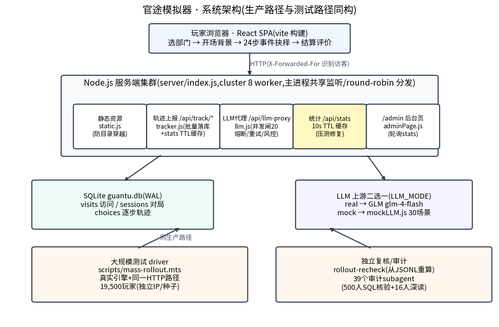
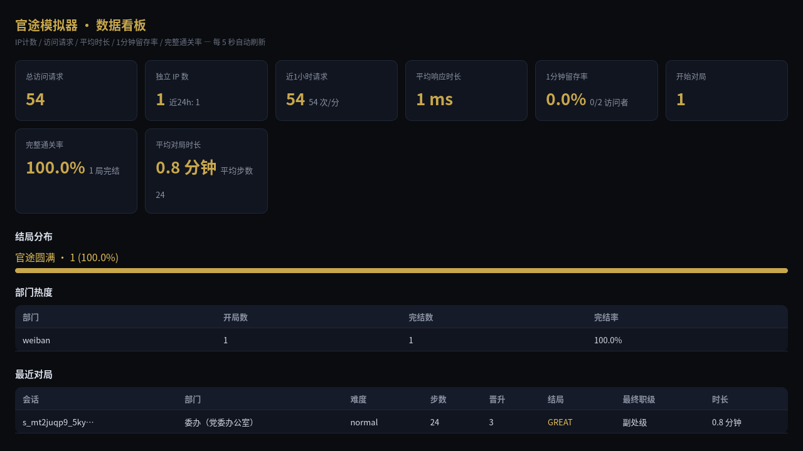

# 服务端详解(latest)

> 活文档:代码变更时必须同步更新本文,维护规则见 [docs/README.md](../README.md)。基线:main@e4fa8f5(2026-08-21)

本文描述 `server/` 目录下的 Node.js 服务端:cluster 进程模型、HTTP API、SQLite 数据留存、LLM 代理、/admin 看板、安全与性能档案。所有断言以 `server/*.js` 当前代码为准。



## 目录

1. [进程模型与启动](#1-进程模型与启动)
2. [HTTP API 一览](#2-http-api-一览)
3. [数据留存:表结构与批量写入](#3-数据留存表结构与批量写入)
4. [/api/stats 聚合与 TTL 缓存](#4-apistats-聚合与-ttl-缓存)
5. [LLM 代理](#5-llm-代理)
6. [mock LLM(30 场景罐装)](#6-mock-llm30-场景罐装)
7. [/admin 数据看板](#7-admin-数据看板)
8. [安全清单](#8-安全清单)
9. [性能档案(压测与 rollout 实测)](#9-性能档案压测与-rollout-实测)
10. [生产部署要点](#10-生产部署要点)
11. [数据来源与复现](#11-数据来源与复现)

## 1. 进程模型与启动

启动链路:`npm start` → 根目录 `server.js`(仅 `require('./server/index.js')`)→ `server/index.js`。

- **cluster 多 worker**:`WORKERS` 环境变量,`0`/未设置 = `min(CPU 核数, 8)`,`1` = 单进程(调试)(`server/index.js:12-16`)。master `cluster.fork()` 全部 worker,worker 退出自动重启(`server/index.js:21-24`)。
- **同端口共享监听**:由 `node:cluster` 内置机制完成(主进程持有 listening socket,round-robin 分发给 worker),worker 各自 `server.listen(PORT)`。代码未设置 `SO_REUSEPORT` socket 选项(本文档撰写时曾发现架构图 g01 误标为 SO_REUSEPORT,已修正图表为"主进程共享监听/round-robin 分发",以本节与修正后图为准)。
- **每 worker 独立 SQLite 连接**:worker 分支内各自 `openDb(DB_PATH)`、各自实例化 `LLMService` / `createApp`(tracker、VisitBatchWriter、限流器均为 worker 私有内存态,`server/index.js:33-40`)。多进程靠 SQLite WAL + busy_timeout 共存,不靠共享连接。
- **建库竞态防护(343b952)**:8 个 worker 同时冷启动时,`journal_mode=WAL` 与建表都要写锁;没有 busy_timeout 会立即抛 `database is locked`,cluster 反复重启 worker 形成启动崩溃循环。修复为:busy_timeout 必须最先设置,WAL 与建表走退避重试(`server/db.js:63-69`):

```js
// server/db.js:66-69
db.exec('PRAGMA busy_timeout = 8000;');
execWithRetry(db, 'PRAGMA journal_mode = WAL;');
db.exec('PRAGMA synchronous = NORMAL;');
execWithRetry(db, SCHEMA);
```

  `execWithRetry` 最多 10 次、同步退避(10ms 起步、上限 200ms,`server/db.js:74-88`)。
- **TCP 层参数**(`server/index.js:53-59`):`keepAliveTimeout=65000`、`headersTimeout=70000`、`requestTimeout=120000`、`maxRequestsPerSocket=0`。最后这项来自压测修复:原值 1000 时,长连接第 1001 个请求起被 Node 内核直接回 503(实测 autocannon 20 连接恰好 20000 个 2xx 后全部 503,服务端日志无任何非 200,343b952)。
- **优雅关闭**:master 收 SIGTERM/SIGINT 后向全部 worker 发 SIGTERM;worker 调 `handle.close()`(即 `visits.close()`,把内存队列中的访问日志落库)→ `server.close()` → 4s 强制退出;master 5s 强制退出(`server/index.js:26-32, 68-75`、`server/app.js:196-198`)。

## 2. HTTP API 一览

路由全部在 `server/app.js:94-194` 的 `handle()` 中手写分发(无框架)。所有响应带 CORS 头(`Access-Control-Allow-Origin: *`)与 `X-Content-Type-Options: nosniff`。

| 方法 | 路径 | 入参(请求体/查询) | 出参 | 实现位置 |
| --- | --- | --- | --- | --- |
| GET/HEAD | `/` 与 dist 内任意路径 | — | 文件流(gzip+ETag+分级缓存);不存在的路径 SPA 回退 `index.html`(`no-cache`) | `server/static.js:67-95` |
| GET | `/healthz` | — | `{ok, mode, pid}` | `server/app.js:143-145` |
| GET | `/api/stats` | — | 留存聚合 JSON(§4) | `server/app.js:148-150` → `server/tracker.js:100-198` |
| GET | `/admin` | — | 数据看板 HTML | `server/app.js:151-156` → `server/adminPage.js` |
| POST | `/api/track/start` | `sessionId`*,`deptId`,`deptName`,`difficulty`,`maxSteps`(默认 24) | `{ok:true}` | `server/app.js:163` → `server/tracker.js:34-49` |
| POST | `/api/track/choice` | `sessionId`*,`step`,`year`,`eventTitle`,`eventTag`,`choiceText`,`effects`,`attrsAfter`,`rankAfter`,`promoted` | `{ok:true}` | `server/app.js:164` → `server/tracker.js:51-70` |
| POST | `/api/track/end` | `sessionId`*,`stepsDone`,`finalRank`,`endingType`,`promotions`,`attrs`,`timeline`,`durationMs` | `{ok:true}` | `server/app.js:165` → `server/tracker.js:72-89` |
| POST | `/api/llm-proxy` | `prompt`*(string),`max_tokens`(默认 1600,上限 4000),`temperature`(默认 0.85),`top_p`(默认 0.9) | `{content, provider}` | `server/app.js:170-182` → `server/llm.js:141-189` |
| OPTIONS | 任意 | — | `204`(CORS 预检) | `server/app.js:135-139` |

\* `sessionId` 缺失时 tracker 抛错,经统一 catch 返回 `500 {error:'missing sessionId'}`;`prompt` 缺失或非字符串返回 `400`。

错误路径(统一经 `early()`,`server/app.js:97-102`):

- `429` — 超过每 IP 限流(默认 600 次/分,`RATE_LIMIT_PER_MIN`;仅限 `/api/track/*` 与 `/api/llm-proxy`,静态资源不限,`server/app.js:28-50`)。
- `400` — 非法请求行 URL;llm-proxy 缺 prompt。`404` — 未知 `/api/track/*` 端点。`405` — 非 GET/HEAD/OPTIONS/POST。
- `413` — 请求体超过 2MB(`BODY_LIMIT`,`server/app.js:10`)。
- `early()` 会先 `req.resume()` 排空请求体再响应:否则 Node 因未消费的请求体销毁 keep-alive 连接,客户端同连接的后续管线请求全部报错(500 并发下实测 1800 个连接级错误,343b952 修复)。

访问日志:`res.on('finish')` 时入队一条 visits(`/assets/*`、`/healthz`、`/favicon.ico` 不记——静态请求量是页面访问的数百倍,逐条入库只会写放大,`server/app.js:119-133`)。

**一条 `POST /api/track/choice` 的完整生命周期**(串联上述机制):

1. cluster 主进程把连接分给某 worker,`handle()` 记录 `start` 时间(`server/app.js:95`);
2. `new URL()` 解析 pathname(非法请求行直接 400 并排空请求体);
3. `clientIp()` 取 IP(TRUST_PROXY 决定是否读 XFF 最右侧);
4. CORS/nosniff 头;`res.on('finish')` 挂访问日志钩子;
5. 命中 `/api/track/` 前缀 → 限流桶检查(同一 IP 每分钟 600 次),超限 `early(429)`;
6. `readBody()` 读 JSON(≤2MB,解析失败按 `{}` 处理);
7. `tracker.trackChoice(body)`:截断字段 → 预编译 `insertChoice` 写 choices → `touchSession` 刷 sessions.updated_at,同步返回 `{ok:true}`;
8. 响应后 finish 钩子把 `{ts, ip, ua, path, status, durationMs}` 推进 VisitBatchWriter 队列,2s/200 条批量落 visits。

步骤 7 的两次 SQLite 写是同步毫秒级;访问日志(步骤 8)与请求线程解耦,压测下该端点均值 <1ms(§9)。

## 3. 数据留存:表结构与批量写入

三张表(`server/db.js:8-56`),引擎为 `node:sqlite` 内置 `DatabaseSync`。sessions 与 choices 的 DDL(字段含义见注释):

```sql
-- server/db.js:21-54(sessions + choices,节选缩排)
CREATE TABLE IF NOT EXISTS sessions (
  session_id TEXT PRIMARY KEY,       -- 前端生成 s_<base36时间>_<base36随机>
  created_at INTEGER NOT NULL, updated_at INTEGER NOT NULL,
  ip TEXT, ua TEXT,                  -- 服务端注入(meta,非上报字段)
  dept_id TEXT, dept_name TEXT, difficulty TEXT,
  steps_done INTEGER DEFAULT 0, max_steps INTEGER,
  final_rank TEXT, ending_type TEXT, -- 结局五类:GREAT/GOOD/MID/MID2/BAD
  promotions INTEGER DEFAULT 0,
  attrs_final TEXT, timeline TEXT,   -- JSON 串(timeline 截 32KB)
  duration_ms INTEGER, ended INTEGER DEFAULT 0
);
CREATE TABLE IF NOT EXISTS choices ( -- 每步一条
  id INTEGER PRIMARY KEY AUTOINCREMENT,
  session_id TEXT NOT NULL, step INTEGER NOT NULL, year INTEGER,
  event_title TEXT, event_tag TEXT, choice_text TEXT,
  effects TEXT, attrs_after TEXT,    -- JSON:四维效果 / 选择后属性快照
  rank_after INTEGER, promoted INTEGER, ts INTEGER NOT NULL
);
```

- **visits** — HTTP 访问流水:`ts`(毫秒时间戳)、`ip`、`ua`(截 250 字)、`path`、`status`、`duration_ms`(服务端处理耗时)。索引:`ts`、`ip`。
- **sessions** — 对局主记录:`session_id`(PK)、`created_at`/`updated_at`、`ip`/`ua`(服务端注入的 meta)、`dept_id`/`dept_name`/`difficulty`、`steps_done`/`max_steps`、`final_rank`/`ending_type`/`promotions`/`attrs_final`(JSON)/`timeline`(JSON)/`duration_ms`、`ended`(0/1)。
- **choices** — 逐步轨迹:`session_id`+`step`、`year`、`event_title`/`event_tag`/`choice_text`、`effects`/`attrs_after`(JSON)、`rank_after`、`promoted`、`ts`。索引:`session_id`。

**VisitBatchWriter(内存队列批量落库)**:`flushIntervalMs=2000`、`batchSize=200`;`push()` 满 200 条立即 flush,否则 2s 定时器兜底(`server/db.js:91-108`)。flush 用 `BEGIN IMMEDIATE` 事务整批写入——直接取写锁,避免 deferred 事务并发升级死锁;失败整批重试 3 次,仍失败则丢弃并打日志(访问日志允许有损,不能阻塞请求,`server/db.js:110-134`)。压测下请求处理与落库解耦,请求线程永不等待 SQLite。

**字段截断上限**(防超长 payload 撑爆 DB;留存统计不需要全文,`server/tracker.js:12`):

| 字段 | 上限 | 字段 | 上限 |
| --- | --- | --- | --- |
| `sessionId` | 64 字符 | `eventTitle` / `choiceText` | 200 字符(默认 `cap()`) |
| `deptId` | 32 | `eventTag` | 32 |
| `deptName` / `finalRank` | 64 | `difficulty` / `endingType` | 16 |
| `timeline`(JSON 串) | 32KB | `ua`(app.js 侧) | 250 |

写入语义:`trackStart` 用 `INSERT … ON CONFLICT(session_id) DO NOTHING`——同一 sessionId 重复开局不覆盖原记录(幂等);`trackChoice` 每步 insert 一条 choices 并 `touchSession` 刷新 updated_at;`trackEnd` 一次性 `UPDATE` 回填结局字段并置 `ended=1`(`server/tracker.js:16-32`)。预编译语句在 `createTracker` 构造时一次准备,worker 生命周期内复用。

## 4. /api/stats 聚合与 TTL 缓存

`tracker.stats()`(`server/tracker.js:100-198`)单次现算全部指标,返回结构:

- `visits` — 累计请求总数 / 独立 IP 数 / 近 24h 两项。
- `requests` — 近 1 小时请求数、折算每分钟、平均响应时长、`slowestPaths`(近 24h 按 `AVG(duration_ms)` 倒序 top10,即"慢路径")。
- `retention` — **1 分钟留存率**:近 24h 按 `ip+ua` 归一的访问者中,活跃跨度(`MAX(ts)-MIN(ts)`)≥60s 的占比;附分子分母。
- `sessions` — 开始/完结局数、**通关率**(有结局的 session / 已开始的 session)、平均对局时长与步数、结局分布(`byEnding`)、部门分布(`byDept`,开局数/完结数)、最近 20 局明细。
- `generatedAt` — 本次聚合生成时间(ISO)。

返回 JSON 骨架(键名与 admin 看板、E2E 断言对齐,`server/tracker.js:163-195`):

```js
{
  generatedAt: '…ISO…',
  visits:   { total, uniqueIps, last24h, last24hUniqueIps },
  requests: { total, lastHour, perMinuteLastHour, avgDurationMs, slowestPaths },
  retention:{ oneMinute, visitors24h, retainedVisitors },
  sessions: { started, completed, completionRate, avgDurationMs, avgSteps,
              byEnding, byDept, recent },
}
```

**为什么要 10s TTL 缓存**:stats() 要在 visits 表做多组无索引聚合,而 `node:sqlite` 是同步执行,会阻塞 worker 事件循环。rollout 压测中 visits 累积到约 47 万行,单次冷聚合阻塞 ~1.2s;管理页与监控高频轮询时,同 worker 上的玩家请求长尾被一起拖垮——首测 S3 场景 20s 仅完成 1,188 个请求(p50 885ms、p99 17.2s)。加 10s TTL 后复测:同场景 186,651 个请求(**吞吐 156 倍**)、p99 17,195ms → 107ms;残余 max≈2.2s 是每 worker 每 10s 一次的冷聚合,不再影响 p99(数字出处:`docs/rollout-report.md`,修复提交 17e764f)。

```js
// server/tracker.js:96-104
let statsCache = null;
const STATS_TTL_MS = Math.max(0, Number(process.env.STATS_TTL_MS ?? 10_000));

function stats() {
  const now = Date.now();
  if (statsCache && now - statsCache.at < STATS_TTL_MS) {
    return statsCache.data;
  }
```

`STATS_TTL_MS` 可调,设 `0` 完全关闭缓存;缓存的是同一份对象引用(`statsCache.data`),面板容忍秒级陈旧,`generatedAt` 如实标注。

**单测三边界**(`tests/unit/trackerStatsCache.test.ts`,内存 SQLite):

1. TTL 窗口内:第二次调用返回同一对象(`expect(second).toBe(first)`),`generatedAt` 不变,窗口内新写入不可见。
2. TTL 过期后(25ms TTL + 40ms 等待):重新现算,新写入可见,`generatedAt` 更新。
3. `STATS_TTL_MS=0`:关闭缓存,每次现算,写入立即可见。

## 5. LLM 代理

`/api/llm-proxy` 是浏览器侧唯一的 LLM 入口:API Key 只存服务端环境变量,前端拿到的仅是生成文本。核心在 `server/llm.js`。

- **上游列表**:环境变量驱动、有序故障切换。GLM 优先(`GLM_API_KEY` → `GLM_ENDPOINT` 默认智谱 v4 接口 / `GLM_MODEL` 默认 `glm-4-flash`),DeepSeek 兜底(`DEEPSEEK_API_KEY` / `LLM_ENDPOINT` / `LLM_MODEL`,`server/llm.js:14-33`)。新增供应商只需 push 一项。
- **并发闸门 20**(`MAX_CONCURRENT`,`LLM_MAX_CONCURRENT`):超限请求进 Promise 队列排队(`server/llm.js:79-92`)。这是保护事件循环与上游的有意背压——压测记录显示完全放开并发后 p50 从 13ms 恶化到 877ms(`docs/loadtest-report.md` 注¹);S3/S4 的 p99 尾延迟即来自闸门排队,不是故障。当前代码中 mock 模式在取闸之前直接返回(`server/llm.js:145-150`),闸门只约束真实上游调用。
- **Breaker 熔断**:每上游独立熔断器,连续 3 次失败 → 冷却 30s,期间跳过该上游,恢复后自动回归(`server/llm.js:41-62, 155-182`)。
- **超时语义**:60s(`LLM_TIMEOUT_MS`)AbortController 截断;AbortError 的原生消息不含 "timeout",调用方重试正则匹配不上,会把瞬时超时当致命错误中断整局(8 局确认扫描实测)——统一改写为 `upstream … timeout after Xms`(`server/llm.js:123-130`,单测 `tests/integration/llmTimeout.test.ts`)。返回文本先剥 `<think>…</think>` 段(`server/llm.js:120`)。
- **内容风控 1301 双级降级**:GLM 对涉腐剧情偶发 1301/contentFilter 拦截(未处理时实测第 13 步即被拦中断整局)。双级:① `promptBuilder` 在事件/背景提示词中写明廉洁教育正面基调,显著降低拦截率;② `isContentFilterError`(`1301|contentFilter|内容可能|敏感|risk content` 等)命中后,追加"以廉洁勤政正面教育为基调重新生成"的重试要求,同上游再试一次,仍失败才计入熔断并切换下一上游(`server/llm.js:35-38, 164-177`,提交 83ebda7)。
- **~7% 格式违规 → 解析重试**:代理只透传文本,不做格式解析;真实 GLM 约 7% 概率输出缺标记/零选项等格式违规(`src/engine/gameEngine.ts:170` 注释,实测数字),纠错重试在前端引擎完成:最多 4 次尝试,温度分流(格式违规收敛到 0.6,内容撞车发散到 0.95),重试提示词携带具体纠错说明(`src/engine/gameEngine.ts:155-198`)。
- **指标**:`metrics` 计数 total/ok/fail/mock/累计耗时/lastError(进程内存态,未暴露 HTTP)。

`generate()` 主流程(摘自 `server/llm.js:141-189`,mock 分支在最前):

```js
async generate(prompt, params) {
  this.metrics.total++;
  if (LLM_MODE === 'mock') { /* mockGenerate 纯同步返回,不走闸门 */ }
  await this.acquireSlot();               // 并发闸 20,超限排队
  for (const provider of this.providers) { // GLM → DeepSeek 有序
    const breaker = this.breakers.get(provider.name);
    if (!breaker.available) continue;      // 熔断冷却中,跳过
    try {
      return await this.callProvider(provider, prompt, params);
    } catch (e) {
      if (isContentFilterError(e.message)) { /* 1301:正面基调重试一次 */ }
      breaker.recordFailure();             // 连续 3 次 → 冷却 30s
    }
  }
  throw new Error(this.metrics.lastError); // 全部上游失败
}
```

## 6. mock LLM(30 场景罐装)

`LLM_MODE=mock` 时 `generate()` 直接调 `mockGenerate(prompt)` 纯同步返回,不取并发闸、不耗上游配额,供压测/E2E/大规模 rollout 使用(`server/mockLLM.js`,与前端单测用的 `src/engine/llm.ts` MockLLMClient 是两套独立实现)。

设计背景:早期版本标题池/正文池独立轮换,一局内正文只有 6 种、逐字重复 4-13 次,且衔接语捏造从未登场的人名,被 19,500 玩家 rollout 轨迹审计判为真实违例,遂重写为**场景单元**:

- **SCENE_BANK:30 个完整场景**(tag/tagLabel/title/desc/hint/npc/effects 一体供给)。一局 24 步按 `SCENE_BANK[(step-1) % 30]` 取景 → 局内 24 个场景互不相同、题文一致。刻意不用 prompt 哈希做偏移:哈希随历史每步变化,24 次取 30 必然撞车,唯一性保证就没了(`server/mockLLM.js:239-252`)。
- **CHOICE_BANK:4 槽 × 24 条**选项文案按步轮换(`ci = (step-1+24) % 24`),步步不重复——否则第 7 步起文案重复会被引擎去重管线过滤,E2E 期待的 4 个选项卡就缺了(`server/mockLLM.js:199-235`)。
- **效果数值绑定场景槽位语义**(A 稳妥正面 / B 程序保守 / C 关系运作 / D 消极风险),杜绝"婉拒报备却扣廉洁"的语义倒挂(每场景 `effects[4]`,与 CHOICE_BANK 槽位一一对应)。
- **衔接语只引用真实标题**:`prompt.match(/标题[:：](.+)/)` 从提示词里取出真实存在的上一步事件标题回引("承接「…」的余波"),不再捏造人物;无上一步时输出"这是你入职后的第一件事"(`server/mockLLM.js:253-259`)。
- 开局背景走独立分支:`prompt.includes('官途开局背景')` 返回固定五段式文本(`server/mockLLM.js:240-248`)。

事件输出严格沿用前端解析器的【】标记契约(`server/mockLLM.js:254-275`),这也是 mock 能作为"产品契约替身"跑通全流程的原因:

```js
const lines = [
  `【事件类型】${scene.tag}`,           // daily/opportunity/temptation/…
  `【类型标签】${scene.tagLabel}`,      // 日常政务/晋升机遇/…
  `【事件标题】${scene.title}`,
  `【剧情衔接】${lastTitle ? `承接「${lastTitle.trim()}」的余波…` : '这是你入职后的第一件事。'}`,
  `【事件描述】${scene.desc}`,
  `【出场人物】${scene.npc};办公室同事小刘(科员)`,
  `【官场格言】${scene.hint}`,
];
// 选项 A-D:文案取 CHOICE_BANK[槽位][ci],效果取 scene.effects[i]:
// 【选项A】… 【选项A提示】… 【选项A效果】政治嗅觉:x 执行力:x 人脉资源:x 廉洁度:x 晋升:0
```

跨玩家场景序列相同属 mock 罐装预期;真实多样性由真实 GLM 扫描验证(`docs/diversity-report.md`,13 局 312 事件标题重复 0)。

## 7. /admin 数据看板

`server/adminPage.js` 生成一张**无构建依赖**的服务端 HTML(内联 CSS/JS,不依赖 dist,`renderAdminPage()` 返回字符串)。页面每 5 秒 `fetch('/api/stats')` 轮询刷新(`adminPage.js:84-85`),展示:

- **8 张指标卡**:总访问请求、独立 IP 数(含近 24h)、近 1 小时请求(含次/分)、平均响应时长、1 分钟留存率(含分子分母)、开始对局、完整通关率(含完结局数)、平均对局时长(含平均步数)。
- **结局分布**:五种结局(GREAT 官途圆满 / GOOD 平稳落幕 / MID 调任闲职 / MID2 受到处分 / BAD 落马)计数、占比与比例条。
- **部门热度表**:13 部门开局数/完结数/完结率。
- **最近对局表**:最近 20 局的部门、难度、步数、晋升次数、结局、最终职级、时长。



上图是 E2E(`e2e/game.spec.ts`)访问 `/admin` 的实拍:顶部指标卡行对应 stats 的 `requests`/`visits`/`retention`/`sessions` 聚合,下方为结局分布与部门热度/最近对局表。所有来自 stats 的字符串(部门名/难度/职级等)都经玩家可控的 `/api/track/*` 写入,渲染前必须 `esc()` 转义(见 §8 第 1 行)。

## 8. 安全清单

| # | 风险 | 修复(现行为) | 提交 |
| --- | --- | --- | --- |
| 1 | /admin 存储型 XSS:部门名/难度/职级等 stats 字符串全部玩家可控 | `esc()` 转义全部动态字符串 + `endingClass` 只放行 `/^[A-Z0-9_]+$/` 白名单 | 6f5061b(P1-1) |
| 2 | XFF 伪造:自带 `X-Forwarded-For` 首段轮换可绕过限流、污染 IP 计数(reviewer PoC) | `TRUST_PROXY` 默认关(用 `socket.remoteAddress`);开启后也只取 XFF **最右侧**一段(单层可信反代写入的才是真实直连地址,`server/app.js:16-26`) | 6f5061b(P1-2) |
| 3 | 静态路径穿越:裸 `startsWith` 前缀会放行兄弟目录(`/x/dist` 下的服务可被 `/x/distX/secret` 命中);`/%zz` 非法编码 | `resolveSafe`:`path.resolve` 后必须等于 serveFrom 或以其 `+ path.sep` 开头;decode 失败按不存在处理 → 403(`server/static.js:47-60`;集成测试用原始套接字直发 `GET /../etc/passwd` 验证不落入 SPA 回退) | 6f5061b(P1-3) |
| 4 | dist 缺失时回退仓库根 → 连同 `.env`、`server/` 源码、SQLite 库一起暴露(reviewer PoC:`GET /.env` → 200) | dist 缺失一律 503 + 提示先 `npm run build`,绝不回退(`server/static.js:32-44`) | —(随静态服务重写) |
| 5 | 超长 payload 撑爆 DB / 撑爆看板 | §3 截断表(sessionId 64 / 标题选项 200 / timeline 32KB / ua 250) | 6f5061b(P1-1) |
| 6 | API 滥用 | 每 IP 每分钟 600 次令牌桶(静态资源不限);桶超 1 万个时清理过期项防内存增长(`server/app.js:28-50`) | — |
| 7 | 超大请求体 | 2MB 上限,超限 413 并销毁连接(`server/app.js:10, 53-76`) | — |
| 8 | MIME 嗅探 | 全局 `X-Content-Type-Options: nosniff`(`server/app.js:117`) | — |

`TRUST_PROXY` 前提见 README 环境变量表:**仅在部署于可信反向代理之后才开启**,且源端口不能被直连,否则该头仍可被任意客户端伪造。

## 9. 性能档案(压测与 rollout 实测)


上图为 19,500 玩家 rollout(2026-08-21,`LLM_MODE=mock`,8 worker)的服务器侧数据:左图各 API 请求量全部 200、0 错误——`/api/llm-proxy` 487,500 次(19,500 局 × 25 次)、`/api/track/choice` 468,000 次(19,500 局 × 24 步)、start/end 各 19,500 次;右图负载曲线,64 并发通道 33 分钟内峰值 32,285 req/min。留存量:`rollout-server.db` visits 994,501 条 / 19,501 独立 IP,sessions 19,500 started / 19,500 ended(通关率 100%)。

关键实测数字(出处:`docs/loadtest-report.md`、`docs/rollout-report.md`)。autocannon 四场景(8 worker + dist 静态 + mock LLM,修复 stats TTL 后终测):

| 场景 | 并发 | 20s 请求数 | p50 | p99 | 错误 |
| --- | --- | --- | --- | --- | --- |
| S1 静态首页 `GET /` | 200 连接 | 454,376 | 8ms | 18ms | 0 |
| S2 静态三件套(HTML+JS+CSS) | 200 连接 | 151,188 | 25ms | 53ms | 0 |
| S3 真实用户 API 流水线(7 请求/轮) | 200 连接 | 186,651 | 10ms | 107ms | 0 |
| S4 峰值脉冲(同 S3) | 500 连接×10s | 99,163 | 31ms | 206ms | 0 |

专项指标:

| 指标 | 数值 | 备注 |
| --- | --- | --- |
| 静态首页吞吐(S1) | ~23,700 rps(8 worker) | gzip + ETag + 指纹强缓存 |
| API 流水线(S3,修复 stats TTL 后) | 186,651 请求 / 20s,p50 10ms,p99 107ms | 修复前 1,188 请求,p99 17.2s |
| stats 冷聚合阻塞 | ~1.2s @ visits 47 万行 | 同步 SQLite 无法避免,10s TTL 摊薄 |
| 并发闸完全放开 | p50 13ms → 877ms | 闸门保护事件循环,故 `MAX_CONCURRENT=20` |
| 玩家写路径慢点 | `/api/track/end` 峰值 34ms,`/api/track/choice` 均值 <1ms | VisitBatchWriter 批量落库,请求不等 SQLite |
| 压测错误 | 4 场景全 0 错误,无 worker 崩溃、无 5xx | visits 成功落库 526,793 条 |

## 10. 生产部署要点

**环境变量**(README 环境变量表为主体;`STATS_TTL_MS`、超时与上游 endpoint 项以代码为准):

| 变量 | 默认 | 来源 | 说明 |
| --- | --- | --- | --- |
| `PORT` | `3000` | `server/index.js:11` | 监听端口 |
| `WORKERS` | `min(CPU, 8)` | `server/index.js:12-16` | `1` = 单进程调试 |
| `DB_PATH` | `data/guantu.db` | `server/index.js:14` | SQLite 路径(WAL,多 worker 安全) |
| `LLM_MODE` | `real` | `server/llm.js:9` | `real` / `mock` |
| `GLM_API_KEY` | — | `server/llm.js:16` | real 模式主上游,必填 |
| `GLM_MODEL` / `GLM_ENDPOINT` | `glm-4-flash` / 智谱 v4 | `server/llm.js:19-21` | 模型与接口地址 |
| `DEEPSEEK_API_KEY` / `LLM_MODEL` / `LLM_ENDPOINT` | — | `server/llm.js:24-30` | 备用上游,GLM 熔断时切换 |
| `LLM_MAX_CONCURRENT` | `20` | `server/llm.js:10` | 单 worker 并发闸 |
| `LLM_TIMEOUT_MS` | `60000` | `server/llm.js:11` | 上游调用超时 |
| `RATE_LIMIT_PER_MIN` | `600` | `server/app.js:11` | 每 IP 每分钟 API 上限 |
| `TRUST_PROXY` | 关 | `server/app.js:14` | 可信反代后才开启,取 XFF 最右段 |
| `STATS_TTL_MS` | `10000` | `server/tracker.js:97` | stats 缓存 TTL,`0` 关闭 |

其他要点:

1. **先 `npm run build`**:静态服务只认 `dist/`,缺失时全部 503(拒绝回退仓库根,§8 第 4 行)。启动日志会打印 `静态=dist` 还是 `root(未构建)`。
2. **Node 版本**:`package.json` engines `>=20`;但 `node:sqlite` 需 Node ≥ 22.5(Node 22 系要加 `--experimental-sqlite`),Node 23.4+/24 默认可用。实测 v24.14.0 无 flag 直接运行,仅打印 ExperimentalWarning。rollout/E2E 脚本统一用 `NODE_OPTIONS=--experimental-sqlite` 以兼容低版本。
3. **启动/停止**:`npm start`(或 `node server.js`)。停止用 SIGTERM:worker 会把 VisitBatchWriter 队列里的访问日志落库后再退出,避免丢最后 2s 数据。
4. **反代部署**:nginx 默认 `proxy_add_x_forwarded_for` 追加模式下,开 `TRUST_PROXY=1` 才能拿到真实客户端 IP(限流与 IP 统计都依赖它);直连暴露场景保持关闭。
5. **数据文件**:`DB_PATH` 指向的库文件与 `-wal`/`-shm` 需随卷持久化;rollout/压测均用独立 DB(`data/rollout-server.db`、`data/loadtest.db`)不污染生产库。

## 11. 数据来源与复现

本文撰写时实际执行的核对命令(仓库根目录,分支 `docs/full-docs` @ e4fa8f5):

```bash
git branch --show-current && git log --oneline -5        # 确认分支与基线 e4fa8f5
git rev-parse --short main docs/full-docs HEAD           # main 与工作树同基线
cat server/index.js server/app.js server/db.js server/tracker.js \
    server/llm.js server/static.js server/adminPage.js server/mockLLM.js  # 全量读服务端源码
grep -n "it(\|describe(" tests/integration/server.test.ts tests/integration/llmTimeout.test.ts
git show --stat 343b952 80bca04 6f5061b 83ebda7          # 各修复提交内容
node --version                                           # v24.14.0
node -e "require('node:sqlite')" 2>&1 | tail -1          # 无 flag 可用,仅实验性告警
```

压测/rollout 数字(994,501、47 万行、~1.2s、17.2s→107ms、156 倍、13ms→877ms、7%)引自 `docs/rollout-report.md`、`docs/loadtest-report.md` 与源码注释(`src/engine/gameEngine.ts:170`),本文未重跑压测;如需复现:

```bash
npm run build && DURATION=20 npm run loadtest             # autocannon 4 场景(README 注:单 IP 发压需放宽限流)
NODE_OPTIONS=--experimental-sqlite npx tsx scripts/mass-rollout.mts   # 19,500 玩家 rollout(~33 分钟)
```
